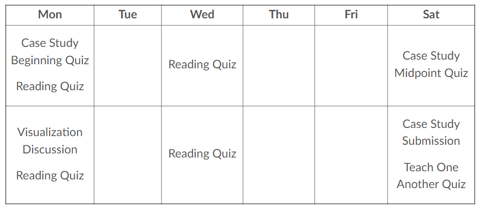
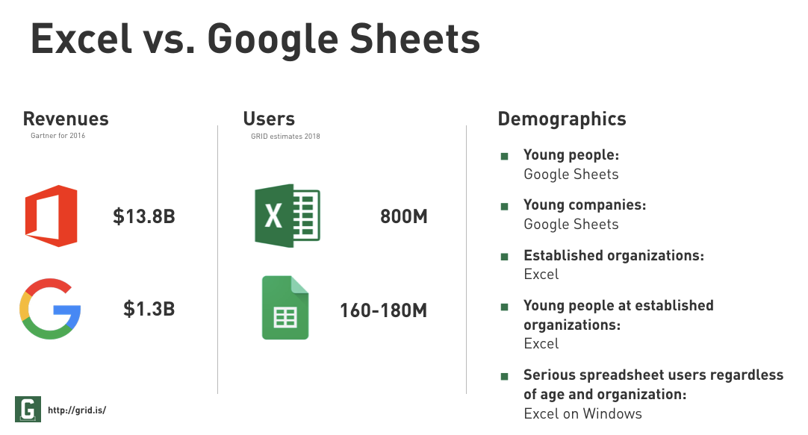
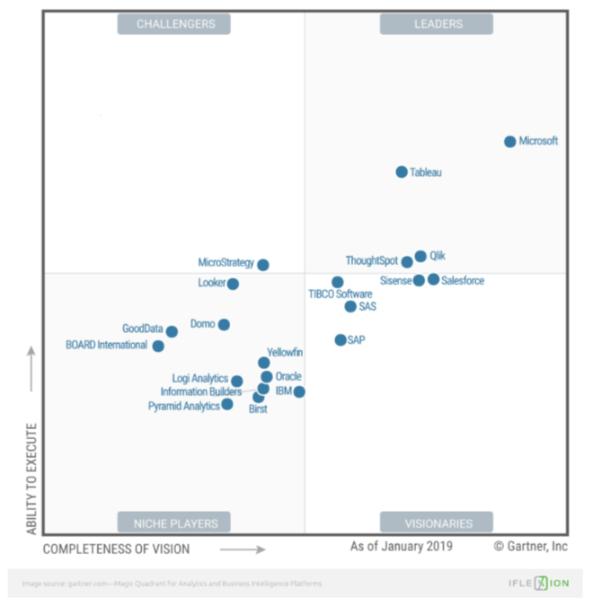
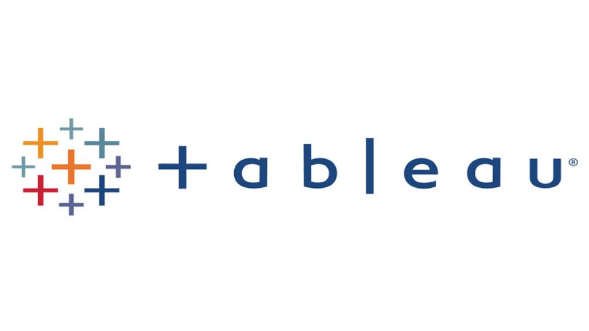

# Introduction to Sister Larson {data-background=#6897bb}

## My family

## My background

> - Undergraduate in Applied Mathematics from BYU-Idaho
> - Masters degree in Statistics from BYU
> - Biostatistician at Myriad Genetics (cancer research)
> - Then back to BYU-Idaho!

## My interests

> - Wanted to be an archeologist
> - Unique applications of math. For example...
>   - [The average chocolate chip cookie](https://pudding.cool/2018/05/cookies/)
>   - [Dinosaurs and statistical distributions](https://twitter.com/EmpiricalDave/status/1067941369237434368)
>   - [Calculus and The Good Place](https://www.andrewheiss.com/blog/2019/02/16/algebra-calculus-r-yacas/)
>   - [Jane Austen and natural language processing](https://juliasilge.com/blog/you-must-allow-me/)
> - Stained glass windows
> - Reading

## Questions?

## One-on-one Interviews

> - Use the link in I-Learn to sign up for a one-on-one
> - My chance to meet you without a mask!
> - Quick, 10-minutes, on zoom

# Introduction to CSE 150 {data-background=#6897bb}

## "Data Intuition and Insight"

Course Outcomes:

1. Organize and store tabular data for time-series, spatial, and measured variables.
2. Calculate data summaries and produce visualizations from data.
3. Communicate about data with people of varied backgrounds (e.g., novices, database administrators, data scientists, business decision-makers).
4. Describe the implications of data visualization and summaries in the decision-making process.

## "Data Intuition and Insight"

Or, another way to phrase it:

- Learn about the field of data science and data visualization.
- Leave this class with marketable skills.
- Discover the joy of data literacy.

# Syllabus Overview  {data-background=#6897bb}

## Course Format

CSE 150 is built around 8 case studies. Most case studies follow this two week format:

Each case study has an [overview](https://byui.instructure.com/courses/102734/pages/visualization-introduction-overview?module_item_id=13091932) that tells you exactly what to do.

## Course Content

Our assignments can be grouped into four categories:

> 1. Weekly Readings (30%)
> 2. Case Studies (55%)
> 3. Teach One Another (15%)
> 4. Visualization Challenge (10%)

[Syllabus details.](https://byui.instructure.com/courses/102734/assignments/syllabus)

## Class Discussions

CSE 150 was designed with the assumption that you will come to class **prepared** and **willing to engage** in a discussion with your peers.

> - Talking with a mask on is not fun.
> - We're going to do it anyway.

# Materials and Technology {data-background=#6897bb}

## Materials

> - [Good Charts](https://www.amazon.com/Good-Charts-Smarter-Persuasive-Visualizations/dp/1633690709)
> - [CSE 150 Supplement](https://byuistats.github.io/BYUI_CSE150_StatBook/)
> - [Tableau Videos]()

## Microsoft Teams

Follow the [link in I-Learn](https://teams.microsoft.com/l/team/19%3af27af53d902b4104b1eecd101c78a545%40thread.tacv2/conversations?groupId=b9451cb4-493d-400c-9875-b3cc28628ef6&tenantId=e6ac1d1f-d695-4ef1-91d4-94cddef8be11) to join our class team.

## Slack vs. Email vs. Canvas vs. Teams

> 1. Canvas is not used outside of Academia (done).
> 2. Email silos conversations, documents, and data. Plus, it hasn't changed much in [over 25 years](https://phrasee.co/a-brief-history-of-email/).
> 3. Teams vs. Slack

## Google Sheets (G Suite)

I believe that spreadsheets are useful for looking at little data sets, building tables, and collaboration. Not for data analysis. Microsoft has accepted some of this point in their development of [PowerBI](https://powerbi.microsoft.com/en-us/) in response to [Tableau](https://www.tableau.com/).

## Google Sheets vs. Excel 

[reference for google](https://medium.com/grid-spreadsheets-run-the-world/excel-vs-google-sheets-usage-nature-and-numbers-9dfa5d1cadbd)

## EdConnect

Virtually no market share, but it seems like a good idea to try during COVID19 and for remote learning in general.

- [Web](https://www.edconnect.app)
- [Google Play](https://play.google.com/store/apps/details?id=com.koppla.education.android&hl=en_US)
- [Apple App Store](https://apps.apple.com/us/app/edconnect-virtual-classroom/id1492164134)

## EdConnect

The link to [join our class group](https://edconnect.page.link/5MrUFXueRxg93LBB8) is in I-Learn.

> - Used to present case studies and tool tips.

## Tableau

[ref](https://www.iflexion.com/blog/power-bi-vs-tableau)

## Tableau

[Instructions for Tableau](https://byuistats.github.io/BYUI_CSE150_StatBook/tools.html#registration-and-download) are in the Case Study 2 Overview.

# What makes a chart "good"? {data-background=#6897bb}

(chart = graph = visualization = plot)

## Is this chart good?

[Source](http://www.perceptualedge.com/example1.php)

## Is this chart good?

[Source](http://www.perceptualedge.com/example1.php)

## Is this chart good?

[Source](http://poppyfield.org/)

## Is this chart good?

[Source](https://generalassemb.ly/blog/the-best-topical-data-visualizations-of-2015/)

## Is this chart good?

[Source](https://yougov.co.uk/topics/politics/articles-reports/2017/03/06/does-pineapple-belong-pizza)

## [Can we make it better?](https://jamboard.google.com/d/1vbLNBFPgCjidY9BBw7_daz1xfzleyhbERHzsu6r0a9o/edit?usp=sharing)

# Why do we attend college? {data-background=#6897bb}

## [Peter Gray on Education](https://www.psychologytoday.com/us/blog/freedom-learn/200808/brief-history-education)

Anthropologists have reported that the hunter-gatherer groups they studied did not distinguish between work and play--essentially all of life was understood as play...

With the rise of schooling, people began to think of learning as children's work. The same power-assertive methods that had been used to make children work in fields and factories were quite naturally transferred to the classroom.

**If children learn nothing else in school, they learn the difference between work and play and that learning is work, not play.**

## [Jeffry R. Holland on learning](https://www.churchofjesuschrist.org/study/ensign/2018/12/making-your-life-a-soul-stirring-journey-of-personal-growth?lang=eng)

So let's talk about learning. As a teacher at heart, I love the word and the idea, though I do think we should define it a little better than we usually do. ... I don't just mean the accumulation of knowledge, though that is part of it. I also don't just mean passively listening to a lecture or memorizing facts. **I mean learning in the sense of growth and change, of insight leading to improvement, of knowing the truth, which in turn leads us closer to the God of all truth.**

## [BYU-Idaho Mission Statement](https://www.byui.edu/about/mission-statement)

To develop disciples of Jesus Christ who are leaders in their homes, the Church, and their communities.