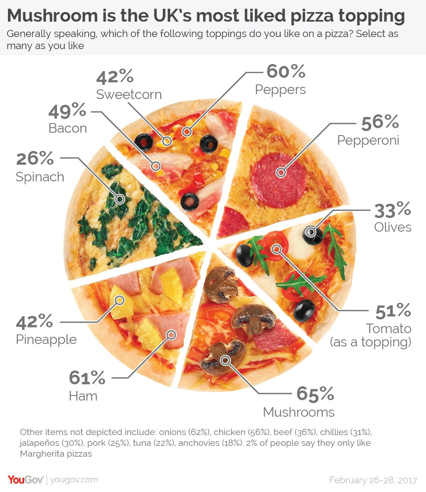
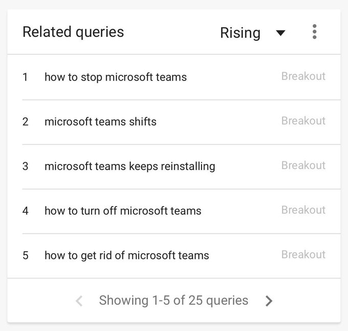

# Introduction to Sister Larson {data-background=#6897bb}

## My family

## My background

> - Undergraduate in Applied Mathematics from BYU-Idaho
> - Masters degree in Statistics from BYU
> - Biostatistician at Myriad Genetics
> - Then back to BYU-Idaho!

## My interests

> - Wanted to be an archeologist
> - Unique applications of math. For example...
>   - [The average chocolate chip cookie](https://pudding.cool/2018/05/cookies/)
>   - [Dinosaurs and statistical distributions](https://twitter.com/EmpiricalDave/status/1067941369237434368)
>   - [Calculus and The Good Place](https://www.andrewheiss.com/blog/2019/02/16/algebra-calculus-r-yacas/)
>   - [Jane Austen and natural language processing](https://juliasilge.com/blog/you-must-allow-me/)
> - Stained glass windows
> - Reading

## Questions?

# Introduction to CSE 150 {data-background=#6897bb}

## "Data Intuition and Insight"

Course Outcomes:

1. Organize and store tabular data for time-series, spatial, and measured variables.
2. Calculate data summaries and produce visualizations from data.
3. Communicate about data with people of varied backgrounds (e.g., novices, database administrators, data scientists, business decision-makers).
4. Describe the implications of data visualization and summaries in the decision-making process.

## "Data Intuition and Insight"

Our goals this semester:

- Learn about the field of data science and data visualization.
- Leave this class with marketable skills.
- Discover the joy of data literacy.

## What makes a chart "good"?

(chart = graph = visualization = plot)

## Is this chart good?

[Source](http://www.perceptualedge.com/example1.php)

## Is this chart good?

[Source](http://www.perceptualedge.com/example1.php)

## Is this chart good?

[Source](http://poppyfield.org/)

## Is this chart good?

[Source](https://generalassemb.ly/blog/the-best-topical-data-visualizations-of-2015/)

## Is this chart good?

[Source](https://yougov.co.uk/topics/politics/articles-reports/2017/03/06/does-pineapple-belong-pizza)

## Class Discussions

CSE 150 was designed with the assumption that you will come to class **prepared** and be **willing to engage** in a discussion with your peers.

> - Talking with a mask on is not fun.
> - We're going to do it anyway.

## What makes a discussion good?

- Do the reading before class. Prepare!
- Be vunerable and willing to share insights that might be "wrong".
- Connect readings with past material and experiences outside of class.
- Ask questions! (I don't expect you to know everything.)
- Ask questions! (Don't be afraid to sound "dumb".)
- Ask questions! (Teach one another.)

# Learning & Grading {data-background=#6897bb}

## On Education

Anthropologists have reported that the hunter-gatherer groups they studied did not distinguish between work and play--essentially **all of life was understood as play**.

With the rise of schooling, people began to think of learning as children's work. The same power-assertive methods that had been used to make children work in fields and factories were quite naturally transferred to the classroom.

If children learn nothing else in school, they learn the difference between work and play, and that learning is work, not play.

> - [Peter Gray](https://www.psychologytoday.com/us/blog/freedom-learn/200808/brief-history-education)

## [Jeffry R. Holland on learning](https://www.churchofjesuschrist.org/study/ensign/2018/12/making-your-life-a-soul-stirring-journey-of-personal-growth?lang=eng)

So let's talk about learning. As a teacher at heart, I love the word and the idea, though I do think we should define it a little better than we usually do. ... I don't just mean the accumulation of knowledge, though that is part of it. I also don't just mean passively listening to a lecture or memorizing facts. **I mean learning in the sense of growth and change, of insight leading to improvement, of knowing the truth, which in turn leads us closer to the God of all truth.**

- What is the difference between *'accumulation of knowledge'* and *'knowing the truth'*?

## Syllabus Overview

# Materials and Technology {data-background=#6897bb}

## Materials

> - [Good Charts](https://www.amazon.com/Good-Charts-Smarter-Persuasive-Visualizations/dp/1633690709)
> - [CSE 150 Supplement](https://byuistats.github.io/BYUI_CSE150_StatBook/)
> - [Tableau Videos!!!!!!!!!!!]()

## Tableau

## Google Sheets

## Microsoft Teams

## EdConnect

## Google Sheets (G Suite)

I believe that spreadsheets are useful for looking at little data sets, building tables, and collaboration. Not for data analysis. Microsoft has accepted some of this point in their development of [PowerBI](https://powerbi.microsoft.com/en-us/) in response to [Tableau](https://www.tableau.com/).

## Google Sheets vs. Excel 

[reference for google](https://medium.com/grid-spreadsheets-run-the-world/excel-vs-google-sheets-usage-nature-and-numbers-9dfa5d1cadbd)

## [Tableau](https://www.forbes.com/sites/liyanchen/2015/06/09/stanfords-new-billionaire-professor-the-academic-behind-tableau-pixar/#433b01fd6ccf)

[ref](https://www.iflexion.com/blog/power-bi-vs-tableau)

## Tableau questions?

## Slack vs. Email vs. Canvas vs. Teams

> 1. Canvas is not used outside of Academia (done).
> 2. Email silos conversations, documents, and data. Plus, it hasn't changed much in [over 25 years](https://phrasee.co/a-brief-history-of-email/).
> 3. Teams vs. Slack (Top Google [Trends related queries](https://twitter.com/msquinn/status/1179874609899827200) for Microsoft Teams.)

## Questiosn about Teams?

## EdConnect

Virtually no market share, but it seems like a good idea to try during COVID19 and for remote learning in general.

- [Web](https://www.edconnect.app)
- [Google Play](https://play.google.com/store/apps/details?id=com.koppla.education.android&hl=en_US)
- [Apple App Store](https://apps.apple.com/us/app/edconnect-virtual-classroom/id1492164134)

## EdConnect Questions

