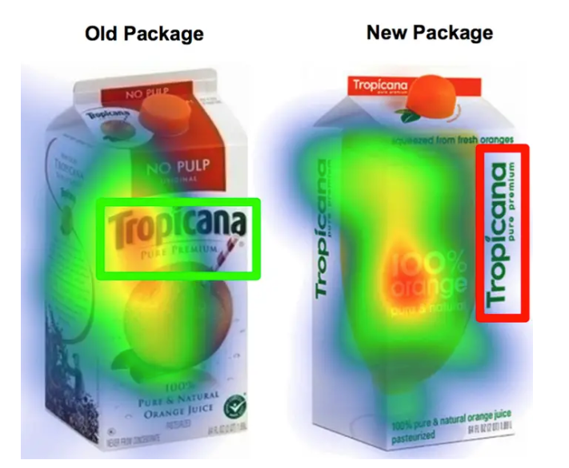
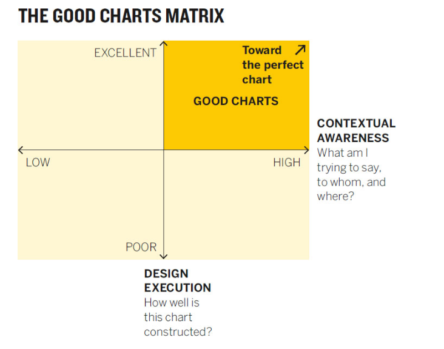
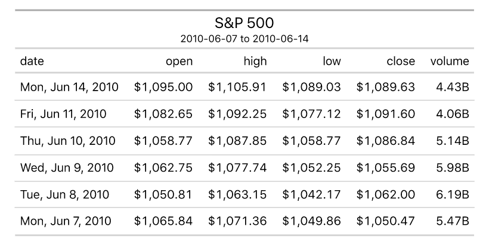

---
---

# Welcome to Class! {data-background=#e8c35d}

## Canvas or course structure questions?

## Teams

# Is there an art to making visualizations? {data-background=#e8c35d}

## How humans see data -- John Rauser

What did you learn from this video? Anything you disagreed with?

- "Your goal with a visualization is to make new ideas appear in the heads of other people."
- "Good visualizations optimize for the human visual system."
- "Above all else, show the data" *Tufte*

## 7 methods of encoding data

#### Ordered by accuracy of perceptual estimation.

1. Position along a common scale
2. Position on common, non-aligned scale
3. Length
4. Angle or slope
5. Area
6. Volume/density/saturation of "color"
7. Color hue

# Good Charts {data-background=#e8c35d}

## Good Charts, Chapter 2: When Charts hit our eyes

- What were your takeaways from Chapter 2?
- Misunderstandings?
- Doubts?

## Five ideas to know

1. We don't go in order
2. We see what stands out
3. We only see a few things at once
4. Humans yearn for patterns
5. Communication only happens through metaphor

- *keep track: close your eyes then take note where you looked first*

##

[Source](https://generalassemb.ly/blog/the-best-topical-data-visualizations-of-2015/)

## Where do people look?

## Don't make it complicated (unless you need to)

**Try to tell me the message in the below paragraph**

> getting Lectured trainingoutsideofcollege is-even-more-expensive-than it is in college. aWeek’sworth of trainingcancostmore dlkjalkdfald;kjfasdlkjfasd than a semester of school here at BYUI........Duetothisexpenselearning howtodigest onlinematerial butmaybeorand get up to speedonatopic before.going.to.the.expertfor                                                 questions                         is a valuableskill todevelop. I expect que tu have completedthe assigned-reading-material-before class begins. You will also have work tocompleteafterclass.

## We want patterns to a fault.

**Conspiracy Theory of Charts**

> - [The case against dual axis charts](https://blog.datawrapper.de/dualaxis/)

**Only do it for transformations: ft -> meters**

## Metaphor matters in all communication

I love his symphony metaphor.

> When deeply complex charts work, we find them effective and beautiful, just as we find a symphony, which is another marvelously complex arrangement of data that we experience as a coherent whole.

## Metaphor highlights

"The influence of the brain and expectation are far greater than the raw data."

- South is down?
- Lighter color shades are "emptier" or lower than darker ones.
- Lines imply ordered relationship
- Time moves from left to right.

- **What other metaphors could you use to describe data visualization?**

## Good Charts Matrix

# Tidy Data ([Section 1.1](https://byuistats.github.io/BYUI_CSE150_StatBook/describing-data.html#tidy-data)) {data-background=#e8c35d}

## How data is stored.

*Data and how to handle it isn't trivial*

1. Visual consumption by humans
2. Computer consumption for storage
3. Analytics consumption

## How humans consume data.

## How computers consume data.

## How data is stored for visualization and analytics.

## Oh no you don't

**You should never attempt all three of the above in one sheet in Excel or Google Sheets.**

*Using multiple tabs or sheets can make this possible but still not recommended.*

# Google Sheets ([Section](https://byuistats.github.io/BYUI_CSE150_StatBook/tools.html#sheets)) {data-background=#e8c35d}

## What we have to do with Google Sheets.

- [View data sets](https://drive.google.com/drive/folders/1jR07hsu3mbsBOmghKset0geclsFn_ZMG?usp=sharing)
- [Do some calculations](https://docs.google.com/spreadsheets/d/1KUq-7qEHB642UB9olN7Fw0Yp9pYoKyCQIhs1TCPP198/template/preview)

- [Maybe create a few simple formulas](https://support.google.com/docs/table/25273)

**Sheets is a sidenote, not our primary tool.**

# Looking Ahead {data-background=#e8c35d}

## Case Study

## Before next class...

> - Sign up for a one-on-one interview with Sister Larson
> - Complete Reading Quiz 1.2
> - Complete Case Study 1
