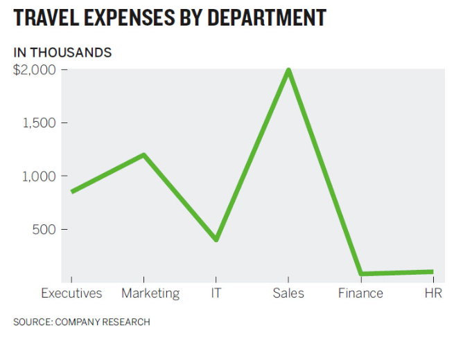

## Canvas or course structure questions?

# Is there an art to making visualizations? {data-background=#6897bb}

## How humans see data -- John Rauser

> Above all else, show the data

**Tufte**

## {data-background-iframe="https://www.youtube.com/embed/fSgEeI2Xpdc?rel=0&start=1740"}

[Rasuer's Presentation](https://www.youtube.com/embed/fSgEeI2Xpdc?rel=0&start=0){target="blank"}

## Hathaway highlights from Rauser

> - [notes](https://byuistats.github.io/M335/presentations_class/rauser_notes.html){target="blank"}

# Good Charts {data-background=#6897bb}

## Good Charts, Chapter 2: When Charts hit our eyes

- What were your takeaways from Chapter 2?
- Misunderstandings?
- Doubts?

## Hathaway takeaways

1. We don't go in order
2. We see what stands out
3. Don't fill up the plot
4. Humans yearn for patterns
5. Communication only happens through metaphor

- *keep track: close your eyes then take note where you looked first*

## {data-background-image=images/gc/Ch1_waldo_noheat_example.jpg}

- [Where did you look?](https://docs.google.com/spreadsheets/d/1pWnULMce4ERZhv9lobDzvF-ZTN-vwVF6i7MdoymPdUs/edit?usp=sharing)

## Where do people look?

## Don't make it complicated (unless you need to)

**Try to tell me the message in the below paragraph**

> getting Lectured trainingoutsideofcollege is-even-more-expensive-than it is in college. aWeek’sworth of trainingcancostmore dlkjalkdfald;kjfasdlkjfasd than a semester of school here at BYUI........Duetothisexpenselearning howtodigest onlinematerial butmaybeorand get up to speedonatopic before.going.to.the.expertfor                                                 questions                         is a valuableskill todevelop. I expect que tu have completedthe assigned-reading-material-before class begins. You will also have work tocompleteafterclass.

## We want patterns to a fault.

**Conspiracy Theory of Charts**

> - [The case against dual axis charts](https://blog.datawrapper.de/dualaxis/)

**Only do it for transformations: ft -> meters**

## Metaphor matters in all communication

I love his symphony metaphor.

> When deeply complex charts work, we find them effective and beautiful, just as we find a symphony, which is another marvelously complex arrangement of data that we experience as a coherent whole.

## Metaphor highlights

- South is down?
- Lighter color shades are "emptier" or lower than darker ones.
- Lines imply ordered relationship
- Time moves from left to right.
- **After reading the chapter, what other metaphors could you use to describe visualization or elements of a visualization?**

## Good Charts Matrix

# Tidy Data ([Section 1.1](https://byuistats.github.io/BYUI_CSE150_StatBook/describing-data.html#tidy-data))

## How data is stored.

*Data and how to handle it isn't trivial*

1. Visual consumption by humans
2. Computer consumption for storage
3. Analytics consumption

## How humans consume data.

## How computers consume data.

## How data is stored for visualization and analytics.

## Oh no you don't

**You should never attempt all three of the above in one sheet in Excel or Google Sheets.**

*Using multiple tabs or sheets can make this possible but still not recommended.*

# Google Sheets ([Section ](https://byuistats.github.io/BYUI_CSE150_StatBook/tools.html#sheets))

## What we have to do with Google Sheets.

- [View data sets](https://drive.google.com/drive/folders/1jR07hsu3mbsBOmghKset0geclsFn_ZMG?usp=sharing)
- [Do some calculations](https://docs.google.com/spreadsheets/d/1KUq-7qEHB642UB9olN7Fw0Yp9pYoKyCQIhs1TCPP198/template/preview)

- [Maybe create a few simple formulas](https://support.google.com/docs/table/25273)

**Sheets is a sidenote, not our primary tool.**

