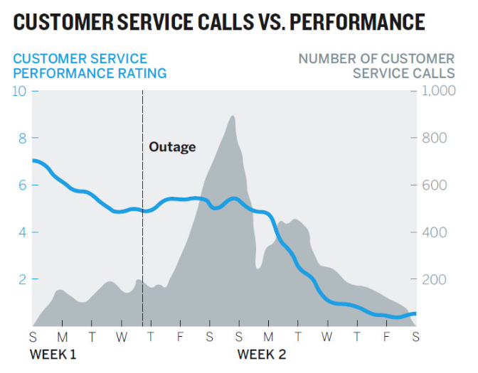

---
---

# Welcome to CSE: Data Intuition and Insight {data-background=#e8c35d}

## My family

## My background

> - Undergraduate in Applied Mathematics from BYU-Idaho
> - Masters degree in Statistics from BYU
> - Biostatistician at Myriad Genetics (cancer research)
> - Then back to BYU-Idaho!

## Why I love data

- [Dinosaurs and statistical distributions](https://twitter.com/EmpiricalDave/status/1067941369237434368)
- [The average chocolate chip cookie](https://pudding.cool/2018/05/cookies/)
- [Calculus and The Good Place](https://www.andrewheiss.com/blog/2019/02/16/algebra-calculus-r-yacas/)
- [Jane Austen and natural language processing](https://juliasilge.com/blog/you-must-allow-me/)
> - [How do dogs know that other dogs are dogs?](https://link.springer.com/article/10.1007/s10071-013-0600-8)

## "Data Intuition and Insight"

- What is intuition?
- What is insight?
- What is data?

## Course Outcomes

1. Organize and store tabular data for time-series, spatial, and measured variables.
2. Calculate data summaries and produce visualizations from data.
3. Communicate about data with people of varied backgrounds (e.g., novices, database administrators, data scientists, business decision-makers).
4. Describe the implications of data visualization and summaries in the decision-making process.

## Mission Statement

> To develop disciples of Jesus Christ who are leaders in their homes, the Church, and their communities.

# Syllabus Overview  {data-background=#e8c35d}

## Course Format

CSE 150 is built around 6 case studies. Most case studies follow this two week format:

Each case study has an overview that tells you exactly what to do.

## Course Content

Our assignments can be grouped into five categories:

> 1. Weekly Readings (25%)
> 2. Case Studies (45%)
> 3. Teach One Another (15%)
> 4. Visualization Challenge (10%)
> 5. Attendance (5%)

## Weekly Readings

>- Readings quizzes
>- Visualization Discussion

## Case Studies

>- Case Study Beginning Quiz
>- Case Study Midpoint Quiz
>- Case Study Submission

## Teach One Another

>- Teach One Another Quiz
>  - Case Study Presentation
>  - Case Study Feedback
>  - Tool Tips

## Visualization Challenge

An in-class challenge that covers three topics:

> 1. Tidy data description
> 2. Visualization critique
> 3. Creating your own visualization

# Materials and Technology {data-background=#e8c35d}

## Readings Materials

> - [Good Charts](https://www.amazon.com/Good-Charts-Smarter-Persuasive-Visualizations/dp/1633690709)
> - [CSE 150 Supplement](https://byuistats.github.io/BYUI_CSE150_StatBook/)
> - [Tableau tutorials]()

## Slack

Like a discussion board, but way better.

<!----------------
## Slack vs. Email vs. Canvas vs. Teams

> 1. Canvas is not used outside of Academia (done).
> 2. Email silos conversations, documents, and data. Plus, it hasn't changed much in [over 25 years](https://phrasee.co/a-brief-history-of-email/).
> 3. Teams vs. Slack

## Google Sheets (G Suite)

I believe that spreadsheets are useful for looking at little data sets, building tables, and collaboration. Not for data analysis. Microsoft has accepted some of this point in their development of [PowerBI](https://powerbi.microsoft.com/en-us/) in response to [Tableau](https://www.tableau.com/).

## Google Sheets vs. Excel 

[reference for google](https://medium.com/grid-spreadsheets-run-the-world/excel-vs-google-sheets-usage-nature-and-numbers-9dfa5d1cadbd)
------------------->

## EdConnect

Used to present case studies and tool tips.

>- [Web](https://www.edconnect.app)
>- [Google Play](https://play.google.com/store/apps/details?id=com.koppla.education.android&hl=en_US)
>- [Apple App Store](https://apps.apple.com/us/app/edconnect-virtual-classroom/id1492164134)

## Tableau

["Tableau makes analyzing data fast, easy, and beautiful for everyone."](https://www.youtube.com/watch?v=gAruNQGxYMA)

## Tableau vs Power BI

[ref](https://www.iflexion.com/blog/power-bi-vs-tableau)

# Looking Ahead {data-background=#e8c35d}

## What to do after class today

- Follow the instructions on the "Technology Tools" page
- Reading Quiz 1.2
- Case Study 1

## What makes a chart "good"?

(chart = graph = visualization = plot)

## Is this chart good?

[Source](http://www.perceptualedge.com/example1.php)

## Is this chart good?

[Source](http://www.perceptualedge.com/example1.php)

## Is this chart good?

[Source](http://poppyfield.org/)

## Is this chart good?

[Source](https://yougov.co.uk/topics/politics/articles-reports/2017/03/06/does-pineapple-belong-pizza)

<!---------
## [Can we make it better?](https://jamboard.google.com/d/1vbLNBFPgCjidY9BBw7_daz1xfzleyhbERHzsu6r0a9o/edit?usp=sharing)
------------>

<!----------------------

## Canvas or course structure questions?

## Teams

# Is there an art to making visualizations? {data-background=#e8c35d}

## How humans see data -- John Rauser

What did you learn from this video? Anything you disagreed with?

- "Your goal with a visualization is to make new ideas appear in the heads of other people."
- "Good visualizations optimize for the human visual system."
- "Above all else, show the data" *Tufte*

## 7 methods of encoding data

#### Ordered by accuracy of perceptual estimation.

1. Position along a common scale
2. Position on common, non-aligned scale
3. Length
4. Angle or slope
5. Area
6. Volume/density/saturation of "color"
7. Color hue

# Good Charts {data-background=#e8c35d}

## Good Charts, Chapter 2: When Charts hit our eyes

- What were your takeaways from Chapter 2?
- Misunderstandings?
- Doubts?

## Five ideas to know

1. We don't go in order
2. We see what stands out
3. We only see a few things at once
4. Humans yearn for patterns
5. Communication only happens through metaphor

- *keep track: close your eyes then take note where you looked first*

##

[Source](https://generalassemb.ly/blog/the-best-topical-data-visualizations-of-2015/)

## Where do people look?

## Don't make it complicated (unless you need to)

**Try to tell me the message in the below paragraph**

> getting Lectured trainingoutsideofcollege is-even-more-expensive-than it is in college. aWeek’sworth of trainingcancostmore dlkjalkdfald;kjfasdlkjfasd than a semester of school here at BYUI........Duetothisexpenselearning howtodigest onlinematerial butmaybeorand get up to speedonatopic before.going.to.the.expertfor                                                 questions                         is a valuableskill todevelop. I expect que tu have completedthe assigned-reading-material-before class begins. You will also have work tocompleteafterclass.

## We want patterns to a fault.

**Conspiracy Theory of Charts**

> - [The case against dual axis charts](https://blog.datawrapper.de/dualaxis/)

**Only do it for transformations: ft -> meters**

## Metaphor matters in all communication

I love his symphony metaphor.

> When deeply complex charts work, we find them effective and beautiful, just as we find a symphony, which is another marvelously complex arrangement of data that we experience as a coherent whole.

## Metaphor highlights

"The influence of the brain and expectation are far greater than the raw data."

- South is down?
- Lighter color shades are "emptier" or lower than darker ones.
- Lines imply ordered relationship
- Time moves from left to right.

- **What other metaphors could you use to describe data visualization?**
-------------------------->

## Good Charts Matrix

<!---------------------------
# Tidy Data ([Section 1.1](https://byuistats.github.io/BYUI_CSE150_StatBook/describing-data.html#tidy-data)) {data-background=#e8c35d}

## How data is stored.

*Data and how to handle it isn't trivial*

1. Visual consumption by humans
2. Computer consumption for storage
3. Analytics consumption

## How humans consume data.

## How computers consume data.

## How data is stored for visualization and analytics.

## Oh no you don't

**You should never attempt all three of the above in one sheet in Excel or Google Sheets.**

*Using multiple tabs or sheets can make this possible but still not recommended.*

-------------------->
