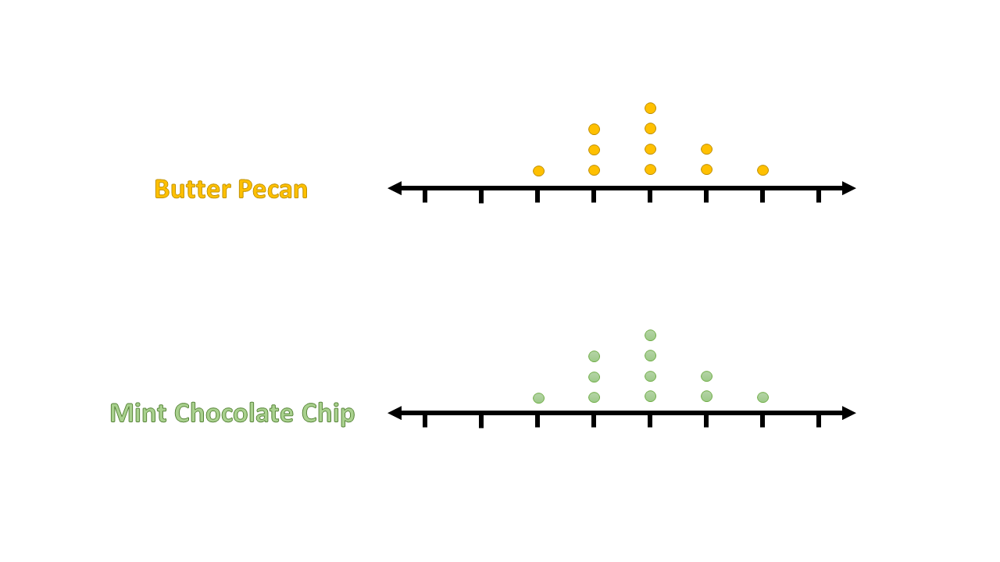
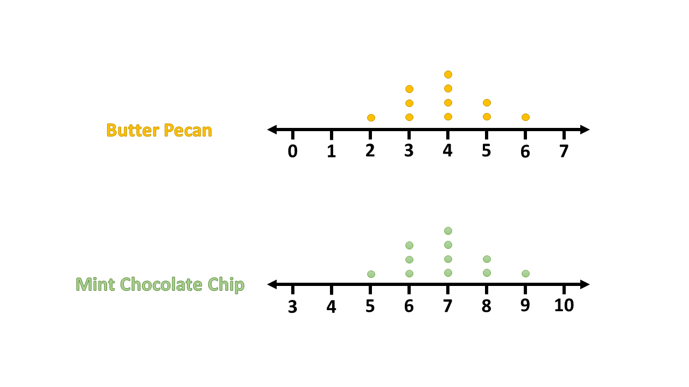
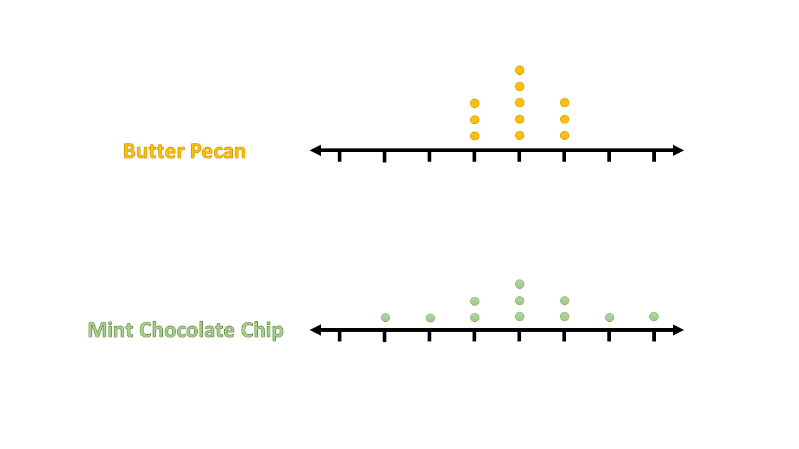
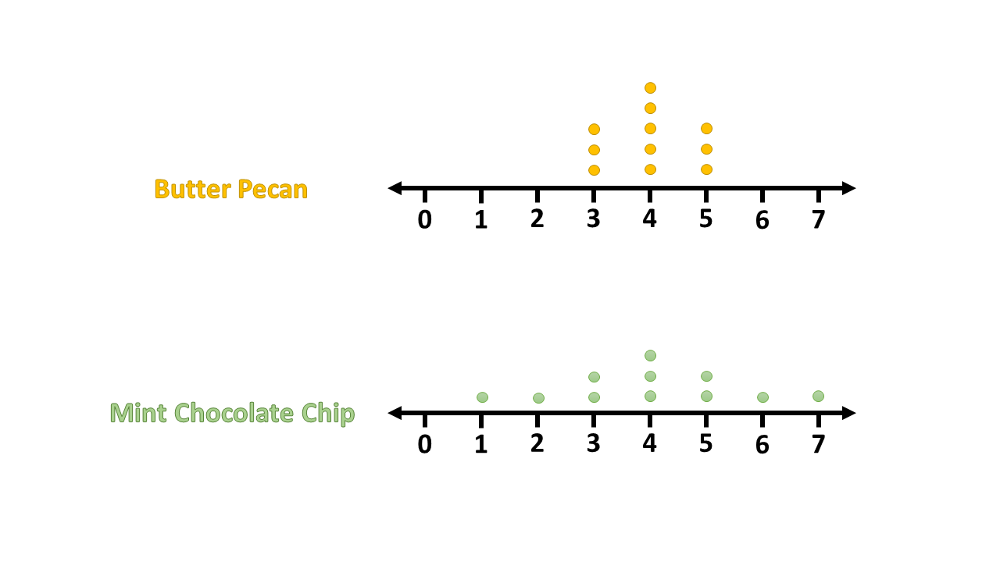
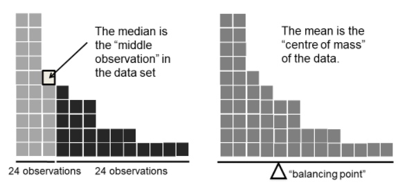

# Welcome to class! {data-background=#e8c35d}

## xkcd for the day

# Good Charts {data-background=#e8c35d}

## Chapter 3: Two questions to four types

>"When it comes to information visualization, the impulse is to immediately choose a chart type and click a button to create it. You should resist this impulse and instead..."

## The Two Questions

1. Is the information *conceptual* or *data-driven*? (What do you have?)
2. Am I *declaring something* or *exploring something*? (What are you doing?)

## The Four Types

- [Consultant Visualization](https://www.google.com/search?q=best+powerpoint+diagrams&tbm=isch&ved=2ahUKEwjB-pXl2f_oAhVSlJ4KHU86CXEQ2-cCegQIABAA&oq=best+powerpoint+diagrams&gs_lcp=CgNpbWcQAzIECAAQGDoECCMQJzoECAAQQzoCCAA6BQgAEIMBOgYIABAFEB46BggAEAgQHlC1_AZYtp0HYKeeB2gAcAB4AIABXogBmQ6SAQIyNJgBAKABAaoBC2d3cy13aXotaW1n&sclient=img&ei=tSSiXoHMKtKo-gTP9KSIBw&bih=867&biw=1614&hl=en) (Conceptual & Declarative)
- [Design Thinking Visualization](https://seattlebusinessmag.com/technology/why-live-drawing-replacing-powerpoint-top-companies) (Conceptual & Exploratory)
- [PowerBI and Excel Users](https://www.google.com/search?q=Power+BI+visualization&tbm=isch&hl=en&ved=2ahUKEwiEo5Ce2P_oAhWQh54KHc7nBsoQBXoECAEQNg&biw=1614&bih=867) (Data-Driven & Declarative)
- [Data Scientists](https://www.google.com/search?q=best+ggplot2+visualizations&tbm=isch&ved=2ahUKEwic8eim2P_oAhWR154KHdURDF0Q2-cCegQIABAA&oq=best+ggplot2+visualizations&gs_lcp=CgNpbWcQAzICCAA6BAgjECc6BAgAEEM6BggAEAgQHjoECAAQGFCj6BZYtIUXYLWGF2gAcAB4AIABiwGIAd8RkgEEMjIuNZgBAKABAaoBC2d3cy13aXotaW1n&sclient=img&ei=JiOiXpzGHpGv-wTVo7DoBQ&bih=867&biw=1614&hl=en) (Data-Driven & Exploratory)

## Which quadrant will we spend the most time in?

Answer the question in Slack.

>   - Conceptual & Declarative (top left)
>   - Conceptual & Exploratory (bottom right)
>   - Data-Driven & Declarative (top right)
>   - Data-Driven & Exploratory (bottom right)

# [Tidy Data](https://byuistats.github.io/BYUI_CSE150_StatBook/describing-data.html#tidy-data)  {data-background=#e8c35d}

## How data is stored

Deciding what data is and how to handle it is not a trivial problem.

1. Visual consumption by humans
2. Computer consumption for storage
3. Analytics consumption

## How humans consume data

## How computers consume data

## How data is stored for visualization and analytics

## Don't mix and match!

You should never attempt all three of the above in one sheet in Excel or Google Sheets.

Using multiple tabs or sheets can make this possible but still not recommended.

(bad example)

## Data tools for this class

Most of our data will be stored as a [csv file](https://www.google.com/search?q=csv+file&rlz=1C1GCEJ_enUS882US882&oq=csv+file&aqs=chrome..69i57j69i60l3j5j69i60l3.622j0j7&sourceid=chrome&ie=UTF-8).

> - Microsoft Excel
> - Google Sheets

<!---------------
## What we have to do with Google Sheets.

- [View data sets](https://drive.google.com/drive/folders/1jR07hsu3mbsBOmghKset0geclsFn_ZMG?usp=sharing)
- [Do some calculations](https://docs.google.com/spreadsheets/d/1KUq-7qEHB642UB9olN7Fw0Yp9pYoKyCQIhs1TCPP198/template/preview)

- [Maybe create a few simple formulas](https://support.google.com/docs/table/25273)

**Sheets is a sidenote, not our primary tool.**
----------------->

<!--------------------
## Measures of Center

## Measures of Center {data-transition="none"}

## Measures of Center {data-transition="none"}

## Measures of Center {data-transition="none"}

## Measures of Center

## Different Types of Center

[*source*](https://learningstatisticswithr.com/book/descriptives.html)

## Measures of Center Activity

> - **Instructions:**
>   - Generate 10 random numbers between 1 and 10
>   - Plot the numbers on your graph
>   - Calculate the mean and median. Cirlce them on your graph.

> - This will be easier if you pick one person to be the writer, one person to generate the random numbers, and one person to do the math.
> - [Jam Board](https://jamboard.google.com/d/1zLvnfW7fe9ZVnUrUEjjnO_CrFCe5NOk6dFJuMxfdn5w/edit?usp=sharing)
> - [Random Number Generator](https://www.google.com/search?q=random+number+between+1+and+10&rlz=1C1GCEJ_enUS882US882&oq=random+number+between+1+and+10&aqs=chrome..69i57j0l7.3815j0j9&sourceid=chrome&ie=UTF-8)

## [Measures of Center](https://byuistats.github.io/BYUI_CSE150_StatBook/describing-data.html#measures-of-center)

**Break into new groups and answer to the following questions:**   

> - What does the phrase 'measures of center' mean?
> - What do you notice about the mean's location relative to the median?
> - Why do we use measures of center?   
> - Which measure of center do you prefer? 
> - Which measure would represent a typical net worth of people living in Seattle better?

- [Bill Gates walks into a bar](https://introductorystats.wordpress.com/2011/09/04/when-bill-gates-walks-into-a-bar/)

## Questions on Measures of Center?

-------------------------->

# Case Study 2 {data-background=#e8c35d}

## Case Study 2 Overview

- You work together to get data recording done, but each of you creates your own visualizations and presentation.   
- You can use similar images, but your presentation and Tableau file should be your own creation. 

## "Tidy" Lego data

## Questions?

# Tableau {data-background=#e8c35d}
