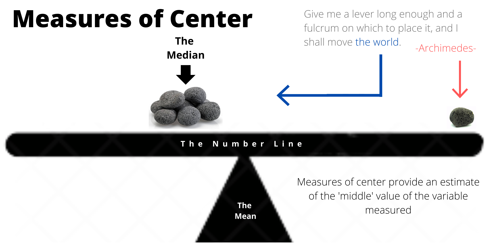
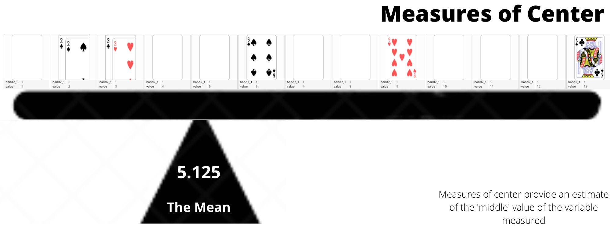

## xkcd for the day

# Good Reads {data-background=#6897bb}

## Chapter 3: Two questions to four types

## Conceptual Visualizations

- [Consultant Visualization (Conceptual & Declarative)](https://www.google.com/search?q=best+powerpoint+diagrams&tbm=isch&ved=2ahUKEwjB-pXl2f_oAhVSlJ4KHU86CXEQ2-cCegQIABAA&oq=best+powerpoint+diagrams&gs_lcp=CgNpbWcQAzIECAAQGDoECCMQJzoECAAQQzoCCAA6BQgAEIMBOgYIABAFEB46BggAEAgQHlC1_AZYtp0HYKeeB2gAcAB4AIABXogBmQ6SAQIyNJgBAKABAaoBC2d3cy13aXotaW1n&sclient=img&ei=tSSiXoHMKtKo-gTP9KSIBw&bih=867&biw=1614&hl=en) and [doctrine visualization](sin_example/sin.html)
- [Design Thinking Visualization (Conceptual & Exploratory)](https://seattlebusinessmag.com/technology/why-live-drawing-replacing-powerpoint-top-companies)
- [PowerBI and Excel Users (Declarative & Data-Driven)](https://www.google.com/search?q=Power+BI+visualization&tbm=isch&hl=en&ved=2ahUKEwiEo5Ce2P_oAhWQh54KHc7nBsoQBXoECAEQNg&biw=1614&bih=867)
- [Data Scientists or Scientists with programming experience](https://www.google.com/search?q=best+ggplot2+visualizations&tbm=isch&ved=2ahUKEwic8eim2P_oAhWR154KHdURDF0Q2-cCegQIABAA&oq=best+ggplot2+visualizations&gs_lcp=CgNpbWcQAzICCAA6BAgjECc6BAgAEEM6BggAEAgQHjoECAAQGFCj6BZYtIUXYLWGF2gAcAB4AIABiwGIAd8RkgEEMjIuNZgBAKABAaoBC2d3cy13aXotaW1n&sclient=img&ei=JiOiXpzGHpGv-wTVo7DoBQ&bih=867&biw=1614&hl=en)

## Where do you think we will be?

/poll "Which quadrant will we be in?" "Consultant (top left)" "Design Thinking (bottom right)" "PowerBI (top right)" "Data Science (bottom right)"

# Supplemental Reading {data-background=#6897bb}

## [Measures of Center](https://byuistats.github.io/BYUI_CSE150_StatBook/describing-data.html#measures-of-center) Discussion

## Measures of Center Activity

> - [Trelliscope Cards](https://hathawayj.github.io/playing_cards/index.html#display=one_deck&nrow=4&ncol=13&arr=row&pg=1&labels=paths,suite,hand7_1,hand6_1&sort=suite;asc&filter=&sidebar=-1&fv=)
> - [Measures of Center Sheet](https://docs.google.com/spreadsheets/d/1Bqw047XaG-gdcUrBIYLlAT8NuGcQaRkCK5q7_Qzyau0/template/preview)
> - [Activity Description](https://docs.google.com/document/d/1ASADV4H_vYFA4hZs_J11C3ZcdW17sKfrzP6XFYQ2xhE/edit?usp=sharing)

## [Measures of Center](https://byuistats.github.io/BYUI_CSE150_StatBook/describing-data.html#measures-of-center)

**Break into groups and decide an answer to the following question**   

> - What does the phrase 'measures of center' mean?
> - What do you notice about the mean’s location relative to the median?
> - Why do we use measures of center?   
> - Which measure of center do you prefer? 
> - Which measure would represent a typical net worth of people living in Seattle better?
> - [Bill Gates walks into a bar](https://introductorystats.wordpress.com/2011/09/04/when-bill-gates-walks-into-a-bar/)

## Questions on Measures of Center

## [Tools: Tableau](https://byuistats.github.io/BYUI_CSE150_StatBook/tools.html#tableau)

**Two tools: Both should work**

> - [Full Tableau Tool](https://www.tableau.com/tft/activation)
> - [Tableau Public](https://public.tableau.com/en-us/s/)

**First Try**

*We have curated a list of tools readings and videos. I would not skip the material we have picked.*

> - [Connecting to Google Sheets](https://www.tableau.com/about/blog/2016/5/connect-directly-your-google-sheets-tableau-10-53954)
> - [Registered Training (pill types)](https://www.tableau.com/learn/tutorials/on-demand/understanding-pill-types): Their videos are great and should be used.  

## Working with Tableau

> - [Let's use the government_data_data4](https://docs.google.com/spreadsheets/d/1uPunkpysrF773ce2QxwqXiYQ3MkxaLCbXBHu3yeASfU/edit#gid=37313239)   

**Tackle the following questions**   

> - *Create a bar chart of the top 20 merchants by sales. Which are the top 2 merchants by sales?*   

# Case Study {data-background=#6897bb}

> - [Measuring LEGO case study](https://byuistats.github.io/CSE150/project.html#Case_Study_2:_Lego_my_data) questions?   
> - Working with a partner but presenting and submitting individually.   
>    - You work together to get data recording done, but each of you creates your own visualizations and presentation.   
>    - You can use similar images, but your presentation and Tableau file should be your own creation.   
