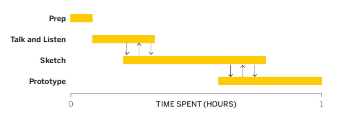
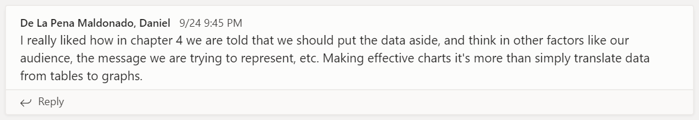
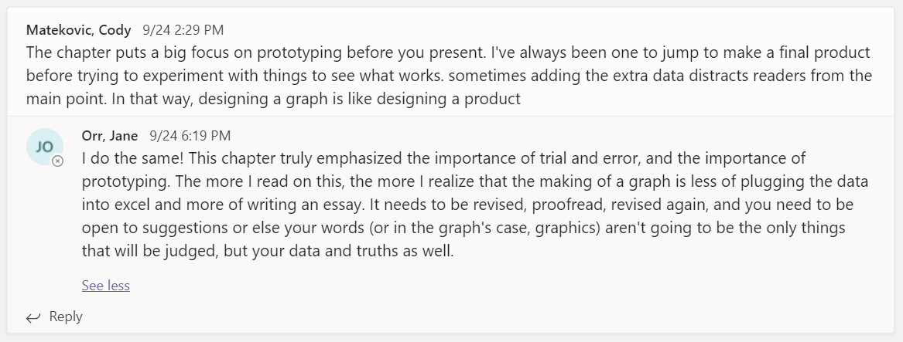
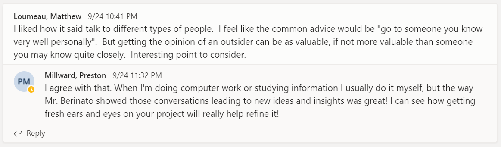

# Welcome to Class! {data-background=#e8c35d}

## Good Charts and Bad Charts

# Good Charts: Chapter 4 {data-background=#e8c35d}

## Chapter 4: Better charts in a couple of hours

## Reading Comments

## Reading Comments

## Reading Comments

## Sister Larson's favorite quotes

- "Programs visualize data. People visualize ideas."
- Talk and Listen will "be the most revelatory, but also possible the least natural."
- "Sketching is generative; it's meant to bring up ideas. Prototyping is iterative; it's meant to hone good ones."

# Practice with LEGO data {data-background=#e8c35d}

## Prep: 3 minutes

Think about what story you want to tell with your charts in Case Study 2.

>- Who are the charts for?
>- What is the most important message to share?

## Talk and listen: 6 minutes

(Zoom breakout rooms with a partner.)

Share ideas with your partner about:

> - What message you want to focus on
> - Why that message is important to you
> - Good ways to communicate that message

## Sketch: 4 minutes

Sketch a few ideas for a chart, and then pick one you'd like to prototype.

# Supplemental Reading {data-background=#e8c35d}

## [Graphical Summaries](https://byuistats.github.io/BYUI_CSE150_StatBook/describing-data.html#graphical-summaries)

> - [Bar Chart](https://byuistats.github.io/BYUI_CSE150_StatBook/CSE150_StatBook_files/figure-html/barchart-1.png)
> - [Box Plots](https://byuistats.github.io/BYUI_CSE150_StatBook/CSE150_StatBook_files/figure-html/boxplot-1.png)
> - [Histograms](https://byuistats.github.io/BYUI_CSE150_StatBook/CSE150_StatBook_files/figure-html/histogram-1.png)
> - [Scatter Plots](https://byuistats.github.io/BYUI_CSE150_StatBook/CSE150_StatBook_files/figure-html/scatterplot-1.png)

<!--- > - [Scatter Box Plot](https://byuistats.github.io/BYUI_CSE150_StatBook/CSE150_StatBook_files/figure-html/boxplot_w_data-1.png) --->

## Tableau Examples (Prototype)

