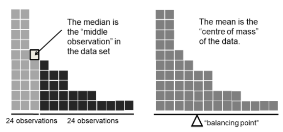

# Welcome to Class! {data-background=#e8c35d}

# Numerical Summaries {data-background=#e8c35d}

## [Measures of Center](https://byuistats.github.io/BYUI_CSE150_StatBook/describing-data.html#measures-of-center)

 

Mean, Median, Mode

- Mean: The balancing point.
- Median: The middle (or "half way") point.
- Mode: The most common.

##

[*source*](https://learningstatisticswithr.com/book/descriptives.html)

## Measures of Center Activity

 

- **Instructions:**
  - Generate 10 random numbers between 1 and 10
  - Plot the numbers on your graph
  - Calculate the mean and median. Mark them on your graph.
  - What do you notice about the mean's location, relative to the median?

 

- This will be easier if you pick one person to be the writer, one person to generate the random numbers, and one person to do the math.
- [Jam Board](https://jamboard.google.com/d/1zLvnfW7fe9ZVnUrUEjjnO_CrFCe5NOk6dFJuMxfdn5w/edit?usp=sharing)
- [Random Number Generator](https://www.google.com/search?q=random+number+between+1+and+10&rlz=1C1GCEJ_enUS882US882&oq=random+number+between+1+and+10&aqs=chrome..69i57j0l7.3815j0j9&sourceid=chrome&ie=UTF-8)

## [Measures of Center](https://byuistats.github.io/BYUI_CSE150_StatBook/describing-data.html#measures-of-center)

 

- What do you notice about the mean's location relative to the median?
- Why do we use measures of center?   
- Which measure of center do you prefer? 
- Which measure would represent a typical net worth of people living in Seattle better?
  - [Bill Gates walks into a bar](https://introductorystats.wordpress.com/2011/09/04/when-bill-gates-walks-into-a-bar/)

## [Measures of Center](https://byuistats.github.io/BYUI_CSE150_StatBook/describing-data.html#measures-of-center)

 

Percentiles and Quartiles

- Percentiles break the data into 100 groups
- Quartiles break the data into 4 groups

## [Measures of Spread](https://byuistats.github.io/BYUI_CSE150_StatBook/describing-data.html#measures-of-spread)

 

- Five number summary
- Standard deviation

## [Measures of Spread](https://byuistats.github.io/BYUI_CSE150_StatBook/describing-data.html#measures-of-spread)

 

If you were a Walmart buyer of cherry tomatoes, what specifications would you give them to make sure you got the size you wanted in the store?

- How might a supplier user your metric to their advantage?
- How could the metric provide safety for Walmart and the supplier?

## Numerical Summaries

 

- Are two data sets the same if they have the same mean?
- Are two data sets the same if they have the same spread?
- Are two data sets the same if they have the same mean and the same spread?
- [Interesting.](https://www.autodesk.com/research/publications/same-stats-different-graphs)

<!--------------------
## Measures of Center

## Measures of Center {data-transition="none"}

## Measures of Center {data-transition="none"}

## Measures of Center {data-transition="none"}

## Measures of Center

## Different Types of Center

[*source*](https://learningstatisticswithr.com/book/descriptives.html)

## Measures of Center Activity

> - **Instructions:**
>   - Generate 10 random numbers between 1 and 10
>   - Plot the numbers on your graph
>   - Calculate the mean and median. Cirlce them on your graph.

> - This will be easier if you pick one person to be the writer, one person to generate the random numbers, and one person to do the math.
> - [Jam Board](https://jamboard.google.com/d/1zLvnfW7fe9ZVnUrUEjjnO_CrFCe5NOk6dFJuMxfdn5w/edit?usp=sharing)
> - [Random Number Generator](https://www.google.com/search?q=random+number+between+1+and+10&rlz=1C1GCEJ_enUS882US882&oq=random+number+between+1+and+10&aqs=chrome..69i57j0l7.3815j0j9&sourceid=chrome&ie=UTF-8)

## [Measures of Center](https://byuistats.github.io/BYUI_CSE150_StatBook/describing-data.html#measures-of-center)

**Break into new groups and answer to the following questions:**   

> - What does the phrase 'measures of center' mean?
> - What do you notice about the mean's location relative to the median?
> - Why do we use measures of center?   
> - Which measure of center do you prefer? 
> - Which measure would represent a typical net worth of people living in Seattle better?

- [Bill Gates walks into a bar](https://introductorystats.wordpress.com/2011/09/04/when-bill-gates-walks-into-a-bar/)

## Questions on Measures of Center?

------------------------------------->

# Good Charts {data-background=#e8c35d}

## Chapter 4: Better charts in a couple of hours

> - **Prep:**  Visualization is creative communication. It takes time, so block it out in 1-2 hour chunks.
> - **Talk & Listen:** Find people that will listen and then talk their ear off.  But listen to what they don't understand.
> - **Sketch:** This is hard.  Don't be afraid to make mistakes. [Use a visualization topic guide](https://datavizcatalogue.com/) or use [good chart cheatsheet](images/gc/Ch4_chart_ideation.png).
> - **Prototype:** *Next class discussion*

## Talk, Sketch, Listen, Prototype...

After prep, all of these can happen at the same time when you are working in a group. As long as everyone has come prepared. 

[Hejazi and Voisin climate paper example](https://www.pnas.org/content/112/34/10635/tab-figures-data).

<!-----------------------

## Good Charts and Bad Charts

# Good Charts: Chapter 4 {data-background=#e8c35d}

## Chapter 4: Better charts in a couple of hours

## Reading Comments

## Reading Comments

## Reading Comments

## Sister Larson's favorite quotes

- "Programs visualize data. People visualize ideas."
- Talk and Listen will "be the most revelatory, but also possible the least natural."
- "Sketching is generative; it's meant to bring up ideas. Prototyping is iterative; it's meant to hone good ones."

----------------------------->

# Practice with LEGO data {data-background=#e8c35d}

## Prep

 

Think about what story you want to tell with your charts in Case Study 2.

>- Who are the charts for?
>- What is the most important message to share?

## With a partner:

**Talk and listen.** Share ideas with a partner about:

> - What message you want to focus on
> - Why that message is important to you
> - Good ways to communicate that message

**Sketch.** Sketch a few ideas for a chart, and then pick one you'd like to prototype.

<!--- 
# Supplemental Reading {data-background=#e8c35d}

## [Graphical Summaries](https://byuistats.github.io/BYUI_CSE150_StatBook/describing-data.html#graphical-summaries)

> - [Bar Chart](https://byuistats.github.io/BYUI_CSE150_StatBook/CSE150_StatBook_files/figure-html/barchart-1.png)
> - [Box Plots](https://byuistats.github.io/BYUI_CSE150_StatBook/CSE150_StatBook_files/figure-html/boxplot-1.png)
> - [Histograms](https://byuistats.github.io/BYUI_CSE150_StatBook/CSE150_StatBook_files/figure-html/histogram-1.png)
> - [Scatter Plots](https://byuistats.github.io/BYUI_CSE150_StatBook/CSE150_StatBook_files/figure-html/scatterplot-1.png)

> - [Scatter Box Plot](https://byuistats.github.io/BYUI_CSE150_StatBook/CSE150_StatBook_files/figure-html/boxplot_w_data-1.png) 
 
 
 --->

