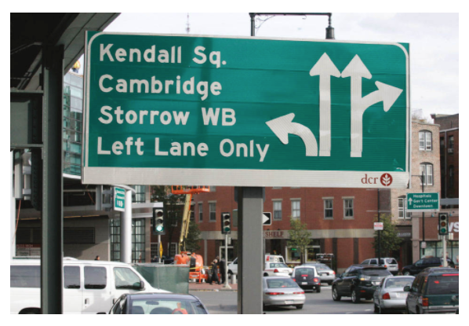
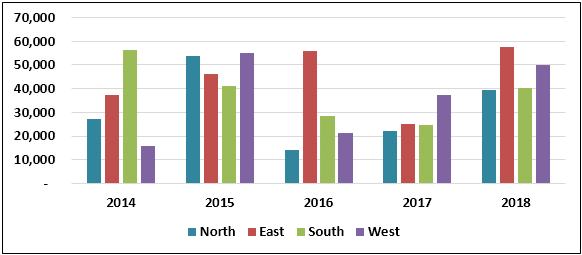

# Welcome to class!  {data-background=#e8c35d}

## Tidy Data Practice

 

What data do we need to make this chart?[.]()

## Case Study Presentations

In your groups:

> - Give each person about 3 minutes to present.
> - Provide feedback to that person. What did you like? What could be better?

<!-----------
## In your breakout rooms:

 

What have you learned about data and the process of collecting data?

Your group needs to list 3 things in Slack.

## EdConnect

>- Record a video and hit the green submit button.
>  - Your video might not show up right away
>  - Click on the class group name (left panel) to get it to refresh

---------->

# Good Charts {data-background=#e8c35d}

## Chapter 5: Refine to impress (Pg. 109-120)

 

**The ambiguity is paralyzing! People don't want to crash into your chart.**

<!----

## The traffic metaphor of visualization

With bad charts, instead of using the chart to guide the meeting, each member has to assign meaning themselves. The team members must slow down purposeful thinking and shift the focus of the meeting to understanding the chart instead of insight and decision making. Everyone gets distracted trying to figure the chart out as quickly as possible. The stress rises as understanding fades. A thought accident is grinding insight to a halt. Some participants are shifting attention to their phones or screens to avoid the collision. We are reading the chart instead of using it to get where the meeting is intended to go! 

---->

## Look-up Effect (Limit eye travel)

 

*Which was better - 2014 East or 2018 South?*

## Look-up Effect (Limit eye travel)

 

*Which was better - 2014 East or 2018 South?*

   
[Chart Source](https://www.wallstreetmojo.com/legends-in-excel-chart/)

<!-------------------
# Supplemental Reading {data-background=#e8c35d}

## You should know how to:

>- Build a histogram
>- Build a box plot
>- Build a line chart
>- Create bins from a continuous measure

Bring questions to class on Thursday.

## [Building a Histogram](https://help.tableau.com/current/pro/desktop/en-us/buildexamples_histogram.htm)

> 1. Drag Quantity to Columns
> 2. Click "Show Me" on the toolbar, then select the histogram chart type.

## [Create Bins from a Continuous Measure](https://help.tableau.com/current/pro/desktop/en-us/calculations_bins.htm)

> 1. In the Data pane, right-click (control-click on Mac) a measure and select Create > Bins.   
   
*How do you change the bin size?*   
*Why would we change the bin size?*
------------------->

# Case Study {data-background=#e8c35d}

## Data Journalism

 

[What Good Marathons and Bad Investments Have in Common](https://www.nytimes.com/2014/04/23/upshot/what-good-marathons-and-bad-investments-have-in-common.html)

## Case Study Deliverables

## Let's practice!

> - How to download data
> - Data "dictionary"

<!----------------
## Running marathons

What is normal about marathons?

>- Make sure you understand the deliverables!
>- Data dictionary
>- How to get the data
>- Article template

## Plotting Marathons

Let's make a histogram.
------------------------->
