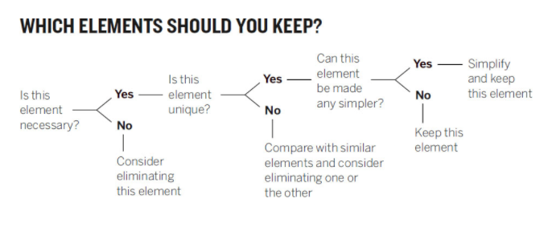

# Welcome to class! {data-background=#e8c35d}

# Good Charts {data-background=#e8c35d}

## Chapter 5: Refine to impress (Pg. 121-132)

 

Group discussion: What did you think of this chapter?

## Chapter 5: Refine to impress (Pg. 121-132)

 

> - A visualization is an abstraction
> - Avoid the 'belt-and-suspenders' design
> - Simple: Understanding? - Clarity? - Detail? 

# Tableau Tools {data-background=#e8c35d}

## The tools

 

> - [Using Shelves and Cards](https://help.tableau.com/current/pro/desktop/en-us/buildmanual_shelves.htm)
> - [Changing the mark or geometry of the graphic](https://help.tableau.com/current/pro/desktop/en-us/viewparts_marks_marktypes.htm)
> - [Editing the marks or geometry](https://help.tableau.com/current/pro/desktop/en-us/viewparts_marks_markproperties.htm)
> - [Reference Lines, Bands, Distributions, and Boxes](https://help.tableau.com/current/pro/desktop/en-us/reference_lines.html)

## Tools activity

 

> - Your group has 10 minutes to prepare a tutorial using the marathon data.
> - Then your group will present the tutorial to the class.

 

> - **Group 1:** [Using Shelves and Cards](https://help.tableau.com/current/pro/desktop/en-us/buildmanual_shelves.htm)
> - **Group 2:** [Changing the mark or geometry of the graphic](https://help.tableau.com/current/pro/desktop/en-us/viewparts_marks_marktypes.htm) and [Editing the marks or geometry](https://help.tableau.com/current/pro/desktop/en-us/viewparts_marks_markproperties.htm)
> - **Group 3:** [Reference Lines, Bands, Distributions, and Boxes](https://help.tableau.com/current/pro/desktop/en-us/reference_lines.html)

<!--------------------

## [Using Shelves and Cards](https://help.tableau.com/current/pro/desktop/en-us/buildmanual_shelves.htm)

> - The **Columns shelf** creates the columns of a table  (x-axis), while the **Rows shelf** creates the rows of a table (y-axis). You can place any number of fields on these shelves.
> - Right-click (control-click on Mac) the row or column you want to hide, and then select Hide.
> - Open the field menu for a field that has hidden columns or rows and select Show Hidden Data.
> - The Pages shelf lets you break a view into a series of pages so you can better analyze how a specific field affects the rest of the data in a view. 
> - [Measure Values and Measure Names](https://help.tableau.com/current/pro/desktop/en-us/datafields_understanddatawindow_meavalues.htm)
> - [Summary Cards](https://help.tableau.com/current/pro/desktop/en-us/inspectdata_summary.htm)

## [Changing the mark or geometry of the graphic](https://help.tableau.com/current/pro/desktop/en-us/viewparts_marks_marktypes.htm)

This is where we change the geometries shown on the page.

## [Editing the marks or geometry](https://help.tableau.com/current/pro/desktop/en-us/viewparts_marks_markproperties.htm)

## [Reference Lines, Bands, Distributions, and Boxes](https://help.tableau.com/current/pro/desktop/en-us/reference_lines.htm#Add_Bullet_Graphs)

Check out the Analytics (much more like data summaries tab) next to Data.

--------------------------->

# Case Study {data-background=#e8c35d}

## Understanding the deliverables

- A **spatial** chart displays spatial data - aka, location.
- A **temporal** chart displays temporal data - aka, time. 
- A **variable summary** chart helps us understand the distribution (values and spread) of a single variable 
- The text mark in Tableau will help with the **data summary table**

## How to find stories in data

## Examples of data journalism

 

> - [Star Wars article](https://fivethirtyeight.com/features/americas-favorite-star-wars-movies-and-least-favorite-characters/)
> - [Lebron James article](https://www.espn.com/nba/story/_/id/24999715/lebron-james-atlas-kirk-goldsberry-king-evolving-offensive-game)
> - [Most wanted cars in America](https://priceonomics.com/the-most-wanted-cars-in-america/)

## Find your own story

 

Load some of the marathon data into Tableau and start looking for a story!

<!-----------------------------------------------
## Find your own example

 

>- [pudding.cool](https://pudding.cool/)
>- [fivethirtyeight](https://fivethirtyeight.com/)
>- [Our World in Data](https://ourworldindata.org/)
>- [priceonomics](https://priceonomics.com/)
------------------------------------------------------------->

## Midpoint Quiz

 

1. Have you posted a draft chart to our class conversation space with a short description?
2. Have you shown and described one of your draft charts to a friend or family member?
3. Have you helped at least one classmate by providing feedback on his or her chart?
