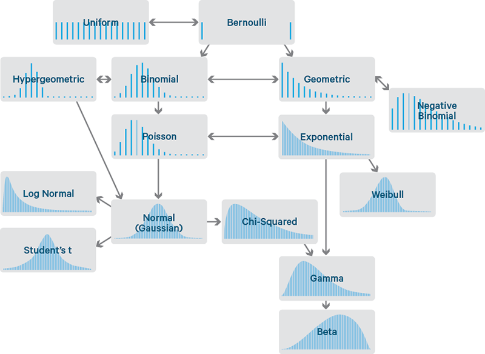
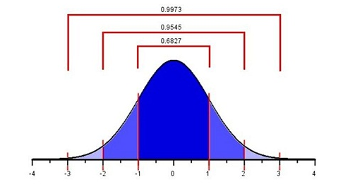

# The Normal Distribution {data-background=#f7d754}

Welcome to class!

# The Normal Distribution {data-background=#f7d754}

## What is a "distribution"?

- The distribution of a variable tells us:
   - What values are possible
   - How frequently those values occur
   
## Example

[House Prices](https://www.google.com/search?q=house+prices+distribution&rlz=1C1GCEJ_enUS882US882&sxsrf=ALeKk03tXT3KdKDrHQSnMdHURLxSwFykTA:1602547328772&source=lnms&tbm=isch&sa=X&ved=2ahUKEwjTpJGCorDsAhWOrp4KHa31BYoQ_AUoAnoECBUQBA&biw=1920&bih=937)

## Different Types of Distributions

## The Normal Distribution

>- The central value (the mean) is the most probable value
>- On either side of the mean, the probability of the data decreases symmetrically
>- The spread of the data can be described by the standard deviation
>- The higher the standard deviation, the more spread out the data is

## Density Curves

All density curves, including normal density curves, have two basic properties:

>- The total area under the curve equals 1.
>- The density curve always lies on or above the horizontal axis.

Because of these two properties, the area under the curve can be treated as a probability.

## The 68-95-99.7% Rule

# Marathon Case Study {data-background=#f7d754}

<!--------------

## Marathon Data

## Types of Charts

## Any questions about the upcoming case study?

# Visualizating variables on maps {data-background=#6897bb}

## Using geographic region chloropleths

## Using dots

## Making maps in Tableau

> - [Get Started Mapping with Tableau](https://help.tableau.com/current/pro/desktop/en-us/buildexamples_maps.htm)
> - Multiple data sets in one Tableau file
> - Joining data sets in a Tableau file

# Case Study {data-background=#6897bb}

## Data interrogation time

Can you find an interesting spatial relationship (lat, long, state, elevation) to race times?

------------->
