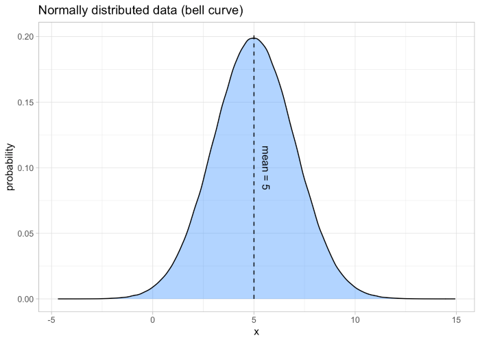
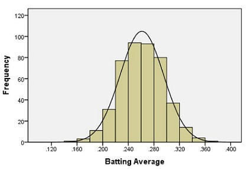
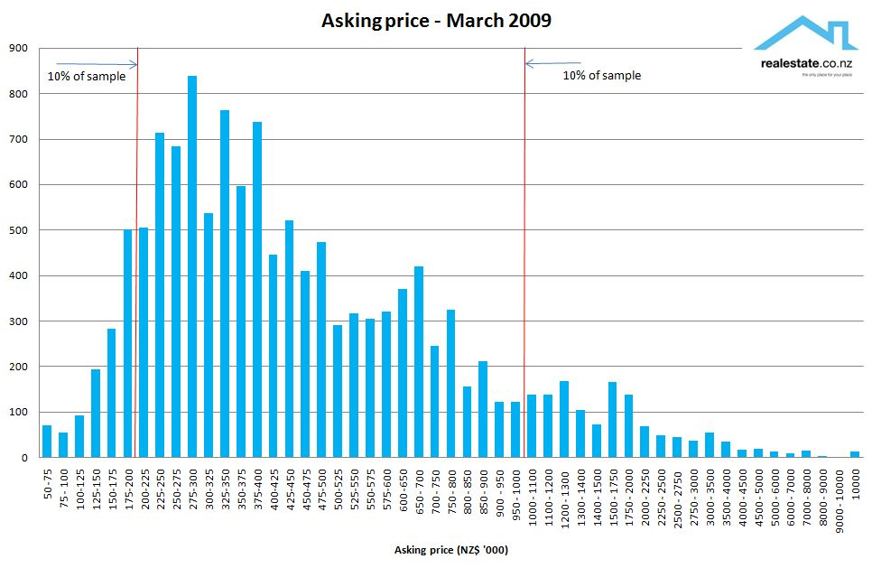
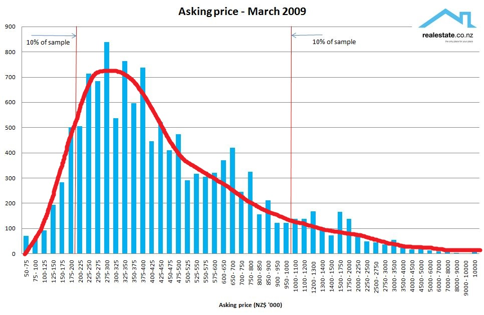
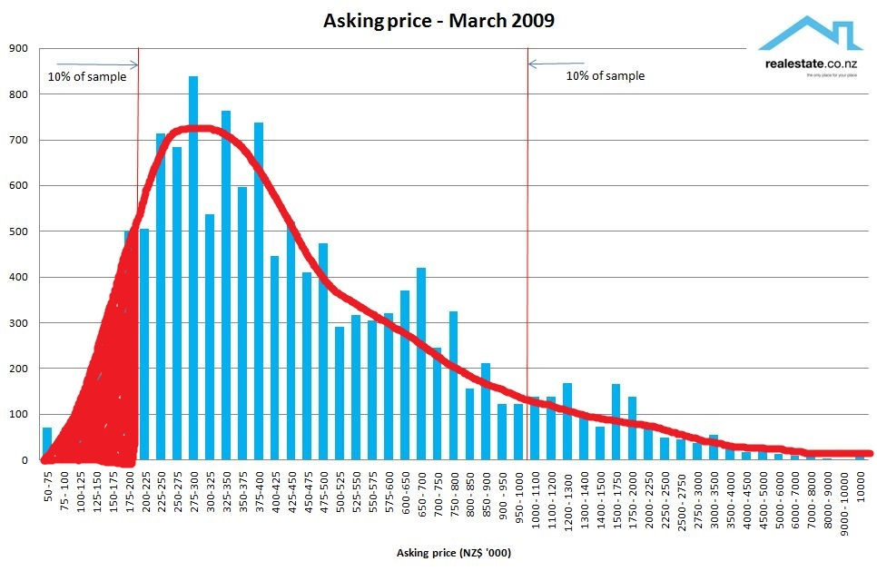
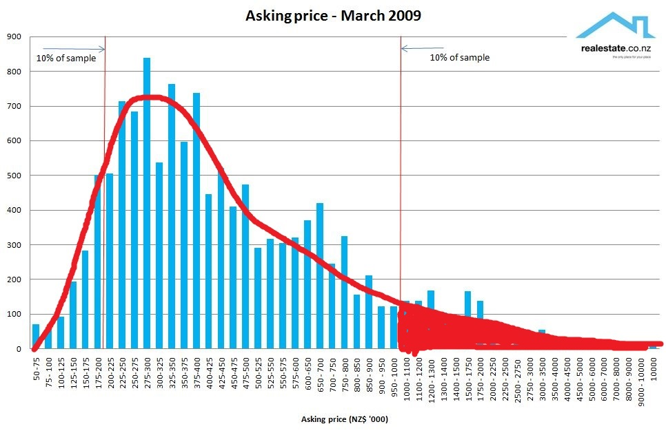
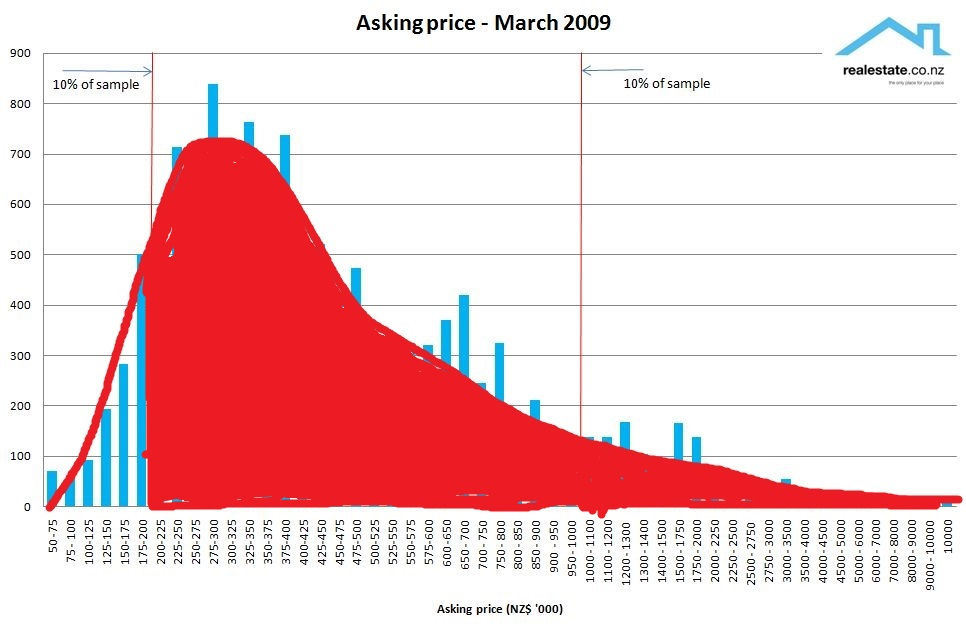
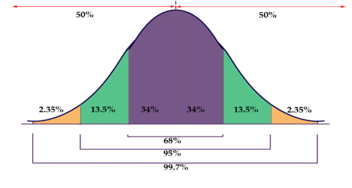
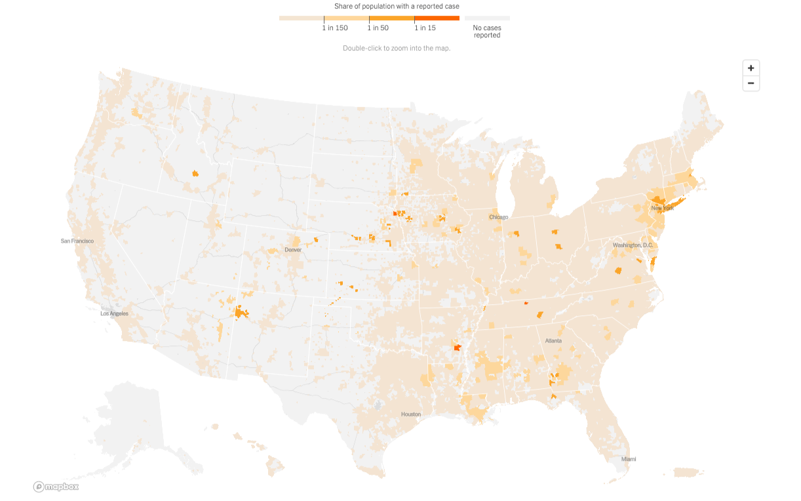
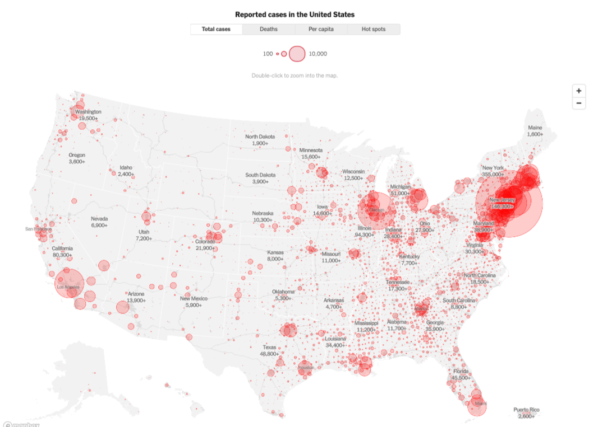

<!---------------------
Hey Sister Larson
These might be good links to use next semester
https://byuistats.github.io/BYUI_CSE150_StatBook/introduction-to-the-normal-distribution-and-z-scores.html#normal

https://galtonboard.com/Content/Images/distribution/monthly-temperature-difference-large.png
https://galtonboard.com/probabilityexamplesinlife

https://www.google.com/search?q=eye+color+distribution&rlz=1C1GCEJ_enUS882US882&sxsrf=ALeKk004aXnqyzoWi7S5aInHHH_KSHUdvw:1612285520818&source=lnms&tbm=isch&sa=X&ved=2ahUKEwjeovrN18vuAhX-GDQIHUr1AqcQ_AUoAXoECCUQAw&biw=1920&bih=969#imgrc=y0H1QalhPKuqyM

https://www.google.com/search?q=height+distribution&rlz=1C1GCEJ_enUS882US882&sxsrf=ALeKk03TmDxoQ9rYO9K4NYNTs56O2EwIJw:1612285478750&source=lnms&tbm=isch&sa=X&ved=2ahUKEwiayPK518vuAhWwCjQIHdmdAA4Q_AUoAXoECBYQAw&biw=1920&bih=969#imgrc=6Ltz52iNbCCe8M
---------------------->

# Welcome to class! {data-background=#e8c35d}

# The Normal Distribution {data-background=#e8c35d}

## What is a "distribution"?

 

> - The distribution of a variable tells us:
>    - What values are possible
>    - How frequently those values occur
   
## Example

 

[House Prices](https://www.google.com/search?q=house+prices+distribution&rlz=1C1GCEJ_enUS882US882&sxsrf=ALeKk03tXT3KdKDrHQSnMdHURLxSwFykTA:1602547328772&source=lnms&tbm=isch&sa=X&ved=2ahUKEwjTpJGCorDsAhWOrp4KHa31BYoQ_AUoAnoECBUQBA&biw=1920&bih=937)

## Different Types of Distributions

 

[Examples](https://www.google.com/imgres?imgurl=https%3A%2F%2Fimage3.slideserve.com%2F6689375%2Fcontinuous-probability-distributions-n.jpg&imgrefurl=https%3A%2F%2Fwww.slideserve.com%2Fbrenna-hardin%2Fcontinuous-probability-distributions&tbnid=nRSEOY-mLcm6QM&vet=12ahUKEwi6uOq7wsvuAhVFYM0KHW7yAsIQMygWegUIARD5AQ..i&docid=kMx4q3yatMohNM&w=720&h=540&q=probability%20distributions&ved=2ahUKEwi6uOq7wsvuAhVFYM0KHW7yAsIQMygWegUIARD5AQ)

## The Normal Distribution

 

- The central value (the mean) is the most probable value
- On either side of the mean, the probability of the data decreases symmetrically
- The spread of the data can be described by the standard deviation
- The higher the standard deviation, the more spread out the data is

## Density Curves

 

All density curves, including normal density curves, have two basic properties:

>- The total area under the curve equals 1.
>- The density curve always lies on or above the horizontal axis.

Because of these two properties, the area under the curve can be treated as a probability.

## Housing Example[.](http://unconditional.co.nz/blog/2009/04/)

 

## Housing Example

 

## Housing Example

 

## Housing Example

 

## Housing Example

 

## The 68-95-99.7% Rule[.](https://www.ck12.org/statistics/properties-of-a-normal-distribution/lesson/probability-density-function-pst/)

 

The normal distribution has a special rule that helps us calculate probabilities.

# Marathon Case Study {data-background=#e8c35d}

<!--------------

## Marathon Data

## Types of Charts

## Any questions about the upcoming case study?

# Visualizating variables on maps {data-background=#6897bb}

## Using geographic region chloropleths

## Using dots

## Making maps in Tableau

> - [Get Started Mapping with Tableau](https://help.tableau.com/current/pro/desktop/en-us/buildexamples_maps.htm)
> - Multiple data sets in one Tableau file
> - Joining data sets in a Tableau file

# Case Study {data-background=#6897bb}

## Data interrogation time

Can you find an interesting spatial relationship (lat, long, state, elevation) to race times?

------------->
