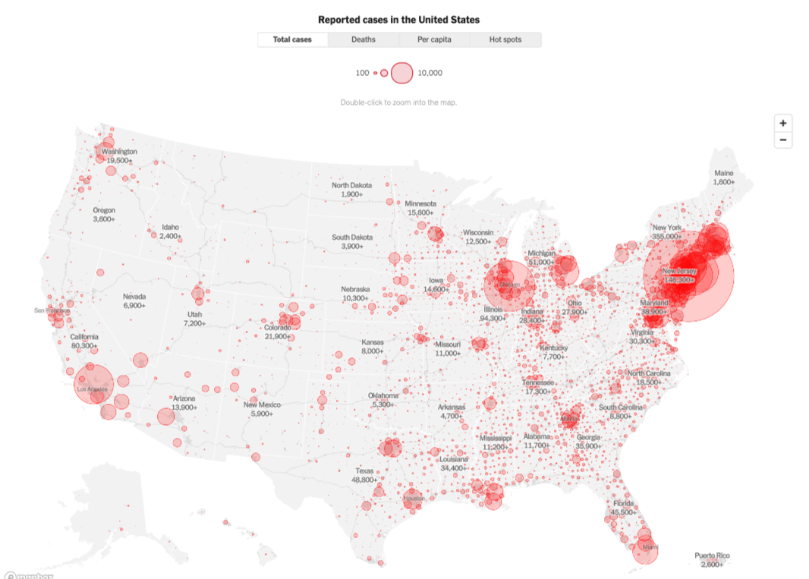

## Outline 

> 1. Discuss tidy data
> 2. Review Good Reads (Refining to persuade)
> 3. Highlight visualizing data with maps
> 4. Work on projects

# Tidy data {data-background=#6897bb}

## In tidy data:

> 1. Each variable forms a column.
> 2. Each observation forms a row.
> 3. Each type of observational unit forms a table.

## Five most common problems

> * Column headers are values, not variable names.
> * Multiple variables are stored in one column.
> * Variables are stored in both rows and columns.
> * Multiple types of observational units are stored in the same table.
> * A single observational unit is stored in multiple tables.

## Tidy data ensures that values of different variables from the same observation are always paired.

# Good Reads {data-background=#6897bb}

## Chapter 6: Refine to Persuade (pgs. 133-142)

> - You are trying to reveal truths dormant in the data; to make a case; compete for attention.
> - It is often the [data scientists] job to *show* all the data - to be as objective as possible.
>    - Data presentation
>    - Data analysis
>    - Persuasion with data
> - We decided that architecture, analytics, and visualization are all equal players.

## Chapter 6: Line Charts vs. Bar Charts

## Chapter 6: Creating the thinking unit

# Visualizating variables on maps {data-background=#6897bb}

## Using geographic region chloropleths

## Using dots

## Making maps in Tableau

> - [Get Started Mapping with Tableau](https://help.tableau.com/current/pro/desktop/en-us/buildexamples_maps.htm)
> - Multiple data sets in one Tableau file
> - Joining data sets in a Tableau file

# Case Study {data-background=#6897bb}

## Data interrogation time

Can you find an interesting spatial relationship (lat, long, state, elevation) to race times?

