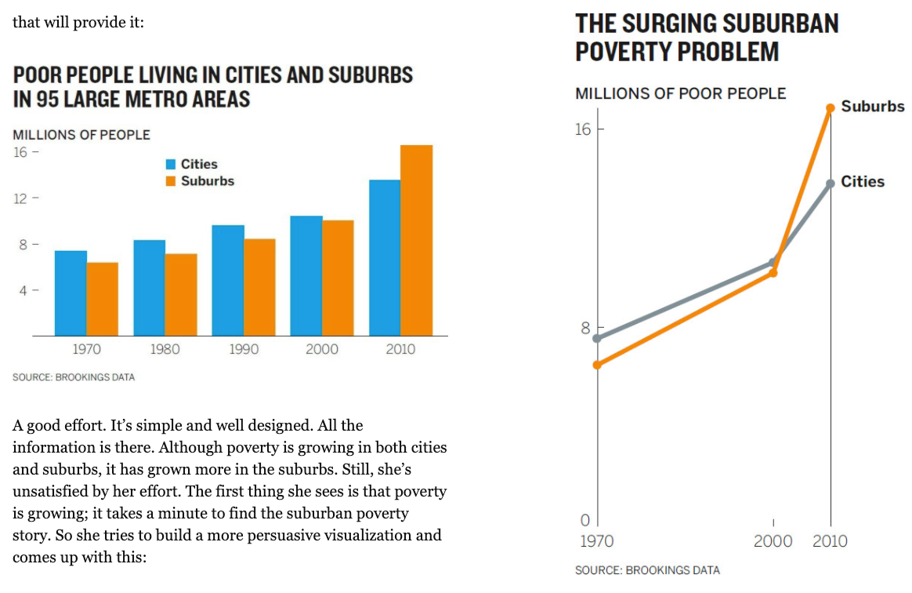
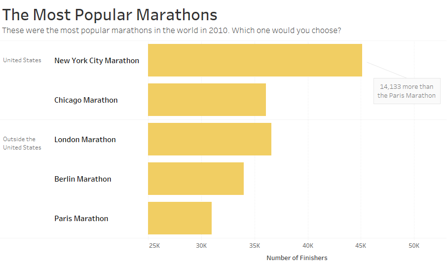

# Welcome to class! {data-background=#e8c35d}

# Good Charts {data-background=#e8c35d}

## Chapter 6: Refine to Persuade

> - You are trying to reveal truths dormant in the data; to make a case; compete for attention.
> - It is often the "data scientists" job to show all the data - to be as objective as possible.
> - There is a difference between:
>    - Data presentation
>    - Data analysis
>    - Persuasion with data

## Chapter 6: Line Charts vs. Bar Charts

## Chapter 6: Heighten the effect

## Chapter 6: Every chart is a manipulation

## Chapter 6: Every chart is a manipulation

>"Perfectly objective visualizations don't exist, because perfectly objective brains don't exist."

# Supplemental Reading {data-background=#e8c35d}

##  Editing your graphic in Tableau

> - [Sorting](https://help.tableau.com/current/pro/desktop/en-us/sortgroup_sorting_computed_howto.htm)
> - [Filters](https://www.youtube.com/watch?v=WN548Hpa-iY)
> - [Tooltips](https://www.youtube.com/watch?v=P1V3SPiiPM8)
> - [Annotations](https://help.tableau.com/current/pro/desktop/en-us/annotations_annotations_add.htm)
> - [Grouping](https://www.youtube.com/watch?v=UAPH5W9Pq90)

## Tools Activity

Can you make this chart?

# Case Study {data-background=#e8c35d}
