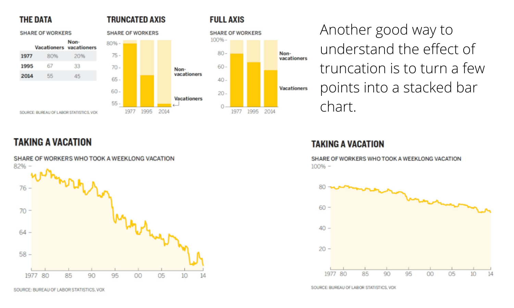
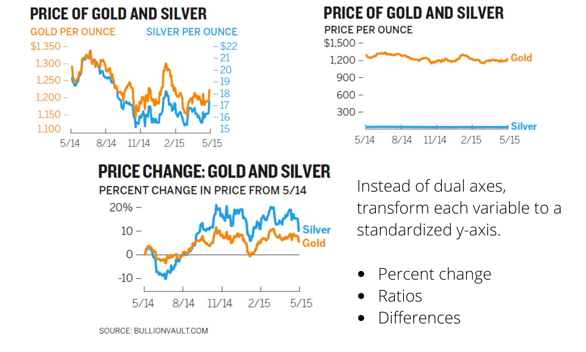
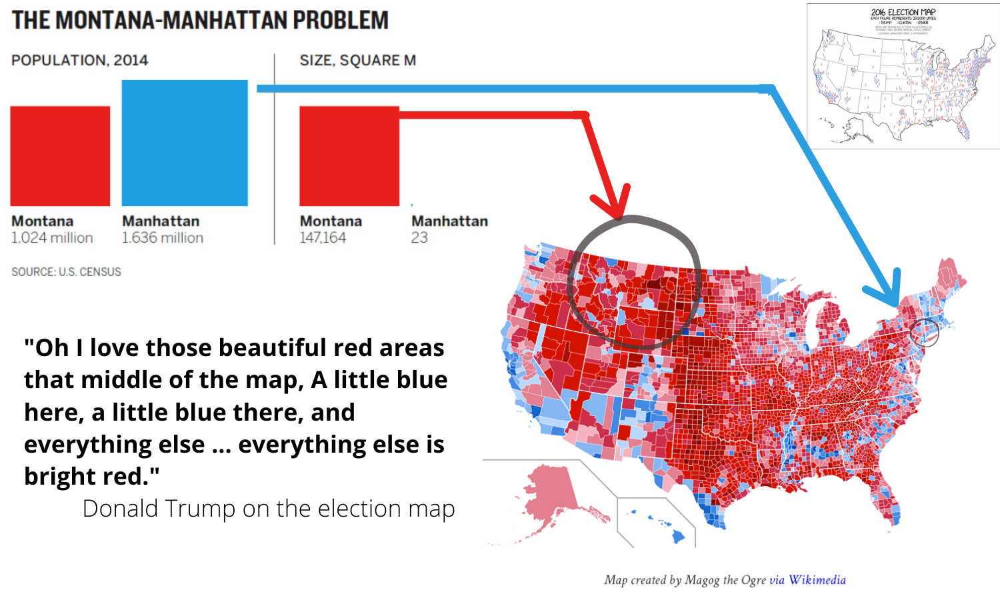

# Week 6: Child Health  {data-background=#f7d754}

Welcome to class! 

Make sure you have the child health data downloaded and Tableau open.

# Good Charts {data-background=#f7d754}

## Group Discussion

In your breakout rooms:

>- Everyone share one insight from the chapter.
>- Then, discuss the question "How do decide if a chart is persuasive and manipulative?"

## Chapter 7: Persuasion or Manipulation? (Truncated Axes)

> - **The truncated axes:** complicated but should be used with thought.

## Chapter 7: Persuasion or Manipulation? (Dual Axes)

## Chapter 7: Persuasion or Manipulation? (Maps)

## You decide: Persuasion or Manipulation?

>- [Spurious correlations](https://www.tylervigen.com/spurious-correlations)
>- [Job losses and gains](https://www.moonofalabama.org/2020/06/cnbc-makes-up-v-shaped-charts-to-support-false-claims-of-economic-recovery.html)
>- [Tax cuts](https://www.statisticshowto.com/misleading-graphs/)

##

> Persuasion is a knife, and knives can be used in any number of ways: skillfully, carelessly, recklessly, even illicitly.

<!----
# Tableau Tools {data-background=#6897bb}

## Tools questions

> - [Grouping](https://www.tableau.com/learn/tutorials/on-demand/grouping)
> - [Filtering](https://www.tableau.com/learn/tutorials/on-demand/ways-filter)
> - [Annotations](https://help.tableau.com/current/pro/desktop/en-us/annotations_annotations_add.htm)
---->

# Case Study {data-background=#f7d754}

## Breakout Rooms

With your group, open these datasets in excel and use the data dictionary to understand the variables. Be preprared to teach the class about your datasets.

**Group 1:**

days_365

childhealth_summary

**Group 2:**

childhealth_dutch

birth_dutch

**Group 3:**

childhealth_us

birth_us

## [Why does height measure health?](https://www.who.int/nutgrowthdb/about/introduction/en/index2.html)

> - Let's plot each child's height by their age.
> - What can we discern about each child?
> - What can we discern about each country?

<!--------
## Understanding Z-scores 

> - How can Z-scores be a measure of health?

$$Z = \frac{x - \mu}{\sigma}$$

## Let's check the z-score calculations of our data

> - Calculated Fields
> - Plotting LAZ by agedays 
--------->

# Looking Ahead {data-background=#f7d754}

## Visualization Discussions {data-background=#f7d754}

[Stephen Curry Has a Popcorn Problem](https://www.nytimes.com/interactive/2019/04/12/sports/basketball/stephen-curry-warriors-popcorn.html)

## Z-scores

Start exploring the data, and make sure you do the reading for Thursday!
