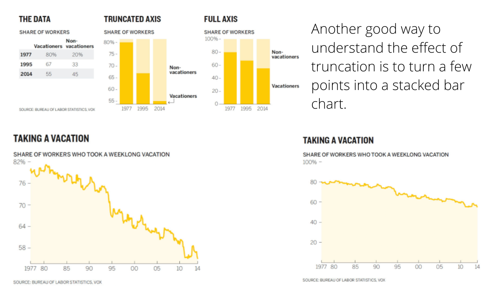

# Week 6: Child Health and Z-scores  {data-background=#f7d754}

Welcome to class! 

Have your marathon case study open and ready to share with your group.

# Case Study Presentations  {data-background=#f7d754}

## Open Microsoft Teams

Today we are going to provide feedback on case studies by writing comments in Microsoft Teams.

## Examples of case study comments.

>- **Helpful feedback:**
>   - "Wow, how did you make that line chart? I really like the way it shows _______."
>   - "On this slide, I think your message would be clearer if you did _________ instead."
>- **Not helpful feedback:**
>   - "i really liked ur graphs."
>   - "your graphs could be better"

## What is normal about marathons?

Instructions for your groups/breakout rooms:

>- **When it's your turn to present:**
>   - Present your case study, explaining your graphs and the message(s) you wanted to communicate.
>- **When someone else is presenting:** 
>   - Pay attention to their presentation. Then share your feeback 1) verbally and 2) by adding a comment in Teams and tagging the student.

<!-------
# Good Reads {data-background=#6897bb}

## Chapter 7: Persuasion or Manipulation? (Truncated Axes)

> - **The truncated axes:** complicated but should be used with thought.

## Chapter 7: Persuasion or Manipulation? (Dual Axes)

> - It creates a relationship by [fiat](https://www.google.com/search?sxsrf=ALeKk01gVeWIh-n6E7yRv4vuGSwK3Ggy8A%3A1590605433288&ei=ebbOXoaMEbbP0PEP_LGc8AU&q=fiat+definition&oq=fiat+def&gs_lcp=CgZwc3ktYWIQAxgAMgoIABCRAhBGEPkBMgUIABCRAjICCAAyAggAMgIIADICCAAyAggAMgIIADICCAAyAggAOgQIABBHOgQIABBDOgcIABAUEIcCUPEzWOg-YJdSaABwAXgAgAFbiAHQApIBATSYAQCgAQGqAQdnd3Mtd2l6&sclient=psy-ab).

## Chapter 7: Persuasion or Manipulation? (Maps)

# Tableau Tools {data-background=#6897bb}

## Tools questions

> - [Grouping](https://www.tableau.com/learn/tutorials/on-demand/grouping)
> - [Filtering](https://www.tableau.com/learn/tutorials/on-demand/ways-filter)
> - [Annotations](https://help.tableau.com/current/pro/desktop/en-us/annotations_annotations_add.htm)
------>

# Child Health and Z-scores {data-background=#f7d754}

## Understanding Z-scores 

$$Z = \frac{x - \mu}{\sigma}$$

## Understanding Z-scores 

$$Z = \frac{x - \mu}{\sigma}$$

> - How can Z-scores be a measure of health?

## [Why does height measure health?](https://www.who.int/nutgrowthdb/about/introduction/en/index2.html)

> - Let's plot each child's height by their age.
> - What can we discern about each child?
> - What can we discern about each country?

## Let's check the z-score calculations of our data

> - Calculated Fields
> - Plotting LAZ by agedays 

