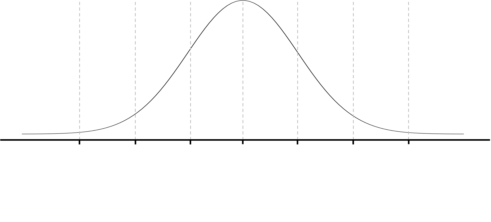

# Welcome to Class! {data-background=#f7d754}

What is your favorite holiday food?

(Type your answer in the chat!)

# Dimension vs. Attribute vs. Measure {data-background=#f7d754}

## Most often:

**You will often hear variables described as *quantitative* or *qualitative*.**

- *Quantitative* sounds like "quantity", which is a number. Also called *numerical*.
- *Qualitative* sounds like "quality", which is a description like good/better/best. Also called *categorical*.

## In Tableau:

**Tablaeu has its own vocabulary, which can be annoying.**

- Quantitative/numerical variables are called *measures*. (Think "can I measure this?") Measures can be aggregated (and often are by default).
- Qualitative/categorical variables are called *dimensions*. Dimenions affect the "level of detail" in your graph.

**The color of a variables pill gives us additional information:**

- *Green* pills are continuous (can have ANY value).
- *Blue* pills are discrete (can only have specific values).

## But what about attributes?

- **Dimensions** affect the "level of detail".
- **Measures** are used to aggregate data.
- **Attributes** are also a type of aggregation, meaning they tell you *one* thing about *many* data points. Attributes find the *common ground* between data points.

# Z-Scores {data-background=#f7d754}

##

Calculate the z-score for your own height and add it to the google document.

[Link](https://docs.google.com/spreadsheets/d/1cLXCZBATuC0-jq72ASMtMroFX06ZtkRGSVcfbRLmkyQ/edit?usp=sharing)

##

<!---
https://tasks.illustrativemathematics.org/content-standards/HSS/ID/A/4/tasks/1020#:~:text=The%20heights%20of%20adult%20men,standard%20deviation%20of%202.5%20inches.
--->

>- Heights of adult men in the United States are normally distributed with a mean of 70 inches and a standard deviation of 3 inches.

>- Heights of adult women in the United States are normally distributed with a mean of 64.5 inches and a standard deviation of 2.5 inches.

$$Z = \frac{x - \mu}{\sigma}$$

## Answer these questions:

>- Who is the tallest person in our class?
>- Who's height in the most extreme, compared to their own gender?

## Z-scores and Probabilities

<!------------

# Good Reads {data-background=#6897bb}

## Chapter 8: Present to Persuade (Pg. 177-192)

**When it's time to talk, don't read the picture.**

## Hans Rosling's Idea Discussion

<iframe width="560" height="315" src="https://www.youtube.com/embed/jbkSRLYSojo" frameborder="0" allow="accelerometer; autoplay; encrypted-media; gyroscope; picture-in-picture" allowfullscreen></iframe>

## Vox's Chart discussion

**I worry that Scott has oversold not explaining the chart**

<iframe width="560" height="315" src="https://www.youtube.com/embed/O-3Mlj3MQ_Q" frameborder="0" allow="accelerometer; autoplay; encrypted-media; gyroscope; picture-in-picture" allowfullscreen></iframe>

- What are your thoughts?

---->

# Case Study {data-background=#f7d754}

## [Why does height measure health?](https://www.who.int/nutgrowthdb/about/introduction/en/index2.html)

> - Let's plot each child's height by their age.
> - What can we discern about each child?
> - What can we discern about each country?

## Understanding Z-scores 

> - How can Z-scores be a measure of health?

$$Z = \frac{x - \mu}{\sigma}$$

## Let's check the z-score calculations of our data

> - Calculated Fields
> - Plotting LAZ by agedays 

## Children's heights
   
Any questions about the deliverables?