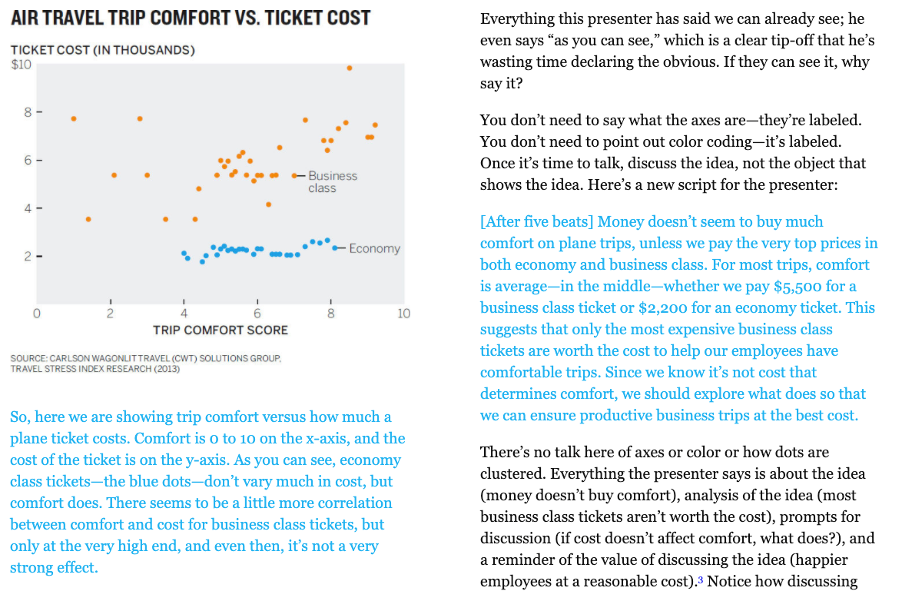

# Good Reads {data-background=#6897bb}

## Chapter 8: Present to Persuade (Pg. 177-192)

**When it's time to talk, don't read the picture.**

## Hans Rosling's Idea Discussion

<iframe width="560" height="315" src="https://www.youtube.com/embed/jbkSRLYSojo" frameborder="0" allow="accelerometer; autoplay; encrypted-media; gyroscope; picture-in-picture" allowfullscreen></iframe>

## Vox's Chart discussion

**I worry that Scott has oversold not explaining the chart**

<iframe width="560" height="315" src="https://www.youtube.com/embed/O-3Mlj3MQ_Q" frameborder="0" allow="accelerometer; autoplay; encrypted-media; gyroscope; picture-in-picture" allowfullscreen></iframe>

- What are your thoughts?

# Case Study {data-background=#6897bb}

## [Why does height measure health?](https://www.who.int/nutgrowthdb/about/introduction/en/index2.html)

> - Let's plot each child's height by their age.
> - What can we discern about each child?
> - What can we discern about each country?

## Understanding Z-scores 

> - How can Z-scores be a measure of health?

$$Z = \frac{x - \mu}{\sigma}$$

## Let's check the z-score calculations of our data

> - Calculated Fields
> - Plotting LAZ by agedays 

## Children's heights
   
1. One slide should explain what a z-score is and how it is calculated for our graphics.   
2. One slide should show height adjusted z-scores (HAZ) for a few healthy and a few unhealthy children from each gender over all the times using the MAL-ED data.   
3. 1-2 Slides about the health of the children at 365 days (1-year) for multiple countries.

   - One chart should show the distribution of heights for children from at least 4 countries at ~365 days.
   - One chart should have visualizations of the health of the children at ~365 days for each country (height adjusted z-scores).

4. Take the time to explain your concerns about the health of the children of the study based on their z-scores.
5. One slide should show a plot of the heights of the dutch children over time. Take the time to describe the key takeaways about their growth.
