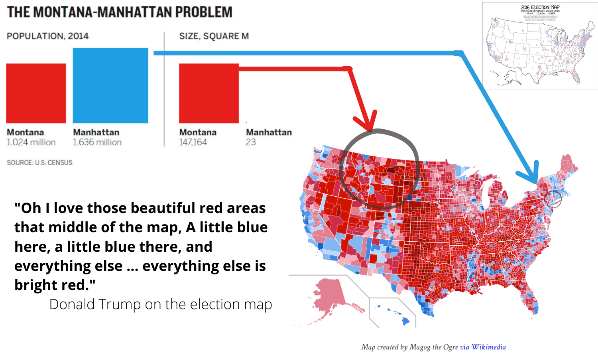

# Welcome to class!   {data-background=#e8c35d}

# Tableau Challenge  {data-background=#e8c35d}

## Can you make this chart?

 

 

Resources:

> - marathon_2010_data4.csv
> - [Grouping](https://www.tableau.com/learn/tutorials/on-demand/grouping)
> - [Filtering](https://www.tableau.com/learn/tutorials/on-demand/ways-filter)
> - [Annotations](https://help.tableau.com/current/pro/desktop/en-us/annotations_annotations_add.htm)

# Good Charts  {data-background=#e8c35d}

## Chapter 7: Persuasion or Manipulation? (Truncated Axes)

 

> - **The truncated axes:** complicated, and should be used with thought.

## Chapter 7: Persuasion or Manipulation? (Dual Axes)

 

> - It creates a relationship by [fiat](https://www.google.com/search?sxsrf=ALeKk01gVeWIh-n6E7yRv4vuGSwK3Ggy8A%3A1590605433288&ei=ebbOXoaMEbbP0PEP_LGc8AU&q=fiat+definition&oq=fiat+def&gs_lcp=CgZwc3ktYWIQAxgAMgoIABCRAhBGEPkBMgUIABCRAjICCAAyAggAMgIIADICCAAyAggAMgIIADICCAAyAggAOgQIABBHOgQIABBDOgcIABAUEIcCUPEzWOg-YJdSaABwAXgAgAFbiAHQApIBATSYAQCgAQGqAQdnd3Mtd2l6&sclient=psy-ab)
> - [Spurious correlations](https://www.tylervigen.com/spurious-correlations)

## Chapter 7: Persuasion or Manipulation? (Maps)

 

## Chapter 8: Present to Persuade

 

**When it's time to talk, don't read the picture.**

<!----------------------
## Hans Rosling's Idea Discussion

 

<iframe width="560" height="315" src="https://www.youtube.com/embed/jbkSRLYSojo" frameborder="0" allow="accelerometer; autoplay; encrypted-media; gyroscope; picture-in-picture" allowfullscreen></iframe>
------------------------->

## Telling Stories

 

[fallen.io](http://www.fallen.io/ww2/)

- *One million, six million, seventy million. Spoken or written, these numbers become a buszz. Incomprehensible. Presented graphically, they hit closer to the heart. As the Soviet losses climbed, I thought my browser had frozen. Surely the top of the column bust have been reached by now, I thought.*

## Present to Persuade Summary

> - Show the chart and stop talking
> - Don't read the picture
> - For unusual visual forms, guide the audience
> - Use [reference charts](https://projects.fivethirtyeight.com/tom-brady-touchdown-passes/)
> - Show something simple, leave behind more detail
> - Tell stories

## Vox's Chart discussion

 

**Has Scott Berinato (Good Charts) oversold not explaining the chart?**

<iframe width="560" height="315" src="https://www.youtube.com/embed/O-3Mlj3MQ_Q" frameborder="0" allow="accelerometer; autoplay; encrypted-media; gyroscope; picture-in-picture" allowfullscreen></iframe>

# Supplemental Reading: [Probability & Sampling](https://byuistats.github.io/BYUI_CSE150_StatBook/probability-sampling-and-confidence-intervals.html) {data-background=#e8c35d}

## What is probability?

## Understanding Probability

 

**One die probability**

What is x? What do the 1 and 6 represent?

$$p(x) = \frac{1}{6} \approx 0.1667$$

 

**What does it mean that rolling a die is a "random process"?**

[Simulation](https://istats.shinyapps.io/RandomNumbers/)

## Understanding Probability

 

**Sum of two dice probability**

What is $x$ or the event now?

- [Catan Tokens](images/other/catan_tokens.jpg)
- [Sum of two dice](images/other/sum_of_two_dice.jpg)

## Sampling and Probability

 

A study was done on the heights of BYU and BYU-Idaho students to find the probability of a student being over 6 feet tall. 

The results:

- *The probability of a BYU-Idaho student being taller than 6 feet is 20%.*
- *The probability of a BYU student being taller than 6 feet is 100%.*

 

- Do you believe this data? What might be the problem?
- 10 students were sampled from both schools.
- The BYU-Idaho students were randomly selected from the student population. (SRS)
- The BYU students were selected off the basketball court. (Convenience)

## Sampling and Probability

 

What makes a collection of data a good example or representative of the general population?

## Sampling from a Population

You have 150 students that graduated from a major in 2019 and you want to take a sample of 25 of them to estimate starting salaries.

Review the [Section 3.2](https://byuistats.github.io/BYUI_CSE150_StatBook/probability-and-sampling.html) and describe the way you would do each sampling method for the scenario above.

> - Convenience sample
> - Simple random sample (SRS) 
> - Systematic random sample 
> - Clustered random sample
> - Stratified random sample
