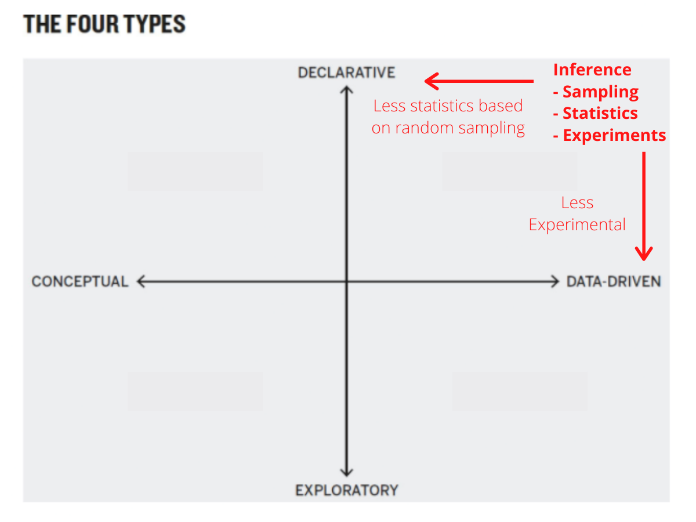

# From Data Decisions to Population Decisions {data-background=#f7d754}

Welcome to Class! 

Open your child health case study and be ready to present it to your group.

## Case Study Presentations

## Tracking Progress

Remember, you need:

> - 6 case study presentations (In Class)
> - 6 case study "comments" (In Class)
> - 6 Tool Tips (Microsoft Teams)

If you miss class when we share our case studies, you can present it in Microsoft Teams, but you miss out on the points for commenting.

# Good Charts {data-background=#f7d754}

## Present to Persuade

*One million, six million, seventy million. Spoken or written, these numbers become a buszz. Incomprehensible. Presented graphically, they hit closer to the heart. As the Soviet losses climbed, I thought my browser had frozen. Surely the top of the column bust have been reached by now, I thought.*

> - See minute 6:05 <http://www.fallen.io/ww2/>

<!------------
## Present to Persuade Summary

> - Show the chart and stop talking
> - Don't read the picture
> - For unusual visual forms, guide the audience
> - Use reference charts
> - Show something simple, leave behind more detail
> - Tell stories
----------------->

# Supplemental Reading {data-background=#f7d754}

## [Section 3: Probability & Sampling](https://byuistats.github.io/BYUI_CSE150_StatBook/probability-sampling-and-confidence-intervals.html)

Write a one sentence definition of probability (without using Google).

<!------------
## Understanding Probability

**[One dice probability](https://istats.shinyapps.io/RandomNumbers/)**

$$p(x) = \frac{1}{6} \approx 0.1667$$

**Sum of two dice probability**

What is $x$ or the event now?

- [Catan Tokens](images/other/catan_tokens.jpg)
- [Sum of two dice](images/other/sum_of_two_dice.jpg)

------------------>

## Sampling from a Population

> - A simple random sample (SRS) vs. a convenience sample

<!-------------------

You have 150 students that graduated from a major in 2019 and you want to take a sample of 25 of them to estimate starting salaries.

Describe the way you would do each sampling method for the scenario above.

> - Convenience sample
> - simple random sample (SRS) 
> - systematic random sample 
> - Clustered random sample
> - Stratified random sample

------------------->

## Sampling from a Population

- The goal of statistical analysis is to determine if what we see in a sample is likely to occur in the population. 
- For example, if we observe a common trend among 100 BYU-Idaho students can we assume that that trend will hold for all BYU-Idaho students? 
- Or as a made-up larger scale example, assume that 1000 Toyota Camrys are tested and 1% of them are found to have a defect in the braking system. 
- Can Toyota assume that 1% of all Toyota Camrys will have the same defect? 
- **Through statistical analysis we are able to obtain answers to these questions.**

## [Section 4.1: Introduction to Inference](https://byuistats.github.io/BYUI_CSE150_StatBook/inferential-decision-making.html#confidence-interval)

**Connecting Inference to Good Charts**

> 1. Is the information conceptual or **data driven**?
> 2. Am I **declaring something** or exploring something?

## [Section 4.2: Hypothesis Testing](https://byuistats.github.io/BYUI_CSE150_StatBook/inferential-decision-making.html#hypothesis-testing)

Who can explain hypothesis testing in 1-2 sentences?

## Fisher's Tea Experiment

<iframe width="560" height="315" src="https://www.youtube.com/embed/lgs7d5saFFc" frameborder="0" allow="accelerometer; autoplay; encrypted-media; gyroscope; picture-in-picture" allowfullscreen></iframe>

- Fisher wondered whether Bristol had simply gotten lucky and guessed correctly all eight times. He worked out the math for this possibility and realized the odds were 1 in 70. So she probably could taste the difference. [ref](https://www.sciencehistory.org/distillations/ronald-fisher-a-bad-cup-of-tea-and-the-birth-of-modern-statistics)

## Setting up the Tea bet

> - What is the null hypothesis?
> - What is the alternative hypothesis?
> - What proof is needed to persuade us of one hypothesis or the other?

## Fisher's follow on questions

- What if she had switched two cups around, incorrectly identifying a tea-first cup as a milk-first cup and vice versa? Can she still tell the difference?
- Would 12 coups instead of eight cups have been a better test? Why?
- What if she was only given two cups and correctly identified both, could we conclude that she had the ability to taste the difference?

## What is a p-value?

[In statistics, the p-value is the probability of obtaining results as extreme as the observed results of a statistical hypothesis test, *assuming that the null hypothesis is true.*](https://fivethirtyeight.com/features/not-even-scientists-can-easily-explain-p-values/)

<iframe src="https://fivethirtyeight.abcnews.go.com/video/embed/56150342" width="640" height="360" scrolling="no" style="border:none;" allowfullscreen></iframe>

## What does it mean to assume something is true?

> - When we conduct a hypothesis test, what are the implications of saying "the null hypothesis is assumed to be true"?

  - **Example 1:**
  - What is the least someone could weigh and still be healthy?
  - Assuming the person is 4 foot tall, what is the least they could weight and be healthy?
  - Assuming you are 7 foot tall, what is the least you could weigh and be healthy?
  - **Example 2:**
  - Assuming you are a criminal, should you go to jail?
  - **Example 3:**
  - If someone asks, "Are you stupid or dumb?" what is the assumption?

<!------------

## The Father of Statistics: Fisher

*Fisher published the fruit of his research in two seminal books, Statistical Methods for Research Workers and The Design of Experiments. The latter introduced several fundamental ideas, including the null hypothesis and statistical significance, that scientists worldwide still use today. And the first example Fisher used in his book—to set the tone for everything that followed—was Muriel Bristol’s tea test.*

[second ref](https://brainder.org/2015/08/23/the-lady-tasting-tea-and-fishers-exact-test/)

-------------->

# Case Study {data-background=#f7d754}

## From an idea to a conclusion.

- "The plural of anecdote is not data."

- What is an [anecdote](https://www.google.com/search?q=anecdote&oq=anecdote&aqs=chrome..69i57j69i60.1926j0j4&sourceid=chrome&ie=UTF-8)?

- How do we tell the difference between a good story and general truth?

- Our case study is built to keep telling Malcom Gladwell's story of the Matthew effect with data (not more anecdotes).

## The statistical tools Google Sheet

## What questions do we have?

1. Build a 6-10 slide presentation of data visualizations and analyses that emphasize the message in Malcolm Gladwell's chapter on the Matthew Effect.
2. At least one slide should have a visualization that compares the US population of births to a sport of your preference with persuasive annotations added to the graphics.
3. At least three slides should describe and show the statistical comparison you performed to provide justification for your inference.
4. Your final slide should have your conclusions beyond the observed data.
5. The remaining slides should provide data visualizations to pair up with text from Malcolm Gladwell's chapter.
