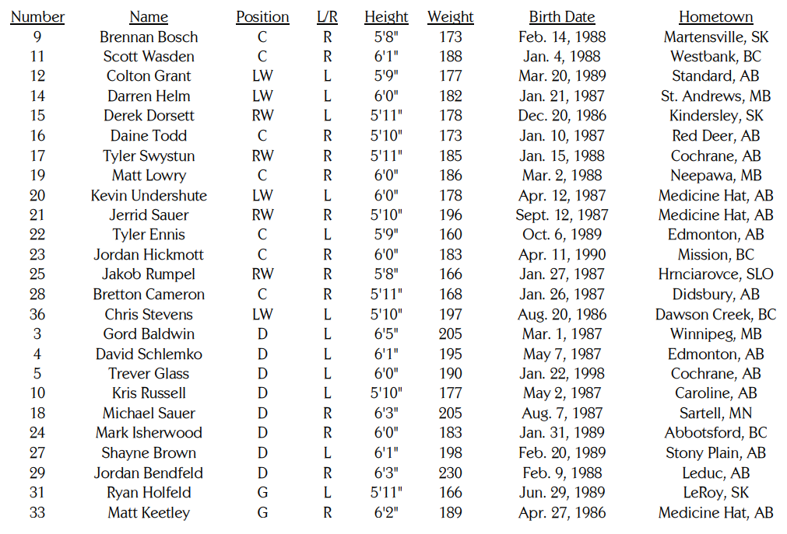

# Comparing Groups {data-background=#f7d754}

Welcome to class!

# Confidence Intervals {data-background=#f7d754}

## Can you explain it?

What is a confience interval? Disscuss with a partner or group. 

Then type your answer in Microsoft Teams.

## Coin Flips and Confidence Intervals

> - [Coin Flip and probability Vs. Confidence Intervals](https://www.random.org/coins/)

- What is the probability that I get heads?
- I flipped a coin. Now, what is the probability I have a head?
- How many heads will we have if we flip the coin ten times?

## Understanding Confidence Intervals

Confidence intervals are like coin flips, just that the probabilities move from 50-50 to 95-5. 

> - [App to help us understand confidence intervals](https://istats.shinyapps.io/ExploreCoverage/) - *You might try adjusting the sample size and observing the effect that has on the size of each interval.*

- Point Estimators Vs. Parameters:  Discuss the WHO child heights data.
    - Point Estimators: Sample mean
    - Parameters: Population mean
- [Interval Estimators](https://en.wikipedia.org/wiki/Interval_estimation): Why do we need interval estimators? 

# The Matthew Effect {data-background=#f7d754}

## What is the Matthew Effect?

##

##

> The more he looked, the more Barnsley
came to believe that what he was seeing was not a chance occurrence but an iron law of Canadian
hockey: in any elite group of hockey players - the very best of the best - 40 percent of the players
will have been born between January and March, 30 percent between April and June, 20 percent
between October and December.

##

> "In all my years in psychology, I have never run into an effect this large," Barnsley says. "You
don't even need to do any statistical analysis. You just look at it."

##

> The explanation for this is quite simple. It has nothing to do with astrology, nor is there
anything magical about the first three months of the year. It's simply that in Canada the eligibility
cutoff for age-class hockey is January 1. A boy who turns ten on January 2, then, could be playing 
alongside someone who doesn't turn ten until the end of the year - and at that age, in
preadolescence, a twelve-month gap in age represents an enormous difference in physical maturity.

# Case Study {data-background=#f7d754}

## [Comparing Proportional Measures](https://byuistats.github.io/BYUI_CSE150_StatBook/inferential-decision-making.html#comparing-proportions)

> - Moving from the *idea* of the Matthew effect to *measuring* the Matthew effect.
> - How could we use a proportion test to test if the Matthew effect is real?
> - What are our Null and Alternative hypotheses?
> - How else could we set up the comparison?
