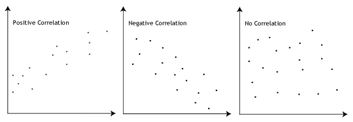

# Comparing Birthdays in Sports {data-background=#e8c35d}

 

**Welcome to class!**

In I-Learn, go to the "Materials" module and open the "Google Sheets Tool".

You'll also want Tableau open with the "counts_all" data loaded.

# Hypothesis Tests {data-background=#e8c35d}

***

Hypothesis tests help us answer questions about our data.

## Review: One Proportion Test

 

- Question: Is this proportion equal to this constant?
- Question: Is the proportion of Hockey players born in January equal to 1/12?

 

- Null hypothesis: The proportion is **equal to** the constant.
- Alternative hypothesis: The proportion is **less than/greater than/not equal to** the constant.

## Review: Two Proportion Test

 

- Question: Is this proportion equal to this proportion?
- Question: Is the proportion of Hockey players born in January equal to the proportion of January births in the US?

 

- Null hypothesis: Proportion 1 is **equal to** proportion 2.
- Alternative hypothesis: Proportion 1 is **less than/greater than/not equal to** proportion 2.

## Chi-Squared Test of Independence

 

The Chi-Squared Test of Independence allows us to to answer questions about two **variables**, rather than two proportions.

## Correlation

 

## Correlation

<!--------
## Scatterplots with two variables
------------>

 

Finish the following sentences for comparing two variables (or "measures")

- **Positive Correlation:** As x increases y ________.
- **Negative Correlation:** As x increases y ________.
- **No Correlation:** As x increases y _________.

 

- If there is a "relationship" between x and y, then knowing x gives us information about y.
- If x and y are "independent" then knowing x tells us nothing about y.

## Thinking in two dimensions

 

Let's think about our birth counts, separated by month and sport group.

- Does being in a professional sport provide information about what month they were born in?

 

- If **yes**, the variables are correlated. Aka, there is a relationship. They are **not independent**.
- If **no**, then birthday months are **independent** of what sport a professional plays.

## [Chi-Squared Test of Independence](https://byuistats.github.io/BYUI_CSE150_StatBook/inferential-decision-making.html#chi-squared-test-of-independence)

 

- Question: Is there a relationship between this variable and this other variable?
- Question: Is there a relationship between birth month and the professional sport you play?

 

- Null hypothesis: The two variables **are** independent.
- Alternative hypothesis: The two variables **are not** independent.

# Case Study {data-background=#e8c35d}

## Building our data tables (Tableau)

 

1. Build a table that shows the sum of all births for each group and each month.
2. Build a table that shows the percentage of births by month within each sport.
3. Build a table that has the counts for the US and Baseball for July and August.

## Are birthdays and sports related?

 

Let's test the data in the [Google Sheets Tool](https://docs.google.com/spreadsheets/d/1KUq-7qEHB642UB9olN7Fw0Yp9pYoKyCQIhs1TCPP198/template/preview).

 

What do you notice?

## Pearson Residuals

 

If we get a small p-value (p < 0.05), then we decide to reject the null hypothesis in favor of the alternative.

 

**Pearson residuals** help us understand which "observed counts" (aka, which groups) are responsible for such a small p-value.

## Cut off dates

 

> - **Baseball:** July 31st
> - **American Football:** July 31st <!---(but it has weight limits and other dates)--->
> - **Basketball:** August 31st <!----(but it has other dates)--->
> - **Hockey:** December 31st

<!------

## Using the two proportions test.

1. How could we compare US births to Hockey births to see if there is a Matthew effect?
2. What are some other ways we could compare the two groups?
3. Which is better?
4. What concerns do you have?

## Comparing multiple variables over two populations?

> - If the Matthew effect is real, why would it only happen in certain months. Should we see a trend?
> - What are the benefits of comparing the entire trend?
> - Now that we see a difference, what would we want to do?

------>

## Birthday and Sport Insights

 

> - Why does Basketball not have a Mathew effect? [Answer.](https://en.wikipedia.org/wiki/Height_in_sports#Basketball)
>- What about American Football? What do you think?
