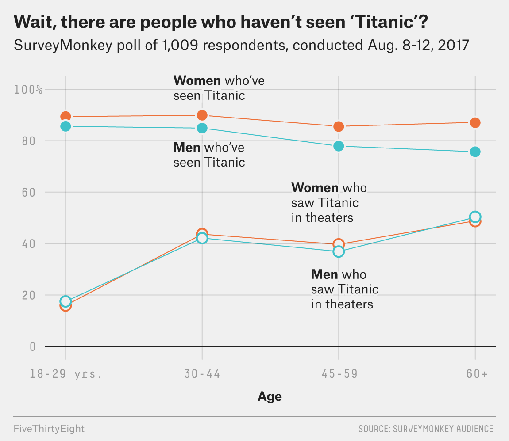
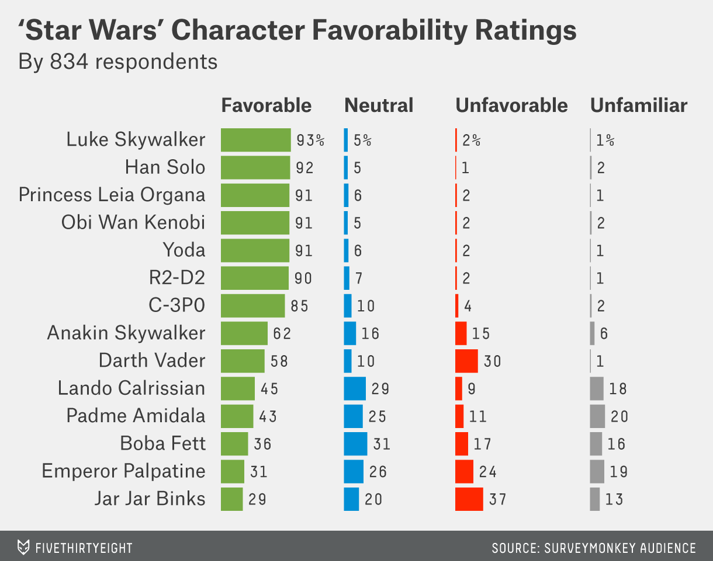

# Welcome to class! {data-background=#e8c35d}

## Remember

You can resubmit case studies and reading quizzes *at any time* during the semester.

## Tracking Progress

You need:

> - 6 case study presentations (In Class)
> - 6 case study "comments" (In Class)
> - 6 Tool Tips (Microsoft Teams)

## Practice

What data do we need to make this chart?

[*Source*](https://fivethirtyeight.com/features/how-many-people-havent-seen-titanic/)

## Practice 

What data do we need to make this chart?

[*Source*](https://fivethirtyeight.com/features/americas-favorite-star-wars-movies-and-least-favorite-characters/)

# From and Idea to a conclusion {data-background=#e8c35d}

## The plural of anecdote is not data

- What is an [anecdote](https://www.google.com/search?q=anecdote&oq=anecdote&aqs=chrome..69i57j69i60.1926j0j4&sourceid=chrome&ie=UTF-8)?

- How do we tell the difference between a good story and general truth?

- Our case study is built to keep telling Malcom Gladwell's story of the Matthew effect with data (not more anecdotes).

## Questions we can answer:

- Is there a relationship between one category and another category?
  - Chi-Squared Test of Independence
- Is one proportion the same as another proportion?
  - Two Proportion Test

# Case Study {data-background=#e8c35d}

## Time to ask questions and finish your case study.