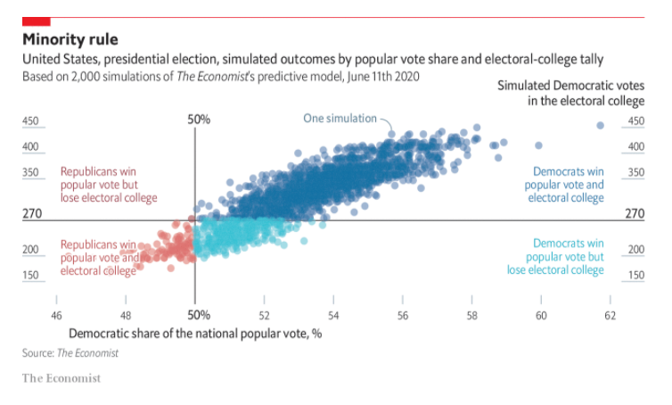
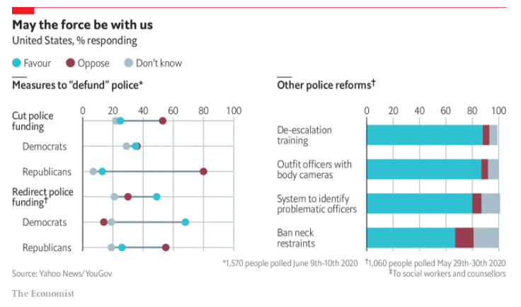

# Good Reads {data-background=#6897bb}

## Visual Crit

> 1. Make a note of the first few things you see.
> 2. Make a note of the first idea that forms in your mind and then search for more.
> 3. Make notes on likes, dislikes, and wish-I-saws.
> 4. Find three things you'd change and briefly say why.
> 5. Sketch and/or prototype your own version, and critique yourself.

[Link to book text](images/gc/ch9_vcsteps.png)

## This is practice for part of our [visualization challenge](https://byuistats.github.io/CSE150/syllabus.html#Visualization_challenge).

> 1. A messy data set that requires you to describe its issues and what you would do to clean it up for use in visualization.   
> 2. **A data journalism article review where you identify the strengths and weaknesses of the visualizations used to tell their story.**   
> 3. A visualization request to be done in Tableau with the data set that we provide.   

## [Crit 1 - Election Simulation](https://www.economist.com/graphic-detail/2020/06/12/americas-anachronistic-electoral-college-gives-republicans-an-edge)

Let's work through the steps together.

## Challenge Questions

> 1. Make a note of the first few things you see.
> 2. Write a short description of the message of the chart (you can come back to this)
> 3. Note 2-3 likes, 2-3 dislikes, and 2-3 wish-I-saws.
> 4. Explain the changes you would make on your 2-3 dislikes and the reason for the changes.
> 5. Sketch and/or prototype your own version, and write a 3-4 sentence paragraph critique of your prototype.

## [Crit 2 - United Nations](https://www.economist.com/graphic-detail/2020/06/25/seventy-five-years-after-the-uns-founding-the-world-order-is-at-risk-of-collapse)

Work through the left chart on your own (15 minutes).

## Practice Your Crit Skills

> - [The Economist: Graphic Detail](https://www.economist.com/graphic-detail)
> - [The New York Times: Upshot](https://www.nytimes.com/section/upshot)
> - [Five Thirty Eight](https://fivethirtyeight.com/tag/data-visualization/)

# Tableau Tools

## Code the chart

[The data](https://docs.google.com/spreadsheets/d/1fVtbnWwRC8ZgZ4bUbGt2-starhJW9HVZNA62yrPwIA0/edit?usp=sharing)

# Case Study {data-background=#6897bb}

