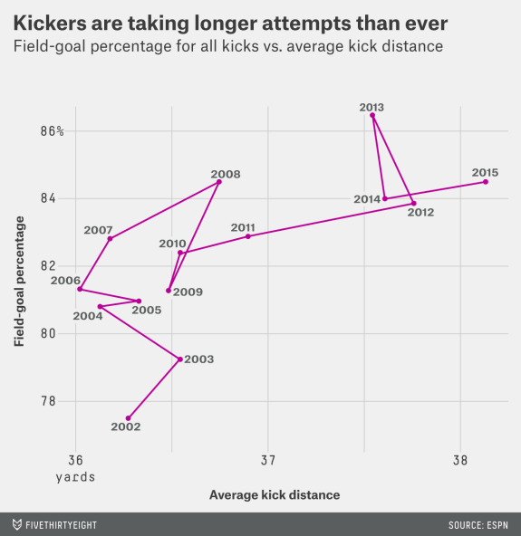
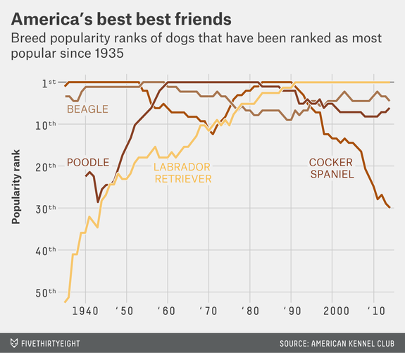

# Welcome to class! {data-background=#e8c35d}

##

[Starting Today](https://www.youtube.com/watch?v=gf_Diac7Mb8&t=1s)

# Building a Story: Visual Crit {data-background=#e8c35d}

## Visual Crit

> 1. Make a note of the first few things you see.
> 2. Make a note of the first idea that forms in your mind and then search for more.
> 3. Make notes on likes, dislikes, and wish-I-saws.
> 4. Find three things you'd change and briefly say why.
> 5. Sketch and/or prototype your own version, and critique yourself.

[Link to book text](images/gc/ch9_vcsteps.png)

## This is practice for part of our visualization challenge.

> 1. A tidy data description from a provided chart.   
> 2. **A data journalism article review where you identify the strengths and weaknesses of the visualizations used to tell their story.**   
> 3. A visualization request to be done in Tableau with the data set that we provide.   

## [Crit 1](https://fivethirtyeight.com/features/the-haters-are-losing-the-war-on-nfl-kickers/)

Let's work through the steps together.

## Challenge Questions

> 1. Make a note of the first few things you see.
> 2. Write a short description of the message of the chart (you can come back to this)
> 3. Note 2-3 likes, 2-3 dislikes, and 2-3 wish-I-saws.
> 4. Explain the changes you would make on your 2-3 dislikes and the reason for the changes.
> 5. Sketch and/or prototype your own version, and write a 3-4 sentence paragraph critique of your prototype.

## [Crit 2](https://fivethirtyeight.com/features/terriers-were-once-the-greatest-dogs-in-the-world-westminster-dog-show/)

Work through this chart your own (15 minutes).

## Practice Your Crit Skills

> - [The Economist: Graphic Detail](https://www.economist.com/graphic-detail)
> - [The New York Times: Upshot](https://www.nytimes.com/section/upshot)
> - [Five Thirty Eight](https://fivethirtyeight.com/tag/data-visualization/)

# Case Study {data-background=#e8c35d}

## Background

 

You have recently been hired by the U.S. internal revenue service (IRS) to catch corporate cheaters. You have been given three companies to investigate. You will need to decide if the IRS should build a legal case to investigate the institution for fraud.

- **Sino Forest Corporation:** You have the values from the financial statement numbers of Sino Forest Corporation's 2010 Report.
- **Government Entity:** A dataset containing the card transactions for a government entity - 2010.
- **General Motors:** The amounts paid to vendors for the 90 days preceding General Motor's 2009 liquidation.

## Our challenge

 

You will be responsible for reporting as much evidence as possible with the data provided for each institution above. The government entity has more available data than the other two, which will require you to dig deeper to find additional clues.

You can find varied data sources available for your use on the data page in Canvas. You will need to use more than one of the data sets provided, but you are not expected to use them all,

## Deliverables

 

- An 8-12 slide presentation to your IRS managers on the case against each entity.
- At least one slide that shows the statistical test results from the analysis you performed.
- At least one slide per institution that visualizes their first digit distribution compared to Benford's law.
- At least one slide for one of the institutions that compare the last digit distribution to what would be expected.
- Multiple visualizations of the **Government Entity** data to find other interesting insights.

# Data Exploration {data-background=#e8c35d}

## What can we do to tell a compelling story to the IRS?

 

The first few slides need to provide a background. Always include a chart, if possible, on each slide.

- Who are the companies?
- Which company are you going to focus in on, and why?
- More details about the focus company.

## What can we do to help them understand Benford's law and our statistical test?

 

We need to give them a background on the Benfords distribution and the Chi-Square Goodness of Fit Test.

- How does it work?
- A short explanation of each.
- Visuals for each of our companies.

## What additional evidence can we provide for the "Government Entity"?

 

Can we guide the IRS where to search?

- Additional Benford plots withing sub-categories.
- Other visualizations?

## Last-digit expectations

 

Benford's law tells us what to expect for first digits. What about last digits?

## A conclusions slide

 

Wrap it up.  Make conclusions and recommendations based on the work you have done.