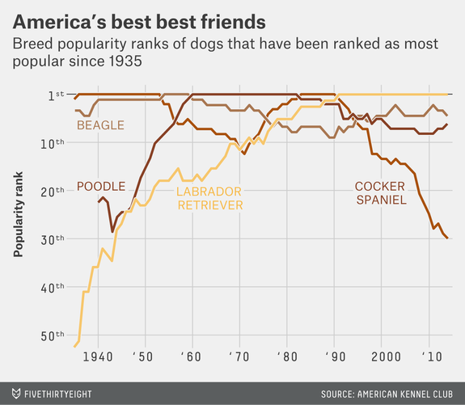

# Building a Story: Visual Crit {data-background=#f7d754}

## Visual Crit

> 1. Make a note of the first few things you see.
> 2. Make a note of the first idea that forms in your mind and then search for more.
> 3. Make notes on likes, dislikes, and wish-I-saws.
> 4. Find three things you'd change and briefly say why.
> 5. Sketch and/or prototype your own version, and critique yourself.

[Link to book text](images/gc/ch9_vcsteps.png)

## This is practice for part of our [visualization challenge](https://byuistats.github.io/CSE150/syllabus.html#Visualization_challenge).

> 1. A tidy data description from a provided chart.   
> 2. **A data journalism article review where you identify the strengths and weaknesses of the visualizations used to tell their story.**   
> 3. A visualization request to be done in Tableau with the data set that we provide.   

## [Crit 1](https://fivethirtyeight.com/features/the-haters-are-losing-the-war-on-nfl-kickers/)

Let's work through the steps together.

## Challenge Questions

> 1. Make a note of the first few things you see.
> 2. Write a short description of the message of the chart (you can come back to this)
> 3. Note 2-3 likes, 2-3 dislikes, and 2-3 wish-I-saws.
> 4. Explain the changes you would make on your 2-3 dislikes and the reason for the changes.
> 5. Sketch and/or prototype your own version, and write a 3-4 sentence paragraph critique of your prototype.

## [Crit 2](https://fivethirtyeight.com/features/terriers-were-once-the-greatest-dogs-in-the-world-westminster-dog-show/)

Work through this chart your own (15 minutes).

## Practice Your Crit Skills

> - [The Economist: Graphic Detail](https://www.economist.com/graphic-detail)
> - [The New York Times: Upshot](https://www.nytimes.com/section/upshot)
> - [Five Thirty Eight](https://fivethirtyeight.com/tag/data-visualization/)

# Case Study {data-background=#f7d754}

