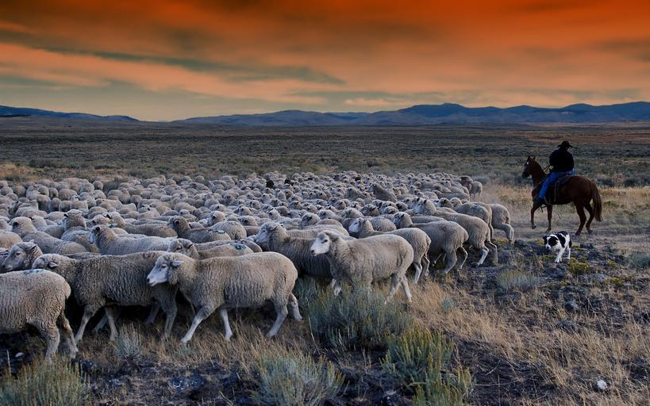

# Case Study 7: Day 2 {data-background=#e8c35d}

Welcome to class!

## What does it mean to "wrangle" data?

## Wrangle

 

## Wrangle Example

 

[The Data Science Process: What a data scientist actually does day-to-day](https://medium.springboard.com/the-data-science-process-the-complete-laymans-guide-to-what-a-data-scientist-actually-does-ca3e166b7c67)

<!-----------------------------
# Supplemental Readings {data-background=#e8c35d}

## Data Science in general

 

- [What is Data Science](https://byuistats.github.io/BYUI_CSE150_StatBook/what-is-data-science.html)
- [The Data Science Process: What a data scientist actually does day-to-day](https://medium.springboard.com/the-data-science-process-the-complete-laymans-guide-to-what-a-data-scientist-actually-does-ca3e166b7c67)
- [The art of structured thinking](https://www.analyticsvidhya.com/blog/2013/06/art-structured-thinking-analyzing/)

## Data science languages

 

What do you think about R, Python, and SQL?  Remember, your case study requires you to have a firm understanding of them to make a recommendation.
------------------------------------->

# Case Study {data-background=#e8c35d}

## TB and the Gates Foundation

 

The Bill and Melinda Gates Foundation wants to eradicate Tuberculosis (Links to an external site.) (TB).  They have asked your team to use the World Health Organization's report on TB to guide them on their next steps in fighting this disease. Address the following questions;

> 1. Which countries require our attention?
> 2. What age groups are of the most concern?
> 3. Are there differences between males and females?
> 4. What data science programming language should we use moving forward?

## What do we want our data to look like?

## Exploring the data

## Making the request
