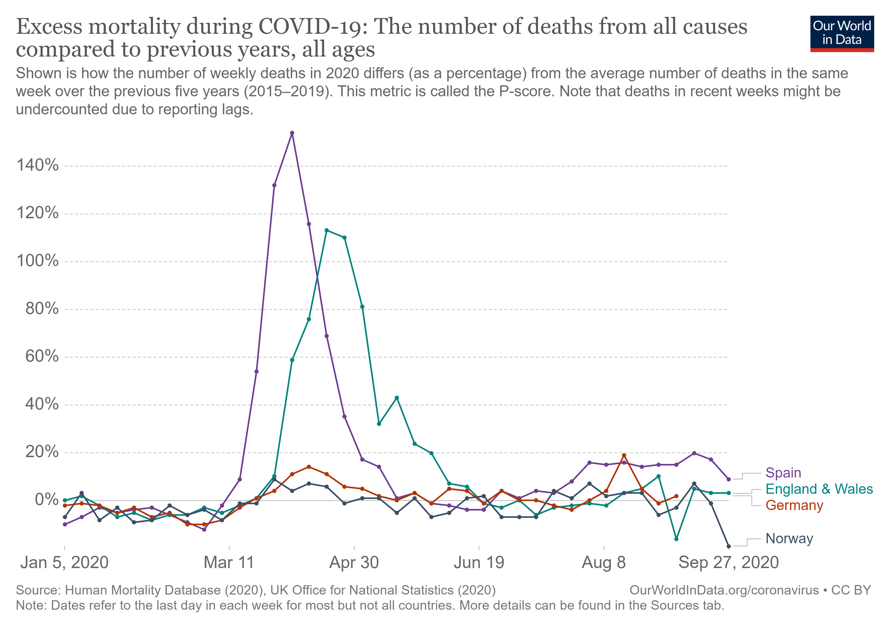
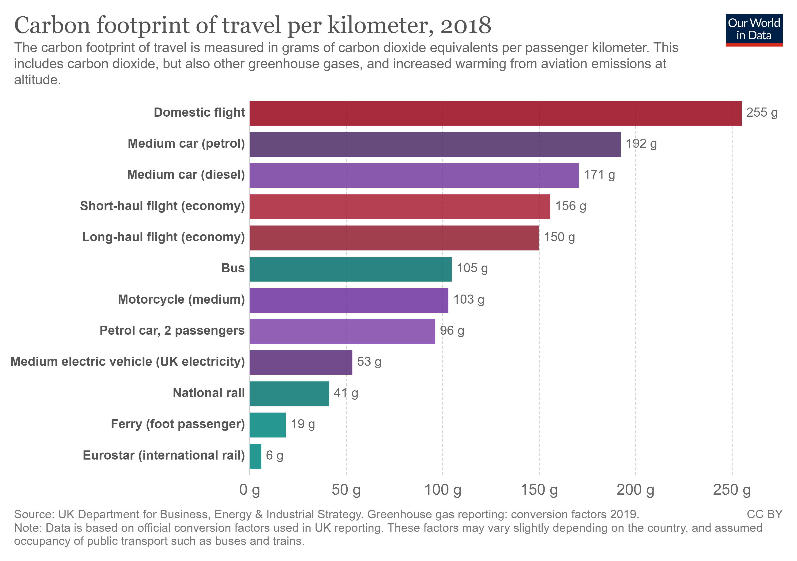

# Welcome to class! {data-background=#e8c35d}

Basic Visualizations: Day 1

<!-------------------------------
## Task 6 says to push the `.Rmd`, `.md`, and the `.html`

<br>


## What does it mean to push the "graphics folder" to GitHub?

<br>

[Example.](https://github.com/BYUI335/M335_WI21_Paxman_Tayl/tree/master/week_02_data_science/task_03)
----------------------------------->

## Spiritual Thought

<br>

[Receiving a Testimony of Light and Truth](https://www.churchofjesuschrist.org/study/general-conference/2014/10/receiving-a-testimony-of-light-and-truth?lang=eng)


## Activity

<br>

Look at this data and tell me about the relationship between x and y.

[Link.](https://github.com/ktoutloud/classslides/raw/master/math335/data/data1.csv)

## Activity

<br>

What about the relationship in this data?

[Link.](https://github.com/ktoutloud/classslides/raw/master/math335/data/data2.csv)

## Why is it important to visualize data?

# The `ggplot2` package {data-background=#e8c35d}

## What is grammar?[.](https://www.google.com/search?q=grammar&rlz=1C1GCEJ_enUS882US882&oq=grammar&aqs=chrome..69i57j0i67i457j0i67i395i433l2j0i67i395j69i60j69i61l2.1229j1j7&sourceid=chrome&ie=UTF-8)

## The Grammar of Graphics

<br>

`ggplot2` uses a "grammar of graphics" that helps us put graphical elements together in a way that makes sense.

##

<br>


##

<br>


##

<br>


## `ggplot2` vs. `tidyverse`

<br>

Try installing and loading the `tidyverse` package.

```
install.packages("tidyverse")
library(tidyverse)
```

What do you see in your R console?

## How do I use `ggplot2`?

<br>

You always start with a `ggplot()` layer. Then you can add on:

- a `geom_*()` layer (required)
- a `coord_*()` layer
- a `facet_*()` layer
- a `scale_*()` layer
- a `theme_*()` layer
- and more!

## How can I get help with `ggplot2`?

<br>

> - Read the [textbook](https://r4ds.had.co.nz/data-visualisation.html)! 
> - Use the [cheatsheet](https://github.com/rstudio/cheatsheets/blob/master/data-visualization-2.1.pdf)!
> - Look at the [documentation](https://ggplot2.tidyverse.org/index.html)! (Or `?ggplot()`)

## More help.

<br>

Layers can get complicated. For example, [themes](https://ggplot2.tidyverse.org/reference/theme.html).

It is easier to google questions and find answers if you know what things are called.

> - [Theme elements](https://henrywang.nl/ggplot2-theme-elements-demonstration/)
> - [More theme elements](https://isabella-b.com/blog/ggplot2-theme-elements-reference/)
> - Google image search.

## Let's practice!

```
ggplot(data = <DATA>) + 
  <GEOM_FUNCTION>(mapping = aes(<MAPPINGS>))
```

<!-----------------------------
# Task 9 {data-background=#e8c35d}

##



## Tidy Data

>- `pivot_longer()`
>- `pivot_wider()`
>- [How to select column names](https://dplyr.tidyverse.org/reference/select.html)

## Sister Larson's Code


# Reading Discussion {data-background=#e8c35d}

## [The Two Questions](https://hbr.org/2016/06/visualizations-that-really-work)

>- Is the information conceptual or data-driven?
>- Am I declaring something or exploring something?

## This class is data-driven.

>- "Exploring" = trying to figure something out = EDA
>- "Delcaring" = communicating information = visualizations for presentations


## Everyday Dataviz

>- Simple, simple, simple
>- Communicate a single message
>- Generate discussion about the ideas in the chart, not the chart itself

## Sister Larson's Favorite Quotes

> "A poorly designed chart will waste that time by provoking questions that require the presenter to interpret information that's meant to be obvious. If an everyday dataviz can't speak for itself, it has failed-just like a joke whose punch line has to be explained."

## Sister Larson's Favorite Quotes

> "Busy charts communicate the idea that you've been just that-busy."

## Sister Larson's Favorite Quotes

> "What we actually do when we make a good chart is get at some truth and move people to feel it-to see what couldn't be seen before. To change minds. To cause action."

# Class Activity {data-background=#e8c35d}

## [Make This Chart](https://ourworldindata.org/grapher/carbon-footprint-travel-mode?tab=chart&stackMode=absolute&region=World)



## What is the message?

What if I only wanted to communicate one message with this chart - that public transportation is better (ie, lower carbon footprint)?


----------------------->
