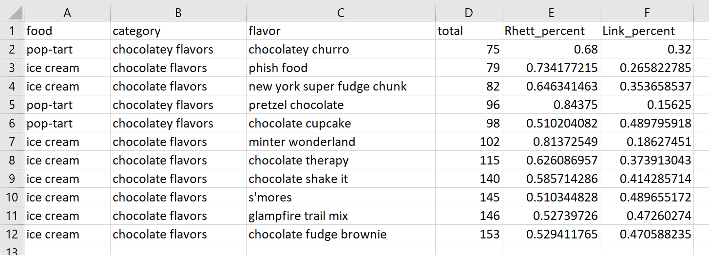

# Welcome to class! {data-background=#e8c35d}

## Git Demo

## Team Activity

1. Open up the [every_flavor_start.csv](https://raw.githubusercontent.com/ktoutloud/classslides/master/math335/data/every_flavor_START.csv) file in excel.
2. With a buddy, manipulate the data to match the image below. You are allowed to: 1) Delete columns, 2) Create new columns 3) Select rows and 4) Rearrange rows
  

  


<!-------------------------------
Try to recreate this plot using the `airquality` dataset in R.


```{r eval=FALSE, include = FALSE}
airquality %>% 
  ggplot() +
  geom_point(aes(x = Temp, y = Ozone, color = Wind), size = 6, alpha = .3) +
  scale_color_gradient(low = "red", high = "blue") +
  facet_wrap(vars(Month)) +
  labs(title = "New York City Ozone Levels")
```

## Case Study Groups
----------------------------------------------->

# Data wrangling with dplyr  {data-background=#e8c35d}

## The dplyr package

<br>

From the official documentation:

> "**dplyr** is a grammar of data manipulation, providing a consistent set of verbs that help you solve the most common data manipulation challenges."

## Remember:

<br>

Hadley Wickham, the author of the dplyr package, says:

> "Whenever you're learning a new tool, for a long time you're going to suck. But the good news is, that is typical, that's something that happens to everyone, and it's only temporary."

## Data manipulation verbs

<br>

- `filter`  - filter data to a smaller set of important rows
- `arrange` - organize the row order of data
- `select`  - select specific columns to keep or remove 
- `mutate`  - add new mutated (changed) variables as columns to data


## Data manipulation verbs for summaries

<br>

- `summarise` - build summaries of the columns specified
- `group_by`  - divide data into groups and change the "scope" of other verbs

## Using multiple verbs in a row

<br>

The "pipe" operator `%>%` can be used to connect `dplyr` verbs (and other functions!) together.

## Using multiple verbs in a row

<br>

(Example in R)

<!-----------------------------
## Data verbs practice

<br>

[Data Verbs Template](https://docs.google.com/presentation/d/1zDWzyacFGixKjPbW6rqAJ0p9jl-25ERZ3pfG1JUfgEI/template/preview)


## Practice reading code

<br>

With a partner (or in the Zoom chat), write this code out in an English paragraph.

```{r weirdname, eval=FALSE, echo=TRUE}
delays <- flights %>% 
  group_by(dest) %>% 
  summarise(
    count = n(),
    dist = mean(distance, na.rm = TRUE),
    delay = mean(arr_delay, na.rm = TRUE)
  ) %>% 
  filter(count > 20, dest != "HNL")
```
---------------------------------->

## Practice writing code

Use the six data verbs to tackle the following challenges. (The dplyr cheatsheet might help!)

> 1. Arrange the `iris` data by `Sepal.Length` and display the first six rows.
> 2. Select the `Species` and `Petal.Width` columns and put them into a new data set called `testdat`.
> 3. Create a new table that has the mean and standard deviation for petal width for each Species.
> 4. Read about the `?summarise_all()` function and get a new table with the means and standard deviations for all the variables for each Species.

```{r eval=FALSE, include = FALSE}
#1
iris %>% arrange(Sepal.Length) %>% head()
iris %>% arrange(Sepal.Length) %>% top_n(6)

#2
testdat <- iris %>% select(Species, Petal.Width)

#3
iris %>% group_by(Species) %>% mutate(mn = mean(Petal.Width), std = sd(Petal.Width))
iris %>% group_by(Species) %>% summarise(mn = mean(Petal.Width), std = sd(Petal.Width))

#4
iris %>% group_by(Species) %>% summarise_all(list(mean, sd))
iris %>% group_by(Species) %>% summarise_all(list(~mean(.), ~sd(.)))
```

## Task 5