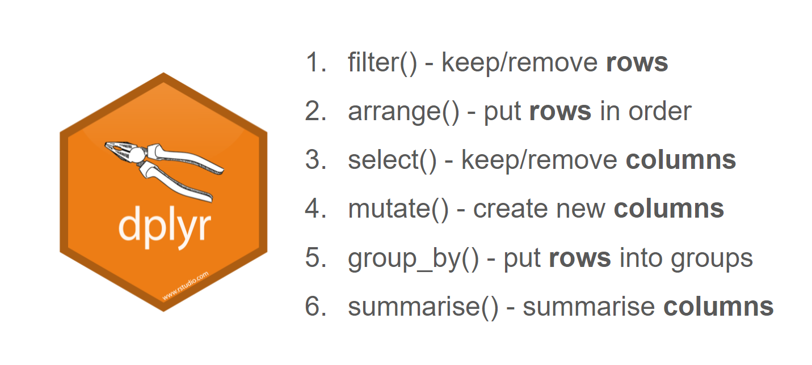

---
params:
  ptitle: true
  pbackground: true
  dtype: "none"
---

# Welcome to class! {data-background=#e8c35d}

## Sign up for "Team Lead"

<br>

Which we are now calling "Discussion Lead".
[Sign up here.](https://docs.google.com/spreadsheets/d/1aPmKWGRJMTKnofBXryUb-UsrIvh9rK7Y4yA6uDfFnms/edit?usp=sharing)

## dplyr Verb Groups

<br>

With your group, study your assigned function and use the `gapminder` data to create an example for the class.



## Task 6

<!-----------------------
Note:
want to students to focus on picking a TOPIC and QUESTION,
rather than finding the perfect data right now.

There is a task in a few weeks (task 11???)
that tells them to find the data for their project
-------------------------->

<!---------------------
With a partner (or in the Zoom chat), write this code out in an English paragraph.

```{r weirdname, eval=FALSE, echo=TRUE}
delays <- flights %>% 
  group_by(dest) %>% 
  summarise(
    count = n(),
    dist = mean(distance, na.rm = TRUE),
    delay = mean(arr_delay, na.rm = TRUE)
  ) %>% 
  filter(count > 20, dest != "HNL")
```
------------------------->
