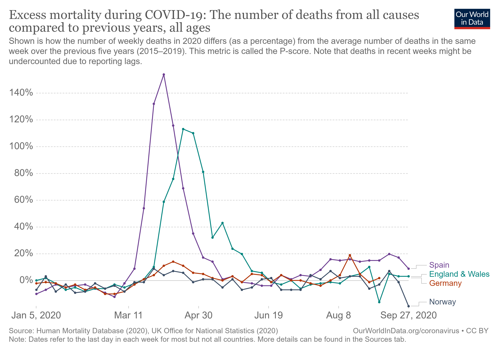
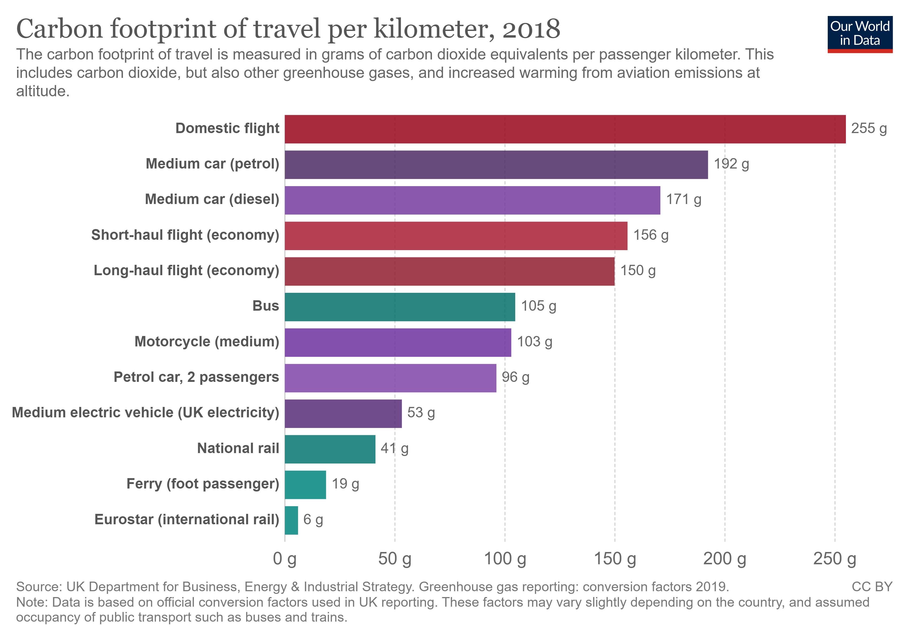

```{r setup, include=FALSE}
knitr::opts_chunk$set(echo = TRUE, message = FALSE, warning = FALSE)

library(tidyverse)
```

# Visualizations for Presentation: Day 2 {data-background=#e8c35d}

Welcome to class!

# Task 11 {data-background=#e8c35d}

##



<!------------
## Tidy Data

>- `pivot_longer()`
>- `pivot_wider()`
>- [How to select column names](https://dplyr.tidyverse.org/reference/select.html)
--------------->

## Sister Larson's Code

# Class Activity {data-background=#e8c35d}

## [Make This Chart](https://ourworldindata.org/grapher/carbon-footprint-travel-mode?tab=chart&stackMode=absolute&region=World)



## What is the message?

What if I only wanted to communicate one message with this chart - that public transportation is better (ie, lower carbon footprint)?

