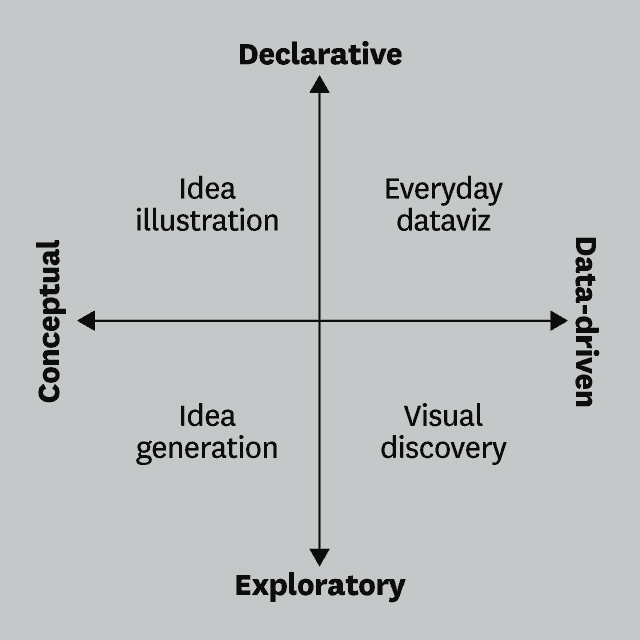

```{r setup, include=FALSE}
knitr::opts_chunk$set(echo = TRUE, message = FALSE, warning = FALSE)

library(tidyverse)
```

# Visualizations for Presentation {data-background=#f7d754}

Welcome to class!

# Task 9 {data-background=#f7d754}

##


## Tidy Data

>- `pivot_longer()`
>- `pivot_wider()`
>- [How to select column names](https://dplyr.tidyverse.org/reference/select.html)

## Sister Larson's Code


# Reading Discussion {data-background=#f7d754}

## [The Two Questions](https://hbr.org/2016/06/visualizations-that-really-work)

>- Is the information conceptual or data-driven?
>- Am I declaring something or exploring something?

## This class is data-driven.

>- "Exploring" = trying to figure something out = EDA
>- "Delcaring" = communicating information = visualizations for presentations



## Everyday Dataviz

>- Simple, simple, simple
>- Communicate a single message
>- Generate discussion about the ideas in the chart, not the chart itself

## Sister Larson's Favorite Quotes

> "A poorly designed chart will waste that time by provoking questions that require the presenter to interpret information that's meant to be obvious. If an everyday dataviz can't speak for itself, it has failed-just like a joke whose punch line has to be explained."

## Sister Larson's Favorite Quotes

> "Busy charts communicate the idea that you've been just that-busy."

## Sister Larson's Favorite Quotes

> "What we actually do when we make a good chart is get at some truth and move people to feel it-to see what couldn't be seen before. To change minds. To cause action."

# Class Activity {data-background=#f7d754}

## [Make This Chart](https://ourworldindata.org/grapher/carbon-footprint-travel-mode?tab=chart&stackMode=absolute&region=World)


## What is the message?

What if I only wanted to communicate one message with this chart - that public transportation is better (ie, lower carbon footprint)?

