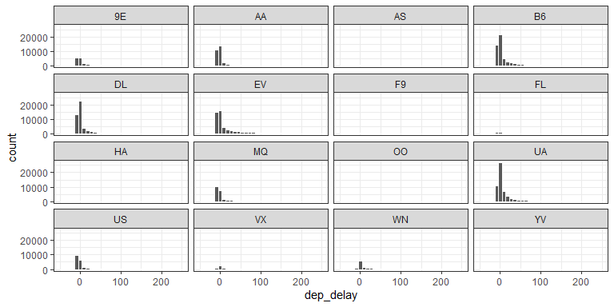
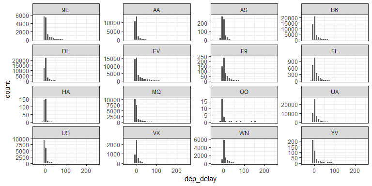
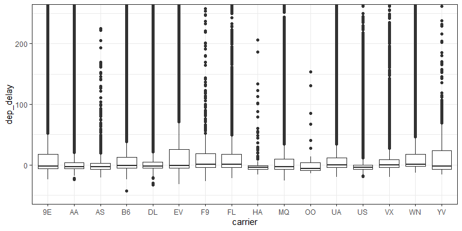
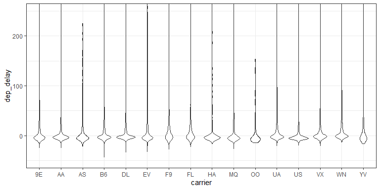
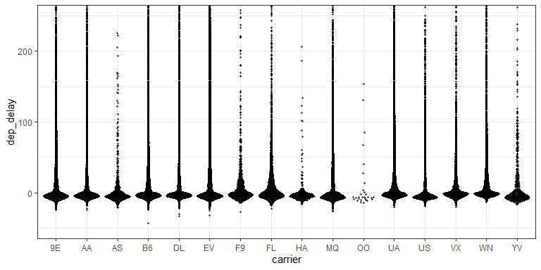
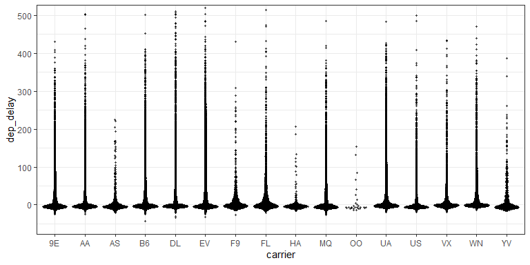
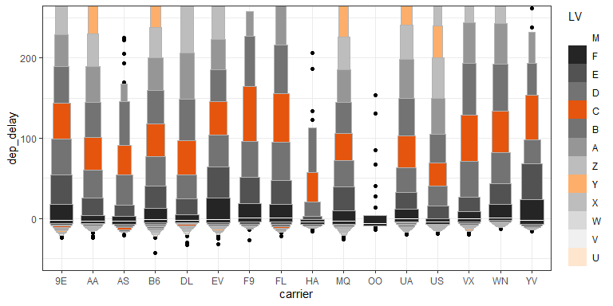
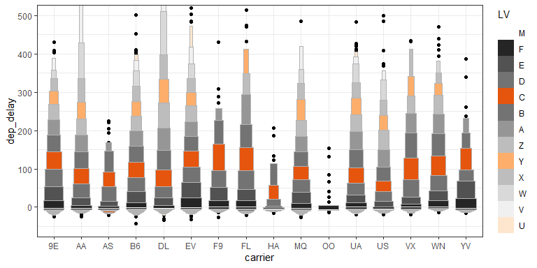

# Visualizations for Presentation {data-background=#f7d754}

Welcome to class!

## Case Study Review

>- Give a quick overview of your case study to your group.
>- Use this time to ask questions, provide feedback, and write issues.

# Labels and Annotations {data-background=#f7d754}

## Communicate Your Understanding

Now that you understand your data, you need to communicate your understanding to others. Your audience will likely not share your background knowledge and will not be deeply invested in the data. To help others quickly build up a good mental model of the data, *you will need to invest considerable effort in making your plots as self-explanatory as possible.*

## Getting Started


```r
#install.packages("nycflights13")
library(nycflights13)

fl_bp <- flights %>%
  ggplot(aes(x = carrier, y = dep_delay))

fl_sc <- flights %>%
  filter(dep_time > 800, dep_time < 900) %>%
  ggplot(aes(x = dep_time, y = dep_delay))

fl_bp + geom_boxplot()
fl_sc + geom_point()
```

Get the above code working, and use either the boxplot or the scatter plot in your group's examples.

## Breakout Rooms

>- Room one: [28.2 Label](https://r4ds.had.co.nz/graphics-for-communication.html#label)
>- Room two: [28.3 Annotations](https://r4ds.had.co.nz/graphics-for-communication.html#annotations)
>- Room three: [28.4 Scales](https://r4ds.had.co.nz/graphics-for-communication.html#scales)


<!-------------

## Labels {data-background=#f7d754}

>- `title`
>- `subtitle`
>- `caption`
>- `x`
>- `y`
>- legends

## Annotations {data-background=#f7d754}

## Scales {data-background=#f7d754}


## Labelling the outside

Complete the following - **Create clean labels for the x and y axes and zoom in on the y-axis from 50 to 100 minutes. Also have breaks every 15 minutes**
   
> - labelling - Axes, Titles, and Legends
> - xy Scales - `scale_x_`, `scale_y`, `coord_` - Setting breaks and changing labels *or* Transforming scale


## Labelling the inside

Complete the following - 

> 1. Color the points of `fl_sc` by `origin` using the brewer scale. 
> 2. Color the points of `fl_sc` by `arr_delay`**

> - color & fill scales   
>     - `scale_color_`
>     - `scale_fill_`
>     - `scale_gradient_`


## Putting the legend on the inside

Complete the following - **1) Color the points of `fl_sc` by `origin` using the brewer scale and use the directlabel package to move the labels into the plotting region.**

> * `library(directlabels)`
>    * http://directlabels.r-forge.r-project.org/examples.html
>    * `geom_dl()` and `direct.label()`


## Changing the feel

Complete the following - **Use a `theme_()` to create a different look for your graphic and change the orientiation of the x-axis test to 35 degrees**

> * Themes (check out `library(ggthemes)`)
> * `ggsave()`


## Scales

Each of the aesthetics has a paired scale function - x, y, size, color, fill, linetype, shape, alpha.  All of the scales start with `scale_` and then the respective aesthetic. All the aesthetic scales have an `_continuous`, `_discrete`, and `_manual`.  

> - `scale_x_` & `scale_y_` are the two scales I most often use
> - `scale_fill_` & `scale_color_` are the next most often used.
>     - manual()
>     - gradientn()

## Labelling Elements inside the graphic

The `library(ggrepel)` package is a must for our work. `library(directlabels)` can also be helpful. 
Here is the [book's graphic](http://r4ds.had.co.nz/communicate-plots_files/figure-html/unnamed-chunk-9-1.png). 

> - What are some concerns you have with this graphic?

## Code and graphic (scales)

Here is the [book's graphic](http://r4ds.had.co.nz/communicate-plots_files/figure-html/unnamed-chunk-9-1.png).  
Use the [code from 28.3](http://r4ds.had.co.nz/graphics-for-communication.html) and update their graphic to match mine.


## My Code Solution


```r
# library(ggrepel)
# library(viridis)
# 
# best_in_class <- mpg %>% 
#   group_by(class) %>% 
#   filter(row_number(desc(hwy)) == 1)
# 
# ggplot(mpg, aes(displ, hwy)) +
#   geom_point(aes(colour = class), size = 3) +
#   geom_point(size = 1.5, data = best_in_class, color = "white") +
#   geom_text_repel(aes(label = model, colour = class), 
#                   data = best_in_class, show.legend = FALSE, 
#                   nudge_x = -1, nudge_y = -2) +
#   theme_bw() + theme(panel.grid.minor = element_blank()) +
#   scale_color_viridis(discrete = TRUE) + 
#   labs(x = "Engine displacement", y = "Miles per gallon (highway)", 
#        color = "Vehicle type")
```


# Displaying multiple distributions {data-background=#e8d725}

## Clarity vs. Complication

Data can get complicated very fast. How do we provide depth of variability understanding without overwhelming the visualization user?

> * [violin plots (`geom_violin()`)](http://eamoncaddigan.net/dataviz/r/psych/2015/09/26/violin-plots/)
> * [beeswarm plots (`ggbeeswarm::geom_quasirandom()`)](https://github.com/eclarke/ggbeeswarm)
> * [letter-value boxplots `lvplot::geom_lv()`](https://github.com/hadley/lvplot). [Here](https://mgimond.github.io/ES218/Week08b.html) is a description.

Another package that makes flipping the axes easier in ggplot -- [rotating axes (`ggstance`)](https://github.com/lionel-/ggstance)

> * [link to last presentation](day_5.html#/displaying-distributions-of-multiple-groups-for-decision-making)

## Clarity vs. Complication (2)

> - What do we know after looking at this plot?
> **How do we provide depth of variability understanding without overwhelming the visualization user?**


Remember, data can get complicated very fast. 


## Distribution background

* [violin plots](http://eamoncaddigan.net/dataviz/r/psych/2015/09/26/violin-plots/)
* [beeswarm plots](https://github.com/eclarke/ggbeeswarm)
* [letter-value box-plots](https://github.com/hadley/lvplot)
* Another package that makes flipping the axes easier in ggplot -- [rotating axes](https://github.com/lionel-/ggstance)


## Histograms (1)

What don't we like about this plot?


```r
# plot code for histograms

flights %>% 
    ggplot(aes(x = dep_delay)) +
    facet_wrap(~carrier) +
    geom_histogram(bins = 150, color = "white") +
    coord_cartesian(xlim = c(-50, 250)) +
    theme_bw()
```




## Histograms (2)

* What changed in this histogram?
* What don't we like about this plot?


```r
# plot code for histograms

flights %>% 
    ggplot(aes(x = dep_delay)) +
    facet_wrap(~carrier, scales = "free_y") +
    geom_histogram(bins = 150, color = "white") +
    coord_cartesian(xlim = c(-50, 250)) +
    theme_bw()
```



## Boxplots

* What don't we like about this plot?
* How hard is it to explain?


```r
gg_base <- flights %>%
  ggplot(aes(x = carrier, y = dep_delay)) +
    coord_cartesian(ylim = c(-50, 250)) +
    theme_bw()
# Now add varied distribution geoms

gg_base + geom_boxplot() 
```



## Violin plots

* What don't we like about this plot?
* How hard is it to explain?


```r
# Now add varied distribution geoms
gg_base + geom_violin()
```



## Beeswarm plots (1)

* What don't we like about this plot?
* How hard is it to explain?


```r
# Now add varied distribution geoms
library(ggbeeswarm)
gg_base + geom_quasirandom(alpha = .6, size = .75)
```



## Beeswarm plots (1)

* What don't we like about this plot?
* How hard is it to explain?


```r
# Now add varied distribution geoms
library(ggbeeswarm)
gg_base + geom_quasirandom(alpha = .6, size = .75) + 
  coord_cartesian(ylim = c(-50, 500)) 
```



## Letter-Value boxplots (1)

* What don't we like about this plot?
* How hard is it to explain?


```r
# Now add varied distribution geoms
library(lvplot)
gg_base + geom_lv(aes(fill = ..LV..)) + scale_fill_lv()
```



## Letter-Value boxplots (2)

* What don't we like about this plot?
* How hard is it to explain?


```r
# Now add varied distribution geoms
library(lvplot)
gg_base + geom_lv(aes(fill = ..LV..)) + 
  scale_fill_lv() + 
  coord_cartesian(ylim = c(-50, 500)) 
```



## Letter-Value boxplots (3)

* What don't we like about this plot?
* How hard is it to explain?


```r
# Now add varied distribution geoms
library(lvplot)
gg_base + geom_lv(aes(fill = ..LV..)) + 
  scale_fill_lv() + 
  coord_cartesian(ylim = c(-50, 1500)) 
```


-------------->
