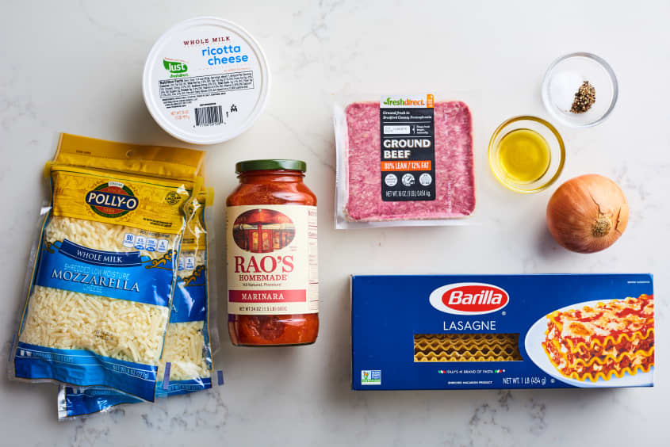
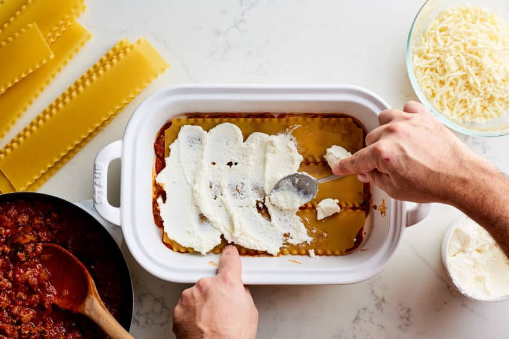
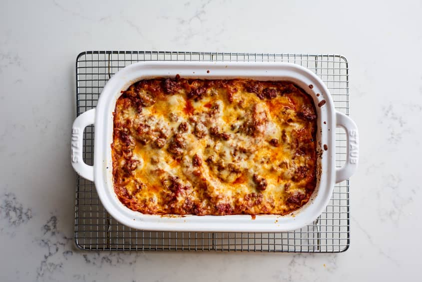

```{r setup, include=FALSE}
knitr::opts_chunk$set(echo = TRUE, message = FALSE, warning = FALSE)
```

```{r notes, include=FALSE}
#  revealjs::revealjs_presentation:
#    self_contained: false
#    reveal_plugins: ["chalkboard"]
#    reveal_options:
#      chalkboard:
#        theme: whiteboard
#        toggleNotesButton: false
```

# Visualizing Large Datasets {data-background=#f7d754}

Welcome to class!

## Today's Outline

> - [Case Study Presentations](https://byui.instructure.com/courses/105484/pages/presentation-and-discussion-lead-responsibilities?module_item_id=11970738)
> - R Markdown behind-the-scenes
> - Intro to "grammar of graphics" and ggplot2
> - Class Example

## Lesson objectives

* Connect ggplot syntax to the concept of grammar of graphics and layering to create plots
  * introduce scale_*_continuous()
  * introduce coord_*()
* Practice using ggplot()
    *  geom_col vs. geom_bar
    *  geom_histogram, geom_point, geom_boxplot, geom_violin, geom_bswarm, geom_quasirandom, etc.
*  Strategies for visualizing large datasets: univariate and bivariate plots

# R Markdown {data-background=#f7d754}

## Why do we use R Markdown?

From the [official website](https://rmarkdown.rstudio.com/):

"R Markdown documents are **fully reproducible**. Use a productive notebook interface to weave together narrative text and code to produce elegantly formatted output."

- An R script (.R file extension) is for getting tasks done. Scripts can be run via command line.
- R Markdown (.Rmd file extension) is for communicating results (either to yourself, or to an audience).

## How does R Markdown work?


- "Markdown" is a plain text formatting syntax aimed at making writing for the internet easier^[1](https://www.ultraedit.com/company/blog/community/what-is-markdown-why-use-it.html)^. (Facebook, Skype, Reddit, etc.)
- An Rmarkdown document combines the easy text formatting of markdown with R code and output.
  - "YAML" headers allow you to control the overall appearance of your document 
  - R "chunks" will be run by `knitr` and converted to markdown
- [Rmarkdown template for class](https://byuistats.github.io/M335/rpages.html#rmd_template)

# Grammar of Graphics and ggplot2 {data-background=#f7d754}

## Introduction to the Grammar

<iframe width="760" height="445" src="https://www.youtube.com/embed/uiTc55clwuA" frameborder="0" allow="autoplay; encrypted-media" allowfullscreen></iframe>

## A better analogy



[*source*](https://www.thekitchn.com/lasagna-recipe-simple-22956038)

## A better analogy



[*source*](https://www.thekitchn.com/lasagna-recipe-simple-22956038)


## A better analogy



[*source*](https://www.thekitchn.com/lasagna-recipe-simple-22956038)


## Introduction to ggplot2 

<iframe width="760" height="445" src="https://www.youtube.com/embed/PiY9hwOkL8U" frameborder="0" allow="autoplay; encrypted-media" allowfullscreen></iframe>

# Class Example (Task 3)

## beeswarm example


```{r eval = FALSE, echo = TRUE}

library(ggbeeswarm)
gg_base + geom_quasirandom(alpha = .6, size = .75) + 
  coord_cartesian(ylim = c(-50, 500)) 
```

## Looking Ahead

* Finish Task 3
* Prepare for Being Readings discussion
* Read through Task 4