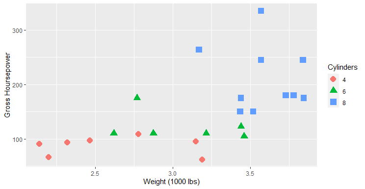

# Wrangling with dplyr {data-background=#f7d754}

Welcome to class!

## Outline

- Case study presentations
- GitHub workflow
- Intro to dplyr/wrangling practice
- Task 5 intro

# Case Study Presentations  {data-background=#f7d754}

# GitHub Workflow  {data-background=#f7d754}

##

>- Use "pull" to move changes from the remote repository to your local repository
>- Use "add", "commit", and "push" to move changes from local to remote

##


[*source*](http://jlord.us/git-it/challenges/remote_control.html)

##


[*source*](https://www.cs.swarthmore.edu/~newhall/unixhelp/git_create.php)

# Data Wrangling with dplyr  {data-background=#f7d754}

## The dplyr package

From the official documentation:

> "**dplyr** is a grammar of data manipulation, providing a consistent set of verbs that help you solve the most common data manipulation challenges."

## Remember...

Haldey Wickham, the author of the dplyr package, says:

> "Whenever you're learning a new tool, for a long time you're going to suck. But the good news is that is typical, that's something that happens to everyone, and it's only temporary."

## Data Manipulation Verbs

- `filter`  - filter your data to a smaller set of important rows.
- `arrange` - Organize the row order of my data
- `select`  - select specific columns to keep or remove 
- `mutate`  - add new mutated (changed) variables as columns to my data.


## Data Manipulation Verbs for Summaries

- `summarise` - build summaries of the columns specified
- `group_by`  - divide your data into groups and change the "scope" of other verbs

## Data verbs practice

[Data Verbs Template](https://docs.google.com/presentation/d/1zDWzyacFGixKjPbW6rqAJ0p9jl-25ERZ3pfG1JUfgEI/template/preview)


## Reading code practice

With a neighbor, write this code out in an English paragraph.


```r
delays <- flights %>% 
  group_by(dest) %>% 
  summarise(
    count = n(),
    dist = mean(distance, na.rm = TRUE),
    delay = mean(arr_delay, na.rm = TRUE)
  ) %>% 
  filter(count > 20, dest != "HNL")
```

## Writing code practice

Use the six data verbs to tackle the following challenges.

(Take turns in the driver's seat.)

> 1. Arrange the `iris` data by `Sepal.Length` and display the first six rows.
> 2. Select the `Species` and `Petal.Width` columns and put them into a new data set called `testdat`.
> 3. Create a new table that has the mean and standard deviation for petal width for each Species.
> 4. Read about the `?summarise_all()` function and get a new table with the means and standard deviations for all the variables for each Species.


## Writing code practice

Tell me how to recreate the following graph:




## Use the dplyr cheatsheet

https://github.com/rstudio/cheatsheets/blob/master/data-transformation.pdf


# Looking Ahead

> - Task 5
> - Being Readings
> - Look over Task 6 and Case Study 3
> - Remember to [use the tutors](https://byuidatascience.github.io/lab.html) and [meet with me!](https://www.meetingbird.com/h/SisterLarson)
