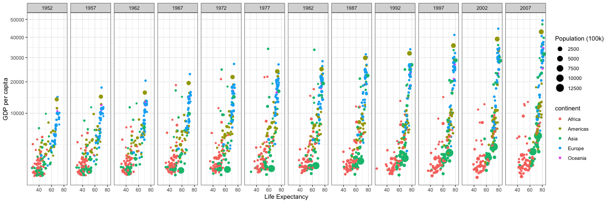

<!-----------------------
Note:
want to students to focus on picking a TOPIC and QUESTION,
rather than finding the perfect data right now.

There is a task in a few weeks (task 11???)
that tells them to find the data for their project
-------------------------->

# Welcome to class! {data-background=#e8c35d}

The Data Science Process: Day 3

## Today's Outline:

>- Reproducible Research
>- The Semester Project
>- Looking Ahead

# Reproducible Research {data-background=#e8c35d}

## Working in silos

## How to share your code

- bad example
  - What went wrong? (packages, file paths, etc)
- good example
  - common file structure across company/projects
  - code to install packages first
  - R projects....

## R Projects

- why they are awesome

## Math 335 Workflow

What steps will they follow for each task and case study?

- Open their 335 project in R Studio
- Make a new file (r script or r markdown)
- pull, add, commit, push
- submit link in Canvas

## Reproducible Research Crisis

- zoom out, big picture. maybe start with this?

# The Semester Project {data-background=#e8c35d}

## What types of questions can data answer?

## How to ask good questions/data questions

- some questions can't be answered
- some questions to subjettive
- need to answer in one semester

## What is the goal?

- choose-your-own-adventure case study

## What should it look like?

- example
- example
- example

## What can I study?

- anything

## Where can I find data?

- don't focus on data
- for now, just do a google search????
- task 11 will talk more abotu data sources

# Looking Ahead {data-background=#e8c35d}

## Upcoming Assignments

> - Case Study 2 (Saturday)
> - Task 5 (Tuesday) 
>   - Reading only
>   - Try taking reading notes in the `readme.md` file in your repo's week 3 folder.

## A note on week 3

Week 3 is all about the `ggplot` package and visualizing data.

This is the goal:

<!-------------------------------------

Other goals for week 3: Want to give them enough ggplot vocabulary
that they will be able to sucessfully google things.

Try a class exercise. 
- They ask me how to do something
- Then they watch me google it and find the answer.
- I explain why i'm using certain words in my google search

--------------------------------------->

