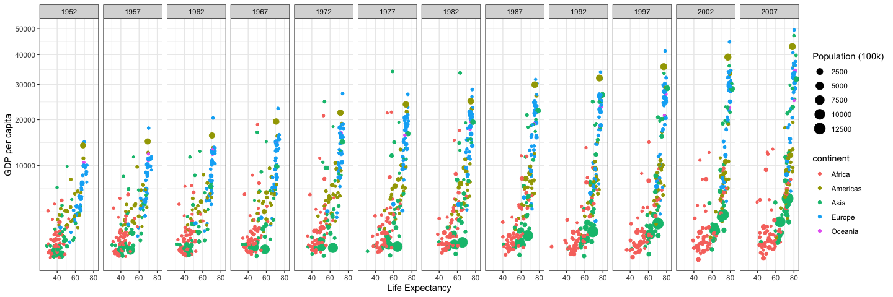

<!-----------------------
Note:
want to students to focus on picking a TOPIC and QUESTION,
rather than finding the perfect data right now.

There is a task in a few weeks (task 11???)
that tells them to find the data for their project
-------------------------->

# Welcome to class! {data-background=#e8c35d}

The Data Science Process: Day 3

## Today's Outline:

>- Data Answer
>- Data Questions
>- The Semester Project
>- Reproducible Research
>- Looking Ahead

## A Data Science Problem

 

**"Can you help us optimize our sales funnel and improve our conversion rates?"**[.](https://medium.springboard.com/the-data-science-process-the-complete-laymans-guide-to-what-a-data-scientist-actually-does-ca3e166b7c67)

 

- You say "yes" and go back to your office to get to work.
- Then what?
- *What does a solution to this problem look like?*

## Does this help?

 

"When a non-technical supervisor asks you to solve a data problem, the description of your task can be quite ambiguous at first. It is up to you, as the data scientist, to translate the task into a concrete problem, figure out how to solve it and *present the solution back to all of your stakeholders*."[.](https://medium.springboard.com/the-data-science-process-the-complete-laymans-guide-to-what-a-data-scientist-actually-does-ca3e166b7c67)

## What about this?

"Communicate results of the analysis: All the analysis and technical results that you come up with are of little value unless you can explain to your stakeholders what they mean, in a way that's comprehensible and compelling. Data storytelling is a critical and underrated skill that you will build and use here."[.](https://medium.springboard.com/the-data-science-process-the-complete-laymans-guide-to-what-a-data-scientist-actually-does-ca3e166b7c67)

## What exactly is a data science solution?

 

Important first step: Framing the problem

## What exactly is a data science solution?

 

You now have an amazing machine learning model that can predict, with high accuracy, how likely a prospective customer is to buy Hotshot's product. But how do you convey its awesomeness to your client, the VP of Sales? **How do you present your results to her in a form that she can use?**

## What exactly is a data science solution?

 

Communication is one of the most underrated skills a data scientist can have. While some of your colleagues (engineers, for example) can get away with being **siloed in their technical bubbles**, data scientists must be able to communicate with other teams and effectively translate their work for **maximum impact**. This set of skills is often called *'data storytelling.'*

## What exactly is a data science solution?

 

Go back and read Step 6 in the [article](https://medium.springboard.com/the-data-science-process-the-complete-laymans-guide-to-what-a-data-scientist-actually-does-ca3e166b7c67). What are the deliverables?

- Current deliverables:
  - A spreadsheet, with "current prospects" ranked
  - A face-to-face conversation where you "walk her through your conclusions"
  - A verbal recommendation
- Future deliverables:

## A Data Science Solution

 

**"Can you help us optimize our sales funnel and improve our conversion rates?"**[.](https://medium.springboard.com/the-data-science-process-the-complete-laymans-guide-to-what-a-data-scientist-actually-does-ca3e166b7c67)

What does a solution to this problem look like?

## What does a data science solution look like?

[The Data Science Process](https://medium.springboard.com/the-data-science-process-the-complete-laymans-guide-to-what-a-data-scientist-actually-does-ca3e166b7c67)

<!--------------------------------
The music/symphony analogy comes from Robert Peng
https://www.coursera.org/lecture/reproducible-research/what-is-reproducible-research-about-FvOGB

"Okay, so in case you didn't recognize it, that was the very beginning of the Symphony Number Eight, by Gustav Mahler. It was performed by the Chicago Symphony Orchestra, under the baton of Sir Georg Solti. And so this might be the polar opposite of the Code Monkey song that I just played for you. This symphony is sometimes called the Symphony of 1000, because just of the sheer number of people that have to be on stage to perform this piece. You need an entire symphony orchestra. You need an entire full chorus to sing. And so there's a lot of complex moving parts needed to perform this piece, and yet it gets performed all the time, and everyone recognizes the piece when they hear it, because it's more or less the same thing. Now how does that happen, right? So how is it that orchestras and choruses all over the world can play this enormously complex piece and it always seems to come off more or less just the same thing, okay? And similarly, how is it that you can listen to Johnathan Colton's song and you can hear the music, and then somehow, if you are trained musician, you can pick it up and maybe play it for yourself, okay? This is really about reproducibility, right? So in music, one of the nice things about music in general is that when you hear the performance, regardless of whether it's a simple popular song or an enormous symphony, you get all the information that you need. And now depending on the complexity of the music, you may get more or less information, because the brain is only able to process so much information at a time. But for something that's very complicated, like a symphony, we actually have a way to write down the instructions to give to the performers to tell them how to play each thing. And so it actually, Mahler is a great example of this because he himself was a conductor. And he knew that as a conductor it's often difficult to look at a composer's music and understand what is it exactly that the composer wanted here? And so when he wrote his music, he put instructions on every single inch of that piece of music, because that way the conductor who is interpreting and the performers who are interpreting the music can understand, oh, that's what the composer wanted here. So for Mahler's Symphony Number Eight what we have is the score. So the score is basically a book that lists every single part of every instrument, and what they need to play, and what instructions they have. And so the conductor can look at the score, and say, okay, I know what the violin's playing at this time and I know what the flute is playing, and I know what the chorus is singing at this time. And that way the music can be coordinated and all performed, and synchronized."

"And so what we're talking about in this course, Reproducible Research, is basically, how do you develop the score for data analysis so that you can communicate to someone what was done, and if they want to reproduce the work, how to do it, okay? Now the fundamental problem in data analysis is that we don't really have an agreed upon notation system for communicating data analysis. And so, everyone does it a different way, and in aggregate, it's kind of a mess. So some people will just describe in words what was done, and in some cases, this is suficient. This is sufficient but in many cases, it's not. Some people will provide the computer code and the data and everything that you need, and sometimes that's good. But sometimes it's enormously complex and it's difficult to sort through. And so there are a variety of ways that you can communicate data analysis, but we just haven't agreed upon what is a way that we can all look, that is sufficient for everybody, or more or less sufficient for everybody. So, what we're gonna focus on in this course, is how to communicate data analysis, using code by writing documents that are very dynamic, and by sharing data so that other people can reproduce the work that you're doing."

"If you want to communicate what you've done to other people, you need to be able to give them the material so that they can perform, so to speak, the analysis themselves."
------------------------------------>

# Reproducible Research {data-background=#e8c35d}

## Close your eyes

##

<iframe src="https://open.spotify.com/embed/playlist/1yWApTnGURJFcz7XE7jN5H" width="300" height="380" frameborder="0" allowtransparency="true" allow="encrypted-media"></iframe>

## Beethoven's Symphony No. 5

Written early 1880s. Score from [1862](https://www.researchgate.net/figure/Ludwig-van-Beethoven-Symphony-No-5-C-Minor-Op-67-Breitkopf-Haertel-Leipzig-1862_fig2_282721507). Songs from 1983 and 2021.

## So what?

If multiple people can get the same results, then it strengthens the arguments of the paper/research/etc.

## Working in silos

## How to share your code

- bad example
  - What went wrong? (packages, file paths, etc)
- good example
  - common file structure across company/projects
  - code to install packages first
  - R projects....

## R Projects

- why they are awesome

## Math 335 Workflow

What steps will they follow for each task and case study?

- Open their 335 project in R Studio
- Make a new file (r script or r markdown)
- Knit (convert RMarkdown --> markdown --> html)
- pull, add, commit, push
- submit link in Canvas

## Reproducible Research Crisis

- zoom out, big picture. maybe start with this?

# The Semester Project {data-background=#e8c35d}

## What types of questions can data answer?

## How to ask good questions/data questions

- some questions can't be answered
- some questions to subjettive
- need to answer in one semester

## What is the goal?

- choose-your-own-adventure case study

## What should it look like?

- example
- example
- example

## What can I study?

- anything

## Where can I find data?

- don't focus on data
- for now, just do a google search????
- task 11 will talk more abotu data sources

# Looking Ahead {data-background=#e8c35d}

## Upcoming Assignments

> - Case Study 2 (Saturday)
> - Task 5 (Tuesday) 
>   - Reading only
>   - Try taking reading notes in the `readme.md` file in your repo's week 3 folder.

## A note on week 3

Week 3 is all about the `ggplot` package and visualizing data.

This is the goal:

<!-------------------------------------

Other goals for week 3: Want to give them enough ggplot vocabulary
that they will be able to sucessfully google things.

Try a class exercise. 
- They ask me how to do something
- Then they watch me google it and find the answer.
- I explain why i'm using certain words in my google search

--------------------------------------->

