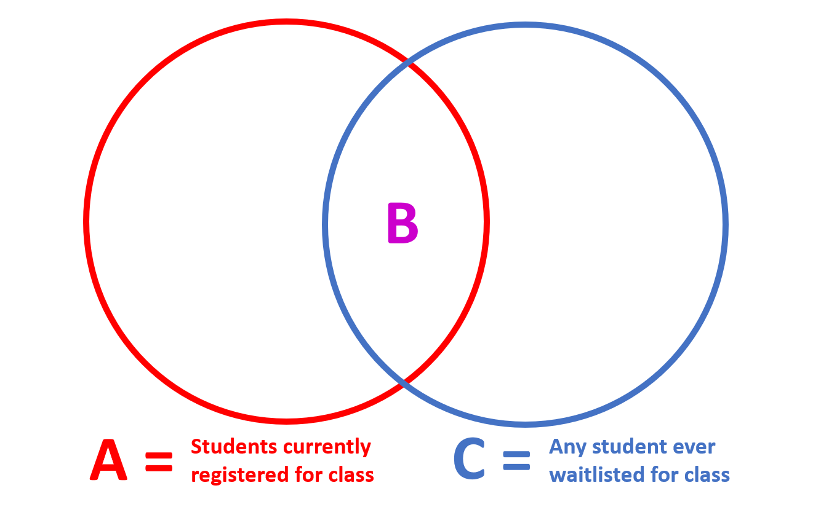

# Functions: Day 1 {data-background=#e8c35d}

Welcome to class!

## Case Study Review

## Semester Project Examples

<br>

On Wednesday. In the meantime...

>- [R Markdown Formats](https://r4ds.had.co.nz/r-markdown-formats.html)
>- [R Markdown Themes](https://www.datadreaming.org/post/r-markdown-theme-gallery/)


# Introduction to Functions {data-background=#e8c35d}

## What is a function?

## What is a function?

<br>

Math 108 Definition:

"A function is a rule that assigns the input value(s) to a single output value."

## How to write a function in R

<br>

1. Pick a **name** for the function that is intuitive and makes sense to other users
2. List the **arguments** to the function inside `function()`
3. Write the steps of your function in the **body**, a `{` block immediately following `function()`
4. The function will **return** the value of the last line in the body. You can make this return value explicit using `return()`.

## Example

<br>

```
count_threes <- function(a_number_vector){
   is_three <- a_number_vector == 3
   sum(is_three)
}
```

## Example

<br>

```
count_threes <- function(a_number_vector){
   is_three <- a_number_vector == 3
   return(sum(is_three))
}
```

## Question: Why use functions?

<br>

Answer:

> One of the best ways to improve your reach as a data scientist is to write functions. Functions allow you to automate common tasks in a more powerful and general way than copy-and-pasting.

## Question: When to use a function?

<br>

Answer: 

> When you've copied and pasted a block of code more than twice.

## [Three Big Advantages](https://r4ds.had.co.nz/functions.html)

<br>

1. You can give a function an evocative name that makes your code easier to understand.
2. As requirements change, you only need to update code in one place, instead of many.
3. You eliminate the chance of making incidental mistakes when you copy and paste (i.e. updating a variable name in one place, but not in another)

## Remember:

<br>

> Writing good functions is a lifetime journey.

<!-------------------------------------------

## The `return()` value

<br>

## Example

<br>

```
```

## Using `if` and `else` in a function

<br>

## Example

<br>

```
```
----------------------------------------------------->

## Your turn:

<br>

Figure out what this function does, and think of a better name for it.

>- Face-to-face students:

```
f1 <- function(string, prefix) {
  substr(string, 1, nchar(prefix)) == prefix
}
```

>- Online students:

```
f2 <- function(x) {
  if (length(x) <= 1) return(NULL)
  x[-length(x)]
}
```

## Your turn:

<br>

Write a function that:

> - Takes a name (a character string) as input
> - Returns "Hello [name]!"

## Your turn:

<br>

Write a function that:

> - Takes a character string as input
> - Checks if the name "Bob" is in the string
> - If so, returns "Hello Bob!"
> - Otherwise, returns "Hello."

*Hint: Check the "conditional statements" section in the reading.*

## Your turn:

<br>

Write a function that:

> - Take two numerical vectors as inputs
> - Calculates the average of all numbers from both vectors combined


# Task 17: Waitlisted {data-background=#e8c35d}

## Assigned reading

<br>

Chapter 19: Functions

- More tips for how to write good functions (humans vs. computers)
- How to add constraints to your functions (check for input errors)
- Return values for functions
- Function environments
- Introduction to conditional statements (super cool! super useful!)
- Guidelines for having good coding style (aka, how to make sure other programmers don't hate you)

## Some good advice

<br>

> It's easier to start with working code and turn it into a function; it's harder to create a function and then try to make it work.

## Two functions

<br>

- **Function 1**: Create a function that calculates the % of currently registered students who were at one time on the waitlist.
- **Function 2**: Create a function that calculates the % of students who were ever on the waitlist that are currently registered for for the class.

## Two fractions

<br>



<br>

- **Function 1** is B/A and **Function 2** is B/C

## Load the data

<br>

```
class_data_all <- read_csv("https://byuistats.github.io/M335/data/waitlist_DP_108.csv")
```

## The first function

<br>

Make sure you understand the goal before you start coding the solution!

1. What does one row represent?
1. Can a student have multiple rows?
1. Why would a student have multiple rows?
1. What are the options for "Status"
1. Can two status updates happen at the same time? Why?
