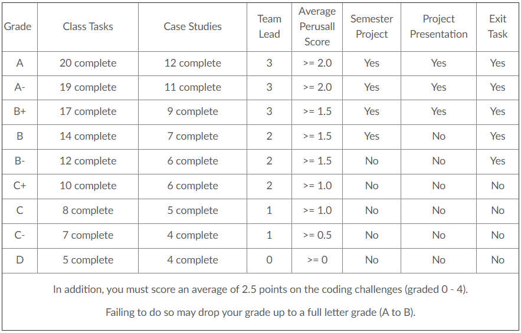

# Welcome to Math 335 and CSE 350! {data-background=#e8c35d}

## Data Wrangling and Visualization

## Wrangle

Oxford Dictionary: "round up, herd, or take charge of (livestock)"

## Visualize

Oxford Dictionary: "form a mental image of; imagine; make visible to the eye"

## Course Outcomes 

To develop disciples of Jesus Christ who are leaders in their homes, the Church, and their communities[.](https://www.byui.edu/about/mission-statement)

<!--- Big L vs. little l leader --->

## Course Outcomes

1. Convert data from varied formats or structures to a desirable format for analysis and visualization.
2. Clean, transform and merge data attributes/variables appropriately.
3. Effectively display and communicate meaning from spatial, temporal, and textual data.
4. Articulate the process, benefits, and challenges of Big Data manipulation.
5. Use current analysis, presentation, and collaboration tools in the data science field (R, Python, D3.js, GitHub). 

## Course Outcomes (Short Version)

Start with data. End with insights.

# Why I Love Data {data-background=#e8c35d}

## Introduction to Sister Larson

When I was little, I wanted to be...

- An archaeologist
- A spy or detective
- A librarian
- A civil engineer
- An architect
- A costume designer
- An office assistant

## Introduction to Sister Larson

What I did instead:

- Undergraduate in Applied Mathematics at BYU-Idaho
- Masters degree in Statistics at BYU
- Biostatistician at Myriad Genetics doing cancer research
- Then back to BYU-Idaho!

## Using Data to Gain Insight

- Everything we do generates data.
- If you have the right tools, you can use those data to answer important questions...and some very silly questions.

## Examples 

<!--- On a scale of silly to serious ---->

> - [Dinosaurs and statistical distributions](https://twitter.com/EmpiricalDave/status/1067941369237434368)
> - [The average chocolate chip cookie](https://pudding.cool/2018/05/cookies/)
> - [Calculus and The Good Place](https://www.andrewheiss.com/blog/2019/02/16/algebra-calculus-r-yacas/)
> - [Rounding movie ratings](https://fivethirtyeight.com/features/fandango-movies-ratings/)
> - [Jane Austen and natural language processing](https://juliasilge.com/blog/you-must-allow-me/)
> - [Text analysis of the Federalist Papers](https://rcc.uchicago.edu/about-rcc/news-features/text-data-federalist-papers-yelp) (Also [here](http://pages.cs.wisc.edu/~gfung/federalist.pdf) and [here](https://towardsdatascience.com/hamilton-a-text-analysis-of-the-federalist-papers-e64cb1764fbf))
> - [Historical network analysis](https://www.themacroscope.org/?page_id=889) and [visual](https://dcicblog.umd.edu/gjlc/2017/02/beyond-family-ties-from-genealogy-to-social-network-analysis/)
> - [How do dogs know that other dogs are dogs?](https://link.springer.com/article/10.1007/s10071-013-0600-8)
> - [Cancer Research](https://www.ncbi.nlm.nih.gov/pmc/articles/PMC7066089/)

# Class Format and Grading {data-background=#e8c35d}

## Weekly Format

- Doing Readings: Learn the *how* of data science
- Being Readings: Learn the *why* and *so what* of data science
- Tasks: Practice doing what you've learned (Get messy! Make mistakes!)
- Case Studies: Practice finding insights and clearly explaining insights

## Other Assignments

- Semester Project: A "choose your own adventure" case study that you'll present to the class.
- Coding Challenges: A chance for you to show me what you've learned.

## Grading Philosophy

- In a specifications-grading system all tasks are evaluated on a high-standards pass/fail basis using detailed checklists of task requirements and expectations. 
- Letter grades are earned by passing marks on a set of tasks. 
- This system provides for a variety of choice and is closer to how learning, and work, is done outside of a classroom.
- It will be easy for us to tell if work is complete, done in good faith, and consistent with the requirements.

## Specifications Grading

## Specifications Grading

## Specifications Grading

## ["Decisions Determine Destiny"](https://speeches.byu.edu/talks/thomas-s-monson/decisions-determine-destiny/)

- What are your priorities?

- What do you want out of this class? This semester? This college experience?

<!---

## "Being" Readings

Assigned readings to help you understand the big picture of data science, and gain context for the skills you are learning.

- Make comments in Perusall (we'll talk about this later)
- Student-lead reading discussion every Wednesday. Come prepared!

## Class Tasks

These tasks help you practice new skills before attempting the case study.

- Can be challenging, but should be less time consuming than the weekly case studies
- The first two weeks are not as consistent as the remaining weeks

## Case Study Format

- Week 1 and Week 2 are slightly different
- Week 3 begins the standard case study format
    1. Open ended question to answer with data provided    
    ...   
    2. Compile your `.md` and `.html` file into your git repository
    3. Find two other student's compiled files in their repository and provide feedback using the issues feature in GitHub (If they already have three issues find a different student to critique)
    4. Address 1-2 of the issues posted on your project and push the updates to GitHub
- Every Monday two students present their case studies to the class

# How to get an "A" {data-background=#e8c35d}

## Grading Philosophy

- In a specifications-grading system all tasks are evaluated on a high-standards pass/fail basis using detailed checklists of task requirements and expectations. 
- Letter grades are earned by passing marks on a set of tasks. 
- This system provides for a variety of choice and is closer to how learning, and work, is done in the real world.
- It will be easy for us to tell if work is complete, done in good faith, and consistent with the requirements.

## Specifications Grading

## To get a "B"

You don't do **B** work on all the tasks and case studies - You do **A** work on half of them.

* Focus on the first 5-weeks material. Pick and choose work after the foundation material.
* I know everyone can earn a B or higher.

---->

# Looking Ahead {data-background=#e8c35d}

## Task 2 (Thursday)

- Get R and RStudio working on your computer
- Join Slack and introduce yourself in the #general_w21_larson channel
- Create an account on GitHub and tell me your username

## Being Reading (Thursday)

- Click on the link in I-Learn
- Read the article in Perusall
- Leave two comments

## On Friday

- Reading Discussion
- Answer course/syllabus questions
- Intro to R

## Case Study 1 (Saturday)

- Doing Readings
- Answer R coding questions

## Questions for me?

## My family

