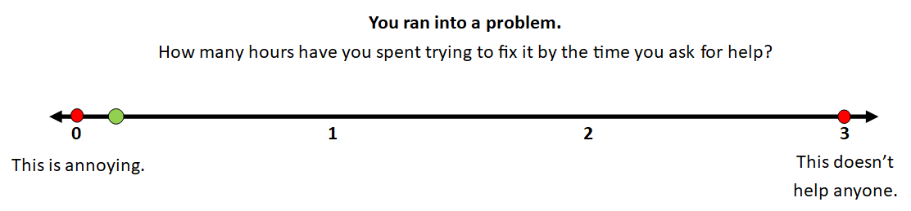

# Welcome to class! {data-background=#e8c35d}

<!---------- winter 2021 -------------
## Today's Outline:

>- Housekeeping and Questions
>- Reading Discussion
>- RStudio and R Markdown
>- Practice in R

## Before Sister Larson forgets:

- GitHub
- Comments in Perusall
- "On time"
- Face-to-face
- Zoom
  - How can we help remote students feel included and engaged?
- Please be respectful

## Questions?

>- Syllabus
>- R, RStudio, Slack, GitHub
>- Anything else

## Try, and then ask questions!

------------------------------>

# Reading Discussion {data-background=#e8c35d}

## [The Data Science Process](https://medium.springboard.com/the-data-science-process-the-complete-laymans-guide-to-what-a-data-scientist-actually-does-ca3e166b7c67)

 

What are your thoughts?

Get into groups of 2 or 3 and share.

## The Data Science Process

 

> "I realized that despite the variation in the details of different projects, the steps that data scientists use to work through a complex business problem remain more or less the same."

[One of my favorite examples.](https://strimas.com/)

## The Data Science Process

 

1. Frame the problem (translation)
1. Collect the raw data needed to solve the problem
1. Process the data (data wrangling)
1. Explore the data
1. Perform in-depth analysis (machine learning, statistical models, algorithms)
1. Communicate results of the analysis (translation)

# R, RStudio, Markdown, and R Markdown {data-background=#e8c35d}

## R vs R Scripts

## Markdown

 

Example in Slack.

## R Markdown

 

[What is R Markdown?](https://rmarkdown.rstudio.com/lesson-1.html)

"A reproducible record of your work."

## Why do we care about reproducibility?

## Reproducibility

 

Let's do an experiment. Close your eyes.

- Those two recordings were made 20 years apart.

## Reproducibility

 

The music was written around 1804.

## Possibilities with R Markdown

 

>- Microsoft Word document
>- Slide show
>- Html slides
>- Website
>- Blog
>- PDF report
>- Dashboard

## Examples

 

- R "chunks"
- YAML (yet another markup language)
- How to keep `.md` file
- **When to use R script vs. R Markdown?**

