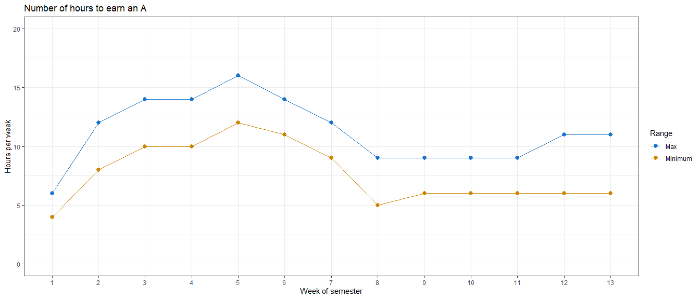

# Welcome to class! {data-background=#e8c35d}

## Today's Outline:

>- Housekeeping and Questions
>- Reading Discussion
>- RStudio and R Markdown
>- Practice in R

## Before Sister Larson forgets:

- GitHub
- Comments in Perusall
- "On time"
- Face-to-face
- Zoom
  - How can we help remote students feel included and engaged?
- Please be respectful

## Questions?

>- Syllabus
>- R, RStudio, Slack, GitHub
>- Anything else

## Try, and then ask questions!

# Reading Discussion {data-background=#e8c35d}

## [The Data Science Process](https://medium.springboard.com/the-data-science-process-the-complete-laymans-guide-to-what-a-data-scientist-actually-does-ca3e166b7c67)

What are your thoughts?

## The Data Science Process

> I realized that despite the variation in the details of different projects, the steps that data scientists use to work through a complex business problem remain more or less the same.

## The Data Science Process

- Frame the problem
- Collect the raw data needed to solve the problem
- Process the data (data wrangling)
- Explore the data
- Perform in-depth analysis (machine learning, statistical models, algorithms)
- Communicate results of the analysis

# R, RStudio, and R Markdown {data-background=#e8c35d}

## R vs. RStudio

## "Knitting" an R Markdown document

## [Data Types](https://www.geeksforgeeks.org/r-data-types/)

- Each variable in R has an associated data type
- Each data type requires different amounts of memory
- Each data type has some specific operations which can be performed over it
  - **Numeric:** Set of all real numbers
  - **Integer:** Set of all integers
  - **Logical:** TRUE and FALSE
  - **Complex:** Set of complex numbers
  - **Character:** "a", "BYU-Idaho", "lions and tigers and bears", "@", "3"

## [Vectors](http://adv-r.had.co.nz/Data-structures.html)

- The basic data structure in R is the vector
- Vectors come in two flavors: atomic vectors and lists
- Atomic vectors and lists have three common properties:
  - **Type:** typeof(), what it is.
  - **Length:** length(), how many elements it contains.
  - **Attributes:** attributes(), additional arbitrary metadata.
- They differ in the types of their elements: 
  - All elements of an atomic vector must be the same type
  - The elements of a list can have different types.

## Practice in R

<!--------------------------------

## What is data science?

Answer: A venn diagram ( [here](https://www.omnisci.com/learn/data-science), [here](https://data36.com/what-is-data-science/), and [here](https://www.innoarchitech.com/blog/what-is-data-science-does-data-scientist-do))

["The Business of Data" video](https://www.youtube.com/watch?v=eMOY79x6drA)

Hadley Wickham's [diagram](https://r4ds.had.co.nz/)

# Syllabus (continued from Day 1)  {data-background=#e8c35d}

## Specifications Grading

## Workload to get an "A"

## To get a "B"

You don't do **B** work on all the tasks and case studies - You do **A** work on half of them.

* Focus on the first 5-weeks material. Pick and choose work after the foundation material.
* I know everyone can earn a B or higher.

## How to get help

> - Slack 
> - R-Lab
> - My office hours

## Questions about the syllabus?

# Task 1 {data-background=#e8c35d}

## Questions about R and/or R-Studio?

## Getting R-Studio under control

# Reading Discussion  {data-background=#e8c35d}

## How Humans See Data

[John Rauser Video](https://www.youtube.com/embed/fSgEeI2Xpdc?rel=0&amp;start=0){target="blank"}

[Class comments.](https://docs.google.com/spreadsheets/d/1Dfj68hm77XwnQgV5mSw3ja3cRTJgcOYYEDKD5RmKjBY/edit?usp=sharing)

> - What did you learn?
> - Were you surprised by anything?
> - Do you disagree with anything he said?

## 7 methods of encoding data

#### Ordered by accuracy of perceptual estimation.

1. Position along a common scale
2. Position on common, non-aligned scale
3. Length
4. Angle or slope
5. Area
6. Volume/density/saturation of "color"
7. Color hue

## Quote from Tufte

> Above all else, show the data

## [Being a Better Online Reader](https://www.newyorker.com/science/maria-konnikova/being-a-better-online-reader)

What do you agree with? Disagree?

What's your plan to succeed this semester?

# Looking Ahead {data-background=#e8c35d}

## Task 2

> - Github
> - Professional Photo
> - Data Science Society

## Before next class...
> - Sign up for a one-on-one interview with Sister Larson
> - Finish Task 2
> - Look over Case Study 1

------------------------------>
