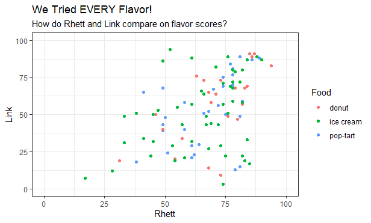

```{r setup, include=FALSE}
knitr::opts_chunk$set(echo = TRUE, message = FALSE, warning = FALSE)

library(tidyverse)
library(nycflights13)
```

# Relational Data: Day 2 {data-background=#e8c35d}

Welcome to class!

# Joining Datasets {data-background=#e8c35d}

## Example 

<br>

Join the `flights` and `airlines` datasets.

<br>

- What do we want the output to look like?
- What is the primary key?
- What is the foreign key?
- `flights %>% dplyr::left_join(airlines, by = "carrier")`
- What happens if I flip the data sets? `airlines %>% dplyr::left_join(flights, by = "carrier")`

## Your turn

<br>

How could we join the `flights` and `airports` data to show the full name of the airport in the `flights`? Post your code in slack.

- It depends. Do we want the origin or destination airport name? Or both?
- Origin: `flights %>% left_join(airports, by = c("origin" = "faa"))`
- Destination: `flights %>% left_join(airports, by = c("dest" = "faa"))`
- Both: `flights %>% left_join(airports, by=c("origin" = "faa")) %>% left_join(airports, by=c("dest" = "faa"))`

## How to make sure a key is unique

<br>

```{r}
planes %>% count(tailnum) %>% filter(n > 1)
flights %>% count(flight) %>% filter(n > 1)
```

## What happend if you have duplicate keys?

<br>

> - [One table w/ duplicates](http://r4ds.had.co.nz/diagrams/join-one-to-many.png)
> - [Both tables w/ duplicates](http://r4ds.had.co.nz/diagrams/join-many-to-many.png)

## In-depth example

<br>

<!----
**Partner-up**: 1 is a problem solver and tells what to do. The other is the coder and codes up the solution.
---->

> - For each tailnumber in `planes` data table, you want to know which carrier is operating it (using the `flights` data).
> - *Bonus*: Include the carrier's full name (in `airlines`), not just the 2 digit abbreviation.


```{r echo = FALSE, eval = FALSE}
planes  %>% 
  left_join(flights, by = "tailnum") %>% 
  distinct(tailnum, carrier) %>% #If I stop here, there are a few duplicate tailnumbers, they were operated by multiple carriers. Because flights is sorted in chronological order, I just take the last (or most recent one) to remove the duplicates
  group_by(tailnum) %>% 
  summarise_all(last)  %>% #or I could have done slice(n())

#Now to get the full carrier's name
left_join(airlines)

```

## Mutating joins

<br>

The `left_join` we just practiced will be the most common join you use. In the `dplyr` package, it is called a *mutating join*.

>- [A venn diagram for mutating joins.](https://r4ds.had.co.nz/diagrams/join-venn.png)

## Other types of joins

<br>

> - [Filtering joins](http://r4ds.had.co.nz/relational-data.html#filtering-joins) don't add columns. They are an efficient way to filter on multiple columns.
>- [Set operations](https://r4ds.had.co.nz/relational-data.html#set-operations) work with individual rows, comparing each value in the rows.


# Upcoming {data-background=#e8c35d}

<br>

>- Coding Challenge
>- Relational Case Study

## Coding Challenge Practice

<br>

- You have 15 minutes to recreate the chart you see.

## Coding Challenge Practice

<br>

Use this data: https://raw.githubusercontent.com/ktoutloud/classslides/master/math335/We%20Tried%20EVERY%20Flavor.csv

