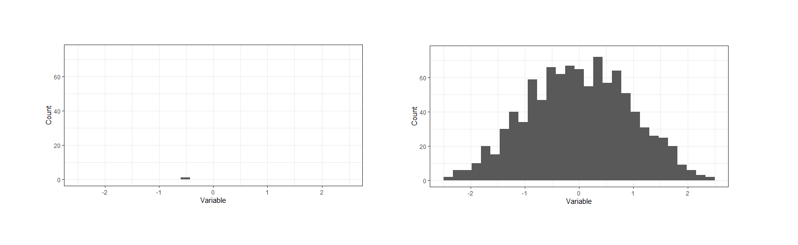

```{r setup, include=FALSE}
knitr::opts_chunk$set(echo = TRUE, message = FALSE, warning = FALSE)

library(tidyverse)
```

# Text Data: Day 1 {data-background=#e8c35d}

Welcome to class!

## Spiritual Thought

<br>

What's the difference between these to charts?



## Spiritual Thought

<br>

Elder Bednar

> As the wise virgins emphasized properly, each of us must "buy for ourselves." These inspired women were not describing a business transaction; rather, they were emphasizing our individual responsibility to keep our lamp of testimony burning and to obtain an ample supply of the oil of conversion. This precious oil is acquired one drop at a time-"line upon line [and] precept upon precept" (2 Nephi 28:30), patiently and persistently. No shortcut is available; no last-minute flurry of preparation is possible.

## Saving .md files

<br>

[Example](https://github.com/BYUI335/M335_WI21_Larson_Kati/tree/master/week_06_relational-data/task_11)

```r
install.packages("devtools")
devtools::install_github("dylanjm/Rtemplates", subdir = "StatsBYUI")
```
# Case Study Sharing {data-background=#e8c35d}

<!----------
## Case Study Groups

>- Paste a link to your case study in Slack
>- Then share your case study with someone next to you

## Case Study Presentations
------------->

# Searching For Patterns {data-background=#e8c35d}

##

<br>

How would you tell a computer to extract the year from this column of information?

Type your answer in English in Slack (no code).

```
April 15, 2020
April 17, 2020
May 1, 2020
```

##

<br>

What about now? Again, type your answer in Slack.

```
4/15/2020 12:36
4/17/2020 9:40
4/17/2020 11:59
4/17/2020 16:06
5/1/2020 11:58
```

## Patterns in Text

<br>

Base R (aka, functions included with default R installation) has a lot of useful function for strings.

The tidyverse `stringr` package does even more. (Use the [cheatsheet](https://stringr.tidyverse.org/) this week!)

- Remember: *Anything you want to do someone has done before, and probably posted about it online.*
- Helpful to know: I use the words text, character, and string the same.

## Coding Example

<br>

> - [Follow along and take notes!](https://raw.githubusercontent.com/ktoutloud/classslides/master/math335/text_variables_examples_s.R)
> - A really good way to learn a new function is **trying to break it**.