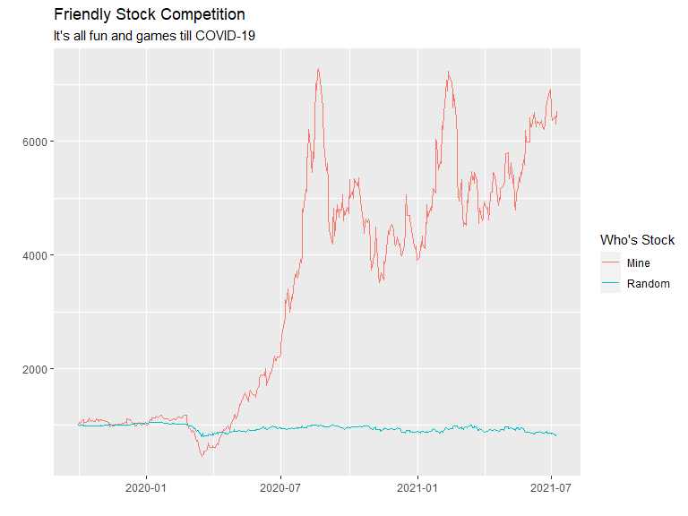

# Background

The stock market is overflowing with data. There are many packages in R that allow us to get quick access to information on publicly traded companies. Imagine that you and a friend each purchased about $1,000 of stock in three different stocks two years ago, and you want to compare your performance up to this week. Use the stock shares purchased and share prices to demonstrate how each of you fared over the period you were competing (assuming that you did not change your allocations).


```r
library(tidyverse)
library(tidyquant)
library(timetk)
library(xts)
library(dygraphs)
```

# Friendly Stock Competition

## My stocks 

I chose Overstock (OSTK), Health Catalyst (HCAT), and Domo (DOMO). The other three "friend" stocks were chosen by a random generator. We are going to pull the price performance data using `library(tidyquant)` and build a visualization that shows who is winning each day of the competition.


```r
# my stocks - utah companies
my.stock <- tq_get(c("OSTK","HCAT","DOMO"),
             get = "stock.prices",
             from = "2019-10-01")
head(my.stock)
```

```
## # A tibble: 6 x 8
##   symbol date        open  high   low close  volume adjusted
##   <chr>  <date>     <dbl> <dbl> <dbl> <dbl>   <dbl>    <dbl>
## 1 OSTK   2019-10-01 10.6   11.1  9.6   9.61 3585900     9.61
## 2 OSTK   2019-10-02  9.48  11.0  9.3  10.4  6454200    10.4 
## 3 OSTK   2019-10-03 10.3   10.5  9.85 10.4  2167500    10.4 
## 4 OSTK   2019-10-04 10.4   10.8 10.2  10.2  2207600    10.2 
## 5 OSTK   2019-10-07 10.1   11.7 10.1  11.2  5690400    11.2 
## 6 OSTK   2019-10-08 11.2   12.2 10.9  11.7  4397900    11.7
```


```r
my.returns <- my.stock %>% 
  group_by(symbol) %>% 
  tq_transmute(select = adjusted,
                    mutate_fun = periodReturn,
                    period = "daily",
                    type = "arithmetic")
head(my.returns)
```

```
## # A tibble: 6 x 3
## # Groups:   symbol [1]
##   symbol date       daily.returns
##   <chr>  <date>             <dbl>
## 1 OSTK   2019-10-01       0      
## 2 OSTK   2019-10-02       0.0801 
## 3 OSTK   2019-10-03      -0.00193
## 4 OSTK   2019-10-04      -0.0135 
## 5 OSTK   2019-10-07       0.0978 
## 6 OSTK   2019-10-08       0.0455
```


```r
my.returns %>% 
  tq_portfolio(assets_col = symbol,
               returns_col = daily.returns,
               weights = c(.5, .25, .25))
```

```
## # A tibble: 446 x 2
##    date       portfolio.returns
##    <date>                 <dbl>
##  1 2019-10-01          0       
##  2 2019-10-02          0.0346  
##  3 2019-10-03          0.0119  
##  4 2019-10-04         -0.0129  
##  5 2019-10-07          0.0602  
##  6 2019-10-08          0.000997
##  7 2019-10-09         -0.0575  
##  8 2019-10-10          0.0191  
##  9 2019-10-11          0.00641 
## 10 2019-10-14          0.00318 
## # ... with 436 more rows
```


```r
my.portfolio <- my.returns %>% 
  tq_portfolio(assets_col = symbol,
               returns_col = daily.returns,
               weights = c(.5, .25, .25),
               wealth.index = TRUE) %>% 
  mutate(value = 1000*portfolio.wealthindex,
         `Who's Stock` = "Mine")
head(my.portfolio)
```

```
## # A tibble: 6 x 4
##   date       portfolio.wealthindex value `Who's Stock`
##   <date>                     <dbl> <dbl> <chr>        
## 1 2019-10-01                  1    1000  Mine         
## 2 2019-10-02                  1.03 1035. Mine         
## 3 2019-10-03                  1.05 1047. Mine         
## 4 2019-10-04                  1.03 1033. Mine         
## 5 2019-10-07                  1.10 1096. Mine         
## 6 2019-10-08                  1.10 1097. Mine
```

# Your stocks


```r
# random stocks
rand.stock <- tq_get(c("TLMD","CQP","RRBI"),
             get = "stock.prices",
             from = "2019-10-01")

rand.returns <- rand.stock %>% 
  group_by(symbol) %>% 
  tq_transmute(select = adjusted,
                    mutate_fun = periodReturn,
                    period = "daily",
                    type = "arithmetic")

rand.portfolio <- rand.returns %>% 
  tq_portfolio(assets_col = symbol,
               returns_col = daily.returns,
               weights = c(.5, .25, .25),
               wealth.index = TRUE) %>% 
  mutate(value = 1000*portfolio.wealthindex,
         `Who's Stock` = "Random")
```

```
## Warning in PerformanceAnalytics::Return.portfolio(., weights = weights, : NA's
## detected: filling NA's with zeros
```

```r
head(rand.portfolio)
```

```
## # A tibble: 6 x 4
##   date       portfolio.wealthindex value `Who's Stock`
##   <date>                     <dbl> <dbl> <chr>        
## 1 2019-10-01                 1     1000  Random       
## 2 2019-10-02                 0.998  998. Random       
## 3 2019-10-03                 0.999  999. Random       
## 4 2019-10-04                 1.00  1000. Random       
## 5 2019-10-07                 1.00  1000. Random       
## 6 2019-10-08                 0.997  997. Random
```

## Who wins?

```r
# put them together and plot
both.portfolio = my.portfolio %>% bind_rows(rand.portfolio)

both.portfolio %>% 
  ggplot(aes(x = date, y = value, colour=`Who's Stock`)) +
  geom_line() +
  labs(title = "Friendly Stock Competition",
       subtitle = "It's all fun and games till COVID-19") +
  xlab("") +
  ylab("")
```



# (Interactive) Friendly Stock Competition

This is what my data looks like right now:


```r
class(both.portfolio)
```

```
## [1] "tbl_df"     "tbl"        "data.frame"
```

```r
head(both.portfolio)
```

```
## # A tibble: 6 x 4
##   date       portfolio.wealthindex value `Who's Stock`
##   <date>                     <dbl> <dbl> <chr>        
## 1 2019-10-01                  1    1000  Mine         
## 2 2019-10-02                  1.03 1035. Mine         
## 3 2019-10-03                  1.05 1047. Mine         
## 4 2019-10-04                  1.03 1033. Mine         
## 5 2019-10-07                  1.10 1096. Mine         
## 6 2019-10-08                  1.10 1097. Mine
```

I want to convert this into an `xts` object, so that I can plot it using `dygraphs`. This will go more smoothly if I convert the two portfolios separately.


```r
mine.xts <- my.portfolio %>% tk_xts()
```

```
## Warning: Non-numeric columns being dropped: date, Who's Stock
```

```
## Using column `date` for date_var.
```

```r
rand.xts <- rand.portfolio %>% tk_xts()
```

```
## Warning: Non-numeric columns being dropped: date, Who's Stock
```

```
## Using column `date` for date_var.
```

```r
class(my.portfolio)
```

```
## [1] "tbl_df"     "tbl"        "data.frame"
```

```r
class(mine.xts)
```

```
## [1] "xts" "zoo"
```

```r
head(mine.xts)
```

```
##            portfolio.wealthindex    value
## 2019-10-01              1.000000 1000.000
## 2019-10-02              1.034591 1034.591
## 2019-10-03              1.046940 1046.940
## 2019-10-04              1.033478 1033.478
## 2019-10-07              1.095729 1095.729
## 2019-10-08              1.096822 1096.822
```

I could also do the conversion manually by creating my own `xts` objects.


```r
mine.xts <- xts(x = my.portfolio$value, order.by = my.portfolio$date)
rand.xts <- xts(x = rand.portfolio$value, order.by = rand.portfolio$date)

class(my.portfolio)
```

```
## [1] "tbl_df"     "tbl"        "data.frame"
```

```r
class(mine.xts)
```

```
## [1] "xts" "zoo"
```

```r
head(mine.xts)
```

```
##                [,1]
## 2019-10-01 1000.000
## 2019-10-02 1034.591
## 2019-10-03 1046.940
## 2019-10-04 1033.478
## 2019-10-07 1095.729
## 2019-10-08 1096.822
```

Now I'm ready for `dygraph`!


```r
both.xts <- cbind(mine.xts, rand.xts)
head(both.xts)
```

```
##            mine.xts  rand.xts
## 2019-10-01 1000.000 1000.0000
## 2019-10-02 1034.591  998.1439
## 2019-10-03 1046.940  998.8263
## 2019-10-04 1033.478 1000.0294
## 2019-10-07 1095.729  999.9744
## 2019-10-08 1096.822  996.6647
```

```r
dygraph(both.xts)
```

```{=html}
<div id="htmlwidget-f8ddbaf59fa7010391c3" style="width:768px;height:576px;" class="dygraphs html-widget"></div>
<script type="application/json" data-for="htmlwidget-f8ddbaf59fa7010391c3">{"x":{"attrs":{"labels":["day","mine.xts","rand.xts"],"legend":"auto","retainDateWindow":false,"axes":{"x":{"pixelsPerLabel":60}}},"scale":"daily","annotations":[],"shadings":[],"events":[],"format":"date","data":[["2019-10-01T00:00:00.000Z","2019-10-02T00:00:00.000Z","2019-10-03T00:00:00.000Z","2019-10-04T00:00:00.000Z","2019-10-07T00:00:00.000Z","2019-10-08T00:00:00.000Z","2019-10-09T00:00:00.000Z","2019-10-10T00:00:00.000Z","2019-10-11T00:00:00.000Z","2019-10-14T00:00:00.000Z","2019-10-15T00:00:00.000Z","2019-10-16T00:00:00.000Z","2019-10-17T00:00:00.000Z","2019-10-18T00:00:00.000Z","2019-10-21T00:00:00.000Z","2019-10-22T00:00:00.000Z","2019-10-23T00:00:00.000Z","2019-10-24T00:00:00.000Z","2019-10-25T00:00:00.000Z","2019-10-28T00:00:00.000Z","2019-10-29T00:00:00.000Z","2019-10-30T00:00:00.000Z","2019-10-31T00:00:00.000Z","2019-11-01T00:00:00.000Z","2019-11-04T00:00:00.000Z","2019-11-05T00:00:00.000Z","2019-11-06T00:00:00.000Z","2019-11-07T00:00:00.000Z","2019-11-08T00:00:00.000Z","2019-11-11T00:00:00.000Z","2019-11-12T00:00:00.000Z","2019-11-13T00:00:00.000Z","2019-11-14T00:00:00.000Z","2019-11-15T00:00:00.000Z","2019-11-18T00:00:00.000Z","2019-11-19T00:00:00.000Z","2019-11-20T00:00:00.000Z","2019-11-21T00:00:00.000Z","2019-11-22T00:00:00.000Z","2019-11-25T00:00:00.000Z","2019-11-26T00:00:00.000Z","2019-11-27T00:00:00.000Z","2019-11-29T00:00:00.000Z","2019-12-02T00:00:00.000Z","2019-12-03T00:00:00.000Z","2019-12-04T00:00:00.000Z","2019-12-05T00:00:00.000Z","2019-12-06T00:00:00.000Z","2019-12-09T00:00:00.000Z","2019-12-10T00:00:00.000Z","2019-12-11T00:00:00.000Z","2019-12-12T00:00:00.000Z","2019-12-13T00:00:00.000Z","2019-12-16T00:00:00.000Z","2019-12-17T00:00:00.000Z","2019-12-18T00:00:00.000Z","2019-12-19T00:00:00.000Z","2019-12-20T00:00:00.000Z","2019-12-23T00:00:00.000Z","2019-12-24T00:00:00.000Z","2019-12-26T00:00:00.000Z","2019-12-27T00:00:00.000Z","2019-12-30T00:00:00.000Z","2019-12-31T00:00:00.000Z","2020-01-02T00:00:00.000Z","2020-01-03T00:00:00.000Z","2020-01-06T00:00:00.000Z","2020-01-07T00:00:00.000Z","2020-01-08T00:00:00.000Z","2020-01-09T00:00:00.000Z","2020-01-10T00:00:00.000Z","2020-01-13T00:00:00.000Z","2020-01-14T00:00:00.000Z","2020-01-15T00:00:00.000Z","2020-01-16T00:00:00.000Z","2020-01-17T00:00:00.000Z","2020-01-21T00:00:00.000Z","2020-01-22T00:00:00.000Z","2020-01-23T00:00:00.000Z","2020-01-24T00:00:00.000Z","2020-01-27T00:00:00.000Z","2020-01-28T00:00:00.000Z","2020-01-29T00:00:00.000Z","2020-01-30T00:00:00.000Z","2020-01-31T00:00:00.000Z","2020-02-03T00:00:00.000Z","2020-02-04T00:00:00.000Z","2020-02-05T00:00:00.000Z","2020-02-06T00:00:00.000Z","2020-02-07T00:00:00.000Z","2020-02-10T00:00:00.000Z","2020-02-11T00:00:00.000Z","2020-02-12T00:00:00.000Z","2020-02-13T00:00:00.000Z","2020-02-14T00:00:00.000Z","2020-02-18T00:00:00.000Z","2020-02-19T00:00:00.000Z","2020-02-20T00:00:00.000Z","2020-02-21T00:00:00.000Z","2020-02-24T00:00:00.000Z","2020-02-25T00:00:00.000Z","2020-02-26T00:00:00.000Z","2020-02-27T00:00:00.000Z","2020-02-28T00:00:00.000Z","2020-03-02T00:00:00.000Z","2020-03-03T00:00:00.000Z","2020-03-04T00:00:00.000Z","2020-03-05T00:00:00.000Z","2020-03-06T00:00:00.000Z","2020-03-09T00:00:00.000Z","2020-03-10T00:00:00.000Z","2020-03-11T00:00:00.000Z","2020-03-12T00:00:00.000Z","2020-03-13T00:00:00.000Z","2020-03-16T00:00:00.000Z","2020-03-17T00:00:00.000Z","2020-03-18T00:00:00.000Z","2020-03-19T00:00:00.000Z","2020-03-20T00:00:00.000Z","2020-03-23T00:00:00.000Z","2020-03-24T00:00:00.000Z","2020-03-25T00:00:00.000Z","2020-03-26T00:00:00.000Z","2020-03-27T00:00:00.000Z","2020-03-30T00:00:00.000Z","2020-03-31T00:00:00.000Z","2020-04-01T00:00:00.000Z","2020-04-02T00:00:00.000Z","2020-04-03T00:00:00.000Z","2020-04-06T00:00:00.000Z","2020-04-07T00:00:00.000Z","2020-04-08T00:00:00.000Z","2020-04-09T00:00:00.000Z","2020-04-13T00:00:00.000Z","2020-04-14T00:00:00.000Z","2020-04-15T00:00:00.000Z","2020-04-16T00:00:00.000Z","2020-04-17T00:00:00.000Z","2020-04-20T00:00:00.000Z","2020-04-21T00:00:00.000Z","2020-04-22T00:00:00.000Z","2020-04-23T00:00:00.000Z","2020-04-24T00:00:00.000Z","2020-04-27T00:00:00.000Z","2020-04-28T00:00:00.000Z","2020-04-29T00:00:00.000Z","2020-04-30T00:00:00.000Z","2020-05-01T00:00:00.000Z","2020-05-04T00:00:00.000Z","2020-05-05T00:00:00.000Z","2020-05-06T00:00:00.000Z","2020-05-07T00:00:00.000Z","2020-05-08T00:00:00.000Z","2020-05-11T00:00:00.000Z","2020-05-12T00:00:00.000Z","2020-05-13T00:00:00.000Z","2020-05-14T00:00:00.000Z","2020-05-15T00:00:00.000Z","2020-05-18T00:00:00.000Z","2020-05-19T00:00:00.000Z","2020-05-20T00:00:00.000Z","2020-05-21T00:00:00.000Z","2020-05-22T00:00:00.000Z","2020-05-26T00:00:00.000Z","2020-05-27T00:00:00.000Z","2020-05-28T00:00:00.000Z","2020-05-29T00:00:00.000Z","2020-06-01T00:00:00.000Z","2020-06-02T00:00:00.000Z","2020-06-03T00:00:00.000Z","2020-06-04T00:00:00.000Z","2020-06-05T00:00:00.000Z","2020-06-08T00:00:00.000Z","2020-06-09T00:00:00.000Z","2020-06-10T00:00:00.000Z","2020-06-11T00:00:00.000Z","2020-06-12T00:00:00.000Z","2020-06-15T00:00:00.000Z","2020-06-16T00:00:00.000Z","2020-06-17T00:00:00.000Z","2020-06-18T00:00:00.000Z","2020-06-19T00:00:00.000Z","2020-06-22T00:00:00.000Z","2020-06-23T00:00:00.000Z","2020-06-24T00:00:00.000Z","2020-06-25T00:00:00.000Z","2020-06-26T00:00:00.000Z","2020-06-29T00:00:00.000Z","2020-06-30T00:00:00.000Z","2020-07-01T00:00:00.000Z","2020-07-02T00:00:00.000Z","2020-07-06T00:00:00.000Z","2020-07-07T00:00:00.000Z","2020-07-08T00:00:00.000Z","2020-07-09T00:00:00.000Z","2020-07-10T00:00:00.000Z","2020-07-13T00:00:00.000Z","2020-07-14T00:00:00.000Z","2020-07-15T00:00:00.000Z","2020-07-16T00:00:00.000Z","2020-07-17T00:00:00.000Z","2020-07-20T00:00:00.000Z","2020-07-21T00:00:00.000Z","2020-07-22T00:00:00.000Z","2020-07-23T00:00:00.000Z","2020-07-24T00:00:00.000Z","2020-07-27T00:00:00.000Z","2020-07-28T00:00:00.000Z","2020-07-29T00:00:00.000Z","2020-07-30T00:00:00.000Z","2020-07-31T00:00:00.000Z","2020-08-03T00:00:00.000Z","2020-08-04T00:00:00.000Z","2020-08-05T00:00:00.000Z","2020-08-06T00:00:00.000Z","2020-08-07T00:00:00.000Z","2020-08-10T00:00:00.000Z","2020-08-11T00:00:00.000Z","2020-08-12T00:00:00.000Z","2020-08-13T00:00:00.000Z","2020-08-14T00:00:00.000Z","2020-08-17T00:00:00.000Z","2020-08-18T00:00:00.000Z","2020-08-19T00:00:00.000Z","2020-08-20T00:00:00.000Z","2020-08-21T00:00:00.000Z","2020-08-24T00:00:00.000Z","2020-08-25T00:00:00.000Z","2020-08-26T00:00:00.000Z","2020-08-27T00:00:00.000Z","2020-08-28T00:00:00.000Z","2020-08-31T00:00:00.000Z","2020-09-01T00:00:00.000Z","2020-09-02T00:00:00.000Z","2020-09-03T00:00:00.000Z","2020-09-04T00:00:00.000Z","2020-09-08T00:00:00.000Z","2020-09-09T00:00:00.000Z","2020-09-10T00:00:00.000Z","2020-09-11T00:00:00.000Z","2020-09-14T00:00:00.000Z","2020-09-15T00:00:00.000Z","2020-09-16T00:00:00.000Z","2020-09-17T00:00:00.000Z","2020-09-18T00:00:00.000Z","2020-09-21T00:00:00.000Z","2020-09-22T00:00:00.000Z","2020-09-23T00:00:00.000Z","2020-09-24T00:00:00.000Z","2020-09-25T00:00:00.000Z","2020-09-28T00:00:00.000Z","2020-09-29T00:00:00.000Z","2020-09-30T00:00:00.000Z","2020-10-01T00:00:00.000Z","2020-10-02T00:00:00.000Z","2020-10-05T00:00:00.000Z","2020-10-06T00:00:00.000Z","2020-10-07T00:00:00.000Z","2020-10-08T00:00:00.000Z","2020-10-09T00:00:00.000Z","2020-10-12T00:00:00.000Z","2020-10-13T00:00:00.000Z","2020-10-14T00:00:00.000Z","2020-10-15T00:00:00.000Z","2020-10-16T00:00:00.000Z","2020-10-19T00:00:00.000Z","2020-10-20T00:00:00.000Z","2020-10-21T00:00:00.000Z","2020-10-22T00:00:00.000Z","2020-10-23T00:00:00.000Z","2020-10-26T00:00:00.000Z","2020-10-27T00:00:00.000Z","2020-10-28T00:00:00.000Z","2020-10-29T00:00:00.000Z","2020-10-30T00:00:00.000Z","2020-11-02T00:00:00.000Z","2020-11-03T00:00:00.000Z","2020-11-04T00:00:00.000Z","2020-11-05T00:00:00.000Z","2020-11-06T00:00:00.000Z","2020-11-09T00:00:00.000Z","2020-11-10T00:00:00.000Z","2020-11-11T00:00:00.000Z","2020-11-12T00:00:00.000Z","2020-11-13T00:00:00.000Z","2020-11-16T00:00:00.000Z","2020-11-17T00:00:00.000Z","2020-11-18T00:00:00.000Z","2020-11-19T00:00:00.000Z","2020-11-20T00:00:00.000Z","2020-11-23T00:00:00.000Z","2020-11-24T00:00:00.000Z","2020-11-25T00:00:00.000Z","2020-11-27T00:00:00.000Z","2020-11-30T00:00:00.000Z","2020-12-01T00:00:00.000Z","2020-12-02T00:00:00.000Z","2020-12-03T00:00:00.000Z","2020-12-04T00:00:00.000Z","2020-12-07T00:00:00.000Z","2020-12-08T00:00:00.000Z","2020-12-09T00:00:00.000Z","2020-12-10T00:00:00.000Z","2020-12-11T00:00:00.000Z","2020-12-14T00:00:00.000Z","2020-12-15T00:00:00.000Z","2020-12-16T00:00:00.000Z","2020-12-17T00:00:00.000Z","2020-12-18T00:00:00.000Z","2020-12-21T00:00:00.000Z","2020-12-22T00:00:00.000Z","2020-12-23T00:00:00.000Z","2020-12-24T00:00:00.000Z","2020-12-28T00:00:00.000Z","2020-12-29T00:00:00.000Z","2020-12-30T00:00:00.000Z","2020-12-31T00:00:00.000Z","2021-01-04T00:00:00.000Z","2021-01-05T00:00:00.000Z","2021-01-06T00:00:00.000Z","2021-01-07T00:00:00.000Z","2021-01-08T00:00:00.000Z","2021-01-11T00:00:00.000Z","2021-01-12T00:00:00.000Z","2021-01-13T00:00:00.000Z","2021-01-14T00:00:00.000Z","2021-01-15T00:00:00.000Z","2021-01-19T00:00:00.000Z","2021-01-20T00:00:00.000Z","2021-01-21T00:00:00.000Z","2021-01-22T00:00:00.000Z","2021-01-25T00:00:00.000Z","2021-01-26T00:00:00.000Z","2021-01-27T00:00:00.000Z","2021-01-28T00:00:00.000Z","2021-01-29T00:00:00.000Z","2021-02-01T00:00:00.000Z","2021-02-02T00:00:00.000Z","2021-02-03T00:00:00.000Z","2021-02-04T00:00:00.000Z","2021-02-05T00:00:00.000Z","2021-02-08T00:00:00.000Z","2021-02-09T00:00:00.000Z","2021-02-10T00:00:00.000Z","2021-02-11T00:00:00.000Z","2021-02-12T00:00:00.000Z","2021-02-16T00:00:00.000Z","2021-02-17T00:00:00.000Z","2021-02-18T00:00:00.000Z","2021-02-19T00:00:00.000Z","2021-02-22T00:00:00.000Z","2021-02-23T00:00:00.000Z","2021-02-24T00:00:00.000Z","2021-02-25T00:00:00.000Z","2021-02-26T00:00:00.000Z","2021-03-01T00:00:00.000Z","2021-03-02T00:00:00.000Z","2021-03-03T00:00:00.000Z","2021-03-04T00:00:00.000Z","2021-03-05T00:00:00.000Z","2021-03-08T00:00:00.000Z","2021-03-09T00:00:00.000Z","2021-03-10T00:00:00.000Z","2021-03-11T00:00:00.000Z","2021-03-12T00:00:00.000Z","2021-03-15T00:00:00.000Z","2021-03-16T00:00:00.000Z","2021-03-17T00:00:00.000Z","2021-03-18T00:00:00.000Z","2021-03-19T00:00:00.000Z","2021-03-22T00:00:00.000Z","2021-03-23T00:00:00.000Z","2021-03-24T00:00:00.000Z","2021-03-25T00:00:00.000Z","2021-03-26T00:00:00.000Z","2021-03-29T00:00:00.000Z","2021-03-30T00:00:00.000Z","2021-03-31T00:00:00.000Z","2021-04-01T00:00:00.000Z","2021-04-05T00:00:00.000Z","2021-04-06T00:00:00.000Z","2021-04-07T00:00:00.000Z","2021-04-08T00:00:00.000Z","2021-04-09T00:00:00.000Z","2021-04-12T00:00:00.000Z","2021-04-13T00:00:00.000Z","2021-04-14T00:00:00.000Z","2021-04-15T00:00:00.000Z","2021-04-16T00:00:00.000Z","2021-04-19T00:00:00.000Z","2021-04-20T00:00:00.000Z","2021-04-21T00:00:00.000Z","2021-04-22T00:00:00.000Z","2021-04-23T00:00:00.000Z","2021-04-26T00:00:00.000Z","2021-04-27T00:00:00.000Z","2021-04-28T00:00:00.000Z","2021-04-29T00:00:00.000Z","2021-04-30T00:00:00.000Z","2021-05-03T00:00:00.000Z","2021-05-04T00:00:00.000Z","2021-05-05T00:00:00.000Z","2021-05-06T00:00:00.000Z","2021-05-07T00:00:00.000Z","2021-05-10T00:00:00.000Z","2021-05-11T00:00:00.000Z","2021-05-12T00:00:00.000Z","2021-05-13T00:00:00.000Z","2021-05-14T00:00:00.000Z","2021-05-17T00:00:00.000Z","2021-05-18T00:00:00.000Z","2021-05-19T00:00:00.000Z","2021-05-20T00:00:00.000Z","2021-05-21T00:00:00.000Z","2021-05-24T00:00:00.000Z","2021-05-25T00:00:00.000Z","2021-05-26T00:00:00.000Z","2021-05-27T00:00:00.000Z","2021-05-28T00:00:00.000Z","2021-06-01T00:00:00.000Z","2021-06-02T00:00:00.000Z","2021-06-03T00:00:00.000Z","2021-06-04T00:00:00.000Z","2021-06-07T00:00:00.000Z","2021-06-08T00:00:00.000Z","2021-06-09T00:00:00.000Z","2021-06-10T00:00:00.000Z","2021-06-11T00:00:00.000Z","2021-06-14T00:00:00.000Z","2021-06-15T00:00:00.000Z","2021-06-16T00:00:00.000Z","2021-06-17T00:00:00.000Z","2021-06-18T00:00:00.000Z","2021-06-21T00:00:00.000Z","2021-06-22T00:00:00.000Z","2021-06-23T00:00:00.000Z","2021-06-24T00:00:00.000Z","2021-06-25T00:00:00.000Z","2021-06-28T00:00:00.000Z","2021-06-29T00:00:00.000Z","2021-06-30T00:00:00.000Z","2021-07-01T00:00:00.000Z","2021-07-02T00:00:00.000Z","2021-07-06T00:00:00.000Z","2021-07-07T00:00:00.000Z","2021-07-08T00:00:00.000Z"],[1000,1034.59068079593,1046.93984708585,1033.47799182134,1095.72920725291,1096.82150839354,1033.76661677489,1053.49135033519,1060.24761811901,1063.62192918058,1087.74880952376,1127.40186392854,1095.09730805814,1066.81586436664,1085.37396851895,1066.87028806581,1066.9055259517,1077.4353404355,1120.34065228166,1099.29585794785,1065.59219608569,1095.46175979322,1086.4266547367,1096.78205009245,1082.59512581387,1078.07653085481,1073.51513525502,1076.0492590263,1075.69152898267,1058.85293636416,972.563522546059,1002.04848460391,992.281397173747,1002.68092362852,991.290215140033,997.991735312212,1024.60676602681,1001.89996612119,1001.22471316637,1022.36030381927,1027.1643390989,1012.78597987411,1042.82823510726,1038.9993936593,1053.62017438096,1051.9240945652,1044.64372334712,1113.58023872877,1103.97724683598,1106.19478953897,1064.30127719712,1063.71766887713,1055.99289585316,1021.62787290534,986.029794531051,997.043065609454,995.011317280626,1022.45898613871,1056.11520564213,1028.56262246705,1009.37557831795,1023.12478054144,1017.07515176008,1019.30599183826,1002.61458773841,1021.7202812512,1099.19158870395,1097.00575076366,1091.01781115726,1128.42565318985,1134.38753466953,1140.010229428,1158.10232937898,1165.11137305818,1151.99228199979,1130.38714568321,1183.00214463538,1172.51944637786,1154.10142272028,1131.19717222799,1109.69437398174,1116.82666401365,1123.32319219861,1120.43046754481,1098.24537434704,1086.05429664816,1100.32685326315,1103.18163863662,1114.58133096966,1119.96998503277,1101.62619069074,1134.26221473581,1152.13589028441,1146.09063549733,1144.99489145548,1128.46117093771,1141.51594834955,1161.31906960359,1178.91199225218,1178.46478104789,1061.83728442474,1033.42601943749,956.222141716148,941.264940241651,906.450598549341,881.434078829389,919.692933302981,899.703830153811,855.438832364491,725.47397208027,745.721642528319,673.564435290481,575.688954273682,576.334183340705,450.339786323216,480.269723526611,482.823538032833,550.151103171797,532.528797664284,574.277358642981,691.04941978755,662.830094475531,650.401708634586,617.487747436578,607.295759523023,646.314702878979,620.042428661451,617.385957826892,615.417215357566,677.102693040789,663.937913019177,736.324208393774,793.351337193134,863.046765128595,932.644688031785,907.748354796352,926.498072118069,929.347365970364,987.218466283092,970.719929105658,913.076469315492,880.113685989199,1008.03895027845,1116.39100044574,1131.07728969351,1172.82693396556,1203.14887742739,1123.97918390078,1189.36517675257,1262.07132657834,1367.2265116993,1376.55674718187,1418.19100376109,1490.38112241889,1524.00759546147,1573.32673139246,1544.26714453389,1498.07302276254,1413.61264852709,1570.57872044606,1618.64465928268,1571.61797792593,1567.59763829129,1531.10457584002,1523.68124561917,1498.00821267933,1602.2623458246,1702.97484722173,1825.69455703589,1851.61253323743,1884.05141648395,1878.76933385992,1892.52648590501,1877.89984742568,1995.19836715516,1707.62264323082,1769.20931706688,1844.81602051804,1913.13616203686,1918.92723515123,1963.98861767056,2048.08564876059,2227.54005188002,2134.36710524871,2168.99122388121,2148.26188876859,2212.28948201095,2198.5664584493,2255.01343415159,2358.88014311874,2578.48666842445,2896.09977549975,3220.66584484299,3148.47877992419,3250.27222667459,3409.77634361032,2999.2199411149,3088.46732893827,3256.22375494386,3229.61593572709,3400.97571198833,3648.86387862224,3614.19470325182,3723.44035585059,3595.67983485,3590.60871219748,3925.22474050673,3856.66144392933,3997.94000778775,4802.48075620243,4758.01311030561,5153.148889199,5118.27666013122,5726.64867540526,5720.78599693609,6206.82555679453,5762.8016227833,5585.83105321638,5453.52873706416,5806.68491906293,5708.97972103922,7006.51347541731,6907.15539507138,7213.92120523104,7277.72229833818,7185.07548446657,6918.84870274852,6755.33618845837,6593.96651174935,5883.15408867561,5942.95236535313,5485.31886968558,5607.08201173495,5262.69450099268,4711.41637659075,4440.4912800629,4195.2134268362,4521.30505048222,4813.57885865796,4331.33333097567,4883.19121069763,4756.85961974794,4803.11852462098,4668.59926608847,4810.89827469176,4783.36688469228,5052.49030703488,4602.39289620705,4770.25711629715,4714.25734556906,4830.06199201119,4814.44566079147,4720.11771602603,5332.14368348305,4986.25786832582,5120.17580195837,4992.89883029885,5346.13554134774,5215.08655663006,5313.283489082,5214.37949690849,5351.09408247316,5163.21899354314,5153.43821079816,4948.57605321058,4708.02510024558,4617.75492151002,4383.96454592821,4585.7528597737,4625.12475345301,4563.81793206634,4637.38916850655,4594.57530361287,4087.18293197605,3733.66392568154,3871.07406740265,4008.33009167832,4001.03788727112,4497.10853781885,4414.2150430802,3670.83860580082,3505.58375543027,3537.26695704407,3610.79859746935,3692.44897846637,3567.06227545708,3894.12736867151,3837.80396522051,3901.04047114684,4098.64046913063,4428.67352743849,4363.29516737331,4481.59028668064,4537.02270920383,4437.94413040245,4200.89973084892,4151.18075510925,4210.80928366246,4313.23076694435,4168.32082647265,4185.8880907299,4050.96790496507,4014.79502092715,3991.67241689355,4158.84653162365,4459.03810727736,4703.91327904029,5051.2334287118,4697.91985456877,4692.87018221041,4616.9001055539,4547.232703527,4437.18472887424,4159.26267240345,4115.70995574645,4154.23602807192,3911.15879238024,3950.62453338322,4172.19672391502,4146.20948035639,4331.76819409834,4189.15979317956,4111.7960112748,4575.54326026019,4560.42330550123,4879.41927401766,4655.37770151933,4851.62949723021,4767.17171018755,4882.88672399934,5159.95978191088,5091.26509526823,6027.58566895795,5995.92949752836,5701.09694448172,5499.3172126415,5642.26904562385,5612.58715675053,6265.08756323365,6214.4981206126,6485.22348134086,6837.43412646465,7073.54837204133,6886.40993225533,7227.98407823528,7179.09444548805,7034.31040695411,6867.85279277229,6592.48663832313,6819.2885547382,6398.35344085803,6033.36847188889,5317.90896507125,5058.47755506183,4952.00307800624,5330.03509503999,5032.35760426678,4720.46769653973,4509.77736187169,4571.60687911265,4523.25485940051,4965.05853034195,4909.68991687326,5277.78609291877,5133.6726379081,5473.04865355503,5320.72844768959,5374.36045015586,5266.80134202321,5456.84237777756,5314.08217337084,4993.05214903415,4556.15388696572,4670.20067442384,4821.23444633977,4593.45079100923,4653.67747685218,4768.33685736175,4929.51677230083,4801.91767639572,4833.4361173539,4608.67658044894,4796.27524695271,5086.08991870205,5109.52573622976,5444.6737017438,5428.65737034384,5369.61014123404,5301.64812939694,4972.55095729642,4862.13842486272,5016.88939042605,4984.15705390583,5172.34424785929,5191.57738994038,5247.20903551308,5270.58360462339,5423.02542207839,5787.43430762003,5803.04176549827,5515.33075548137,5336.77452351347,5468.08300301955,5631.04777607547,5262.94075056152,5399.47918303343,4919.05101855984,4794.5919387985,5081.07079058331,5182.12691539434,5368.76689657029,5270.93291334349,5458.55465994618,5424.29204873374,5674.98778089035,5573.03903136826,5956.74107102633,6196.17705524507,5991.91353590178,5988.05516442623,6409.05612551055,6255.34683362984,6259.26089200633,6500.17905028465,6455.00748067018,6385.10178363999,6257.62447904941,6347.57046486418,6329.49065999989,6281.88514524293,6314.92276835253,6367.02131298331,6261.77552501482,6212.90688965401,6294.99858422074,6575.69611646423,6698.34346754182,6702.73433899092,6868.28523424866,6913.19490793678,6593.90990295928,6493.76684886959,6370.20876356015,6440.83908746172,6294.2095050165,6529.72046098222],[1000,998.143916253474,998.82625001331,1000.02943267485,999.974404739358,996.664712668874,998.99667351103,996.354816763014,995.303952778035,997.193903312073,995.126110397882,992.244616362479,993.073505606885,995.20135521753,997.086782812054,995.498459128372,995.318795656526,996.1039123371,996.942954740572,994.314397694627,997.219133862124,997.995736350629,1003.39131602865,996.17594784842,998.175956189132,1009.48950077795,1006.2907787614,1004.86878485971,1005.72215062029,1004.64120173735,1017.66272143384,1016.0062672887,1017.8384445191,1012.58835827355,1008.73091476427,1005.72452350565,1001.79783535647,1007.4763364119,1007.03053123905,1003.45651631249,1009.40792683365,1009.39587125182,1009.70428446172,1013.36927130228,1014.10956743712,1012.1495880663,1008.3267844223,1013.98367875542,1002.74452191313,1010.38570641885,1019.63297361053,1020.3680487781,1028.46818433591,1029.76430490069,1034.04948682926,1037.64013604389,1036.17337167415,1032.82064068705,1035.54502965671,1035.77359858241,1040.68160136837,1040.18950066799,1040.72581447351,1046.82342645698,1039.74676890444,1044.71695556206,1047.50456028801,1057.75493824608,1051.66391277554,1053.03203307327,1051.82652291858,1053.64849878521,1051.5334648535,1060.07130061491,1058.64315085636,1055.79261631482,1054.43184491145,1052.15697842402,1049.01889192931,1041.09674852445,1032.7129074815,1034.42920869802,1043.56056219813,1037.33552634252,1025.06644913592,1023.71159381833,1028.44536208183,1034.96043279562,1027.90903634039,1033.27432280852,1023.34452187669,1027.97752882329,1029.03347433922,1029.41772010796,1028.66257665689,1021.23604239859,1029.70143609088,1028.64964743366,1023.92703304927,1017.79467041728,1012.82496979057,1010.688947938,992.477844841314,993.060932595926,996.933904215945,994.060854506773,975.471998029922,948.424240836668,957.748881463681,901.198903741994,919.520081302793,915.023644827016,871.153900489067,883.44175524946,801.537502081394,865.404018859715,798.964417632023,815.063058474981,818.282668629849,810.194160100271,821.595469554758,837.649704543308,841.327131369212,836.627249112585,831.616909198382,859.198868772205,836.039796366772,863.817598629336,853.833383002313,875.075200055533,855.882848164919,873.776840176599,884.862064156677,877.384646869303,882.715768227,858.540302676389,848.423795377681,857.484675731915,850.662983909189,865.642314160578,874.948774933305,878.100072842347,878.79985074007,896.543740139213,893.456936767615,933.213336644779,901.681974063002,894.173297896357,897.198136975335,907.32191355339,904.637192383653,889.862496113392,902.368699445015,897.803317497998,893.855968846817,892.099825721477,887.226343976989,896.307686301168,921.384452629574,916.536637582351,915.073825915932,910.566200900185,909.983877348842,916.432471054745,920.319003615218,916.796379497585,924.13808250924,925.308515746066,931.772721341565,940.007528329795,937.568798198937,958.209240935106,967.542084042189,949.397286797624,956.431939656386,934.644885777642,932.952173133396,963.056176047324,963.224555594003,975.665257560432,981.164384766714,983.784574656157,974.454497665668,974.076823790929,960.454845954524,971.018749113229,948.943743082392,958.460317962106,958.663740665202,943.593067483513,943.379794506431,949.366999096671,937.901535536521,935.451351564329,925.806177232904,939.839763806338,946.648323629177,946.270876702711,951.630514601495,944.961748702245,949.393083457493,949.372734566145,965.468173136816,957.071622643902,950.936010103595,959.456664188705,964.188496399117,955.233813185978,989.485529392799,971.515753201065,951.615287506183,961.791281207531,961.571611824132,980.302103700239,987.250813019852,988.423768405646,985.65234949051,1008.32071662168,1006.433505207,1006.40349684702,1006.04413673547,1011.46459728845,999.94298903335,987.662072472204,992.737458399728,996.131981980188,1003.14383493693,996.849672882499,984.393680257747,983.181653471206,978.068950238848,977.497017273838,980.546239064717,982.431169623282,978.059002113363,978.698995284903,1010.82959088,1010.59099352155,1007.30065093762,994.201605407212,996.851579768087,987.317454718321,990.300878007483,972.545577001976,977.11509868104,965.461912120399,957.916976307929,941.979478588404,932.902052642109,944.790978344728,960.098690373794,969.138999182783,953.752387595408,954.170097906604,961.496800004105,967.984029596851,968.247247560417,975.719783700035,982.01253733856,980.382900384155,981.42100685194,980.084020549522,975.237772321549,983.963170743047,975.176004005372,976.190925975634,983.412604840061,983.732142997644,992.903108880263,996.785514078147,983.397549168135,984.407474381541,976.321636974466,949.381615621395,937.816292436022,928.32589916417,957.467501874167,952.472034879615,972.27813665768,935.409427579044,935.390019517645,921.615169967596,920.35466275326,901.371180815284,911.799887070413,929.205797997635,926.110938264267,959.577657039074,950.918857377315,938.727011227742,925.707667282223,935.46026968682,951.182205552917,945.901296550983,921.091333124001,932.666261033607,935.056407904311,937.447425899635,962.036441428359,943.569614153997,942.757908696114,920.700544523223,912.152878082588,885.40330190992,876.83334484375,878.604254084661,871.690796105145,915.163087634959,905.420408233332,910.409601509096,888.296425285294,890.854251124593,875.970760352148,881.791061089298,884.856128782294,880.749153213248,891.945307457766,874.611972503002,862.770249513527,889.993665123738,891.59540580608,888.616033805329,881.727280499758,885.990379325444,884.851065826891,904.156182155508,880.153120500366,894.919984945697,902.27139947126,909.974209602849,939.760883130651,909.300952515742,895.952646195288,893.008966240641,899.3022478067,874.131625738289,870.571097578586,894.934053779098,890.917290365036,884.011183969789,914.249932452342,953.225698990098,951.813653982927,939.841690949001,934.64531206805,934.152128175736,950.992551919645,938.673068851908,978.633591409414,994.675622818222,989.216629249505,971.276672101196,992.688336959663,959.985627919381,942.517343146005,971.820648627401,949.37513450727,945.338450776235,928.382949089053,958.880625445967,967.494190006351,957.939218180529,974.723485964223,990.271812759529,992.392557553824,1002.0945758336,965.079165672509,965.536924028508,966.077161400117,983.541705870997,964.031568323316,916.294873863017,915.938883264877,913.516330912033,938.048919799491,910.45957234819,895.330694363022,894.678915915094,887.401713505765,898.329412185536,904.127957811893,907.589272540314,921.097872876317,924.330755771194,917.52663274729,919.533204344413,923.449025008965,931.649996947096,914.471355117257,905.512228585821,890.771564035057,901.994803439489,911.625053196659,924.356588981334,921.148347893043,917.996347789262,948.243922189544,978.098380414666,973.903241895587,969.397593085388,948.733489649073,949.68086811165,955.630187399777,965.112970356546,949.566928307163,935.571341320923,939.676894986972,915.108363397561,963.990481495165,963.28907796167,934.714717821868,923.606141925573,957.846128999436,956.250664926021,947.69630966765,906.907917133209,872.93378748223,882.297964267886,874.355175566785,882.948722549278,875.780276807745,864.559620796417,858.77597698706,854.61861600003,869.357252730961,865.645242380939,880.658829236926,882.50802367196,887.396850409798,894.536583461133,887.401622303217,878.846753479265,872.197792507515,871.685185226483,880.221529310947,879.82657427591,892.771343133516,866.320838841845,862.613877184622,858.631007205899,854.761143402844,864.215020883494,859.127146172538,834.111501261209,827.509224835012,803.956550900844]]},"evals":[],"jsHooks":[]}</script>
```

